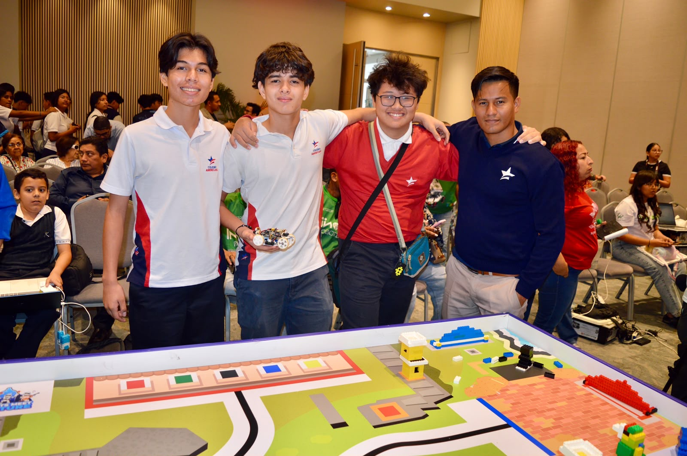
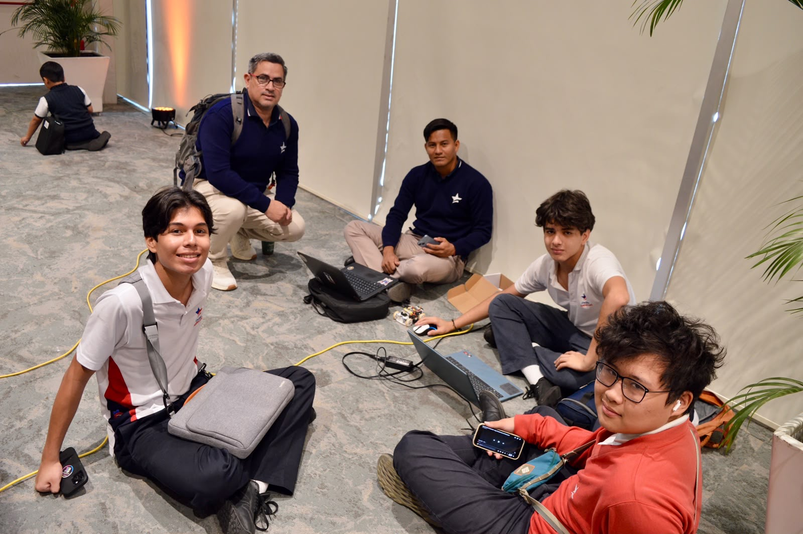
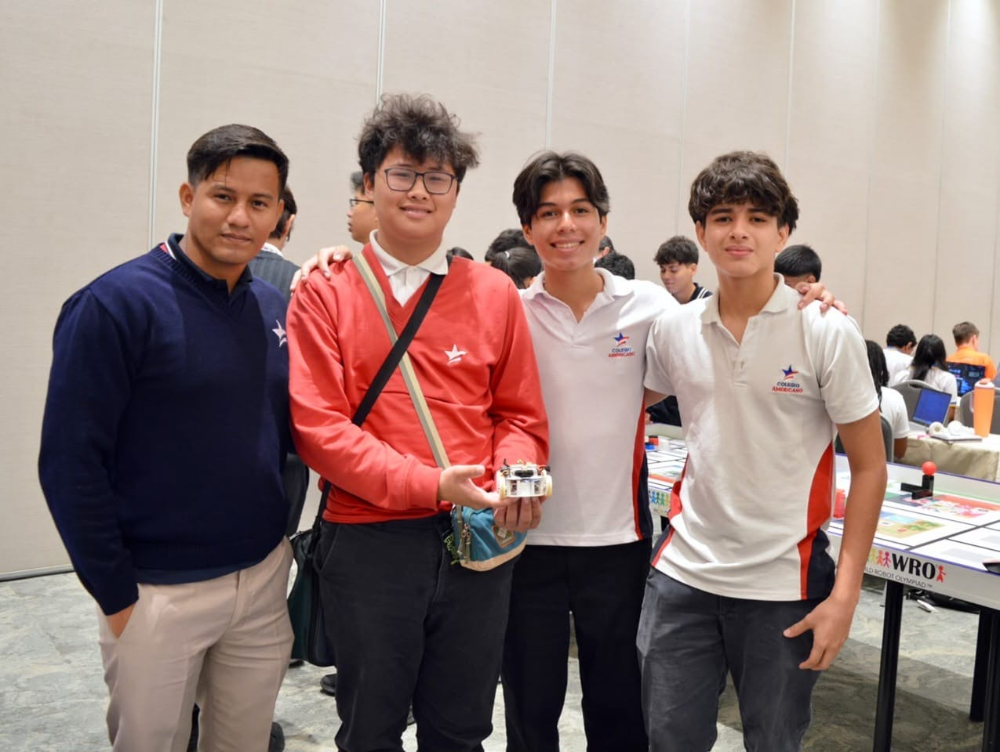
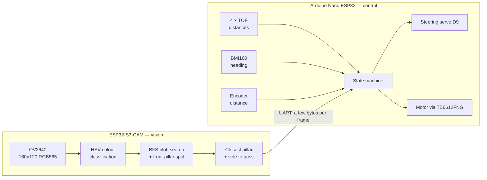
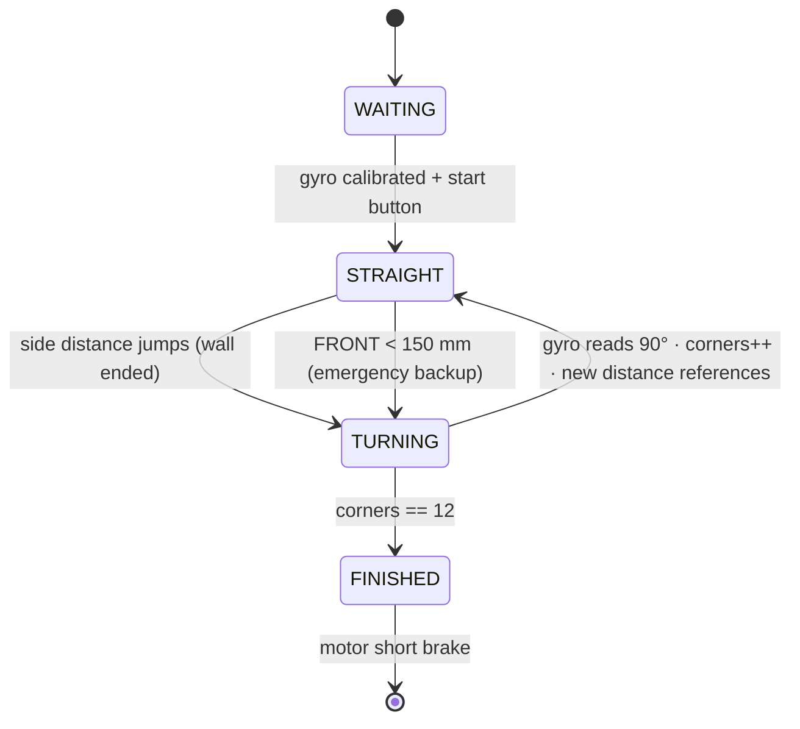

<div align="center">


# WRO 2026 Future Engineers — Team X67

**An autonomous car built from a custom PCB, laser distance sensors, a gyroscope and our own on-board computer vision**

*Colegio Americano de Guayaquil · Ecuador*

<a href="https://www.youtube.com/@SJVL67"></a>
<a href="https://oshwlab.com/edu560/project_ehytvvog"></a>
<a href="docs/ENGINEERING_JOURNAL.md"></a>

</div>

---

This repository documents the car that Team X67 built for the **World Robot Olympiad 2026, Future Engineers** category. The car must drive three laps of a track whose inner walls move every round (**Open Challenge**). In the **Obstacle Challenge** it must also pass red pillars on their right and green pillars on their left, and finish by parallel parking.

Here you will find the full engineering process (what we tried, what failed, the data, and why we changed it), the electrical design with its PCB and power budget, all the source code, and instructions to build, compile and upload everything. All documentation and code are in English.

| | |
|---|---|
| **Main controller** | Arduino Nano ESP32 |
| **Vision** | ESP32-S3-CAM (OV2640) running our own colour-detection pipeline at ~25 fps |
| **Sensors** | 4 × TOF400C laser distance sensors (VL53L1X), BMI160 gyroscope, motor encoder |
| **Drive / steering** | One N20 12 V motor with encoder → rear differential · Ackermann front steering with an MG90 servo |
| **Electronics** | Custom PCB (EasyEDA → JLCPCB) that is also the chassis base |
| **Power** | 3S HV LiPo 11.4 V 380 mAh · CN3903 5 V / 3 A buck converter |

---

## Contents

1. [Repository structure](#1-repository-structure)
2. [The team](#2-the-team)
3. [The challenge](#3-the-challenge)
4. [Vehicle photos and videos](#4-vehicle-photos-and-videos)
5. [Mobility and mechanical design](#5-mobility-and-mechanical-design)
6. [Power and sensor architecture](#6-power-and-sensor-architecture)
7. [Software architecture](#7-software-architecture)
8. [Open Challenge strategy](#8-open-challenge-strategy)
9. [Obstacle Challenge strategy](#9-obstacle-challenge-strategy)
10. [Systems thinking: constraints, trade-offs and risks](#10-systems-thinking-constraints-trade-offs-and-risks)
11. [Testing workflow and metrics](#11-testing-workflow-and-metrics)
12. [How to build, compile and upload](#12-how-to-build-compile-and-upload)
13. [Current status and next steps](#13-current-status-and-next-steps)
14. [Versions and release notes](#14-versions-and-release-notes)

---

## 1. Repository structure

```
.
├── README.md                ← this file: complete overview of the car
├── CHANGELOG.md             ← versions and release notes
├── docs/
│   ├── ENGINEERING_JOURNAL.md  ← day-by-day engineering process: 32 problems, data and decisions
│   └── images/                 ← plots used in the journal
├── schemes/                 ← schematic, wiring diagram, PCB, power budget, BOM, datasheets
├── src/                     ← all source code (see src/README.md)
│   ├── hardware-tests/         ← one sketch per component
│   ├── obstacle-challenge/     ← pillar detection + Pillar Vision Lab web tool
│   └── tools/scenario-roulette/← generates official WRO 2026 track scenarios to test on
├── models/                  ← files for 3D-printed parts
├── t-photos/                ← team photos (official and fun)
├── v-photos/                ← vehicle photos
├── video/                   ← links to the driving videos
└── other/                   ← component pictures, PCB manufacturing steps, competition photos
```

| Folder | Detailed documentation |
|---|---|
| ⚡ Electrical system, PCB, power budget, BOM | [schemes/README.md](schemes/README.md) |
| 💾 Source code, every sketch explained | [src/README.md](src/README.md) |
| 📓 Engineering process | [docs/ENGINEERING_JOURNAL.md](docs/ENGINEERING_JOURNAL.md) |
| 🚗 Vehicle photos | [v-photos/README.md](v-photos/README.md) |
| 👥 Team photos | [t-photos/README.md](t-photos/README.md) |
| 🎥 Videos | [video/video.md](video/video.md) |
| ⚙️ 3D models | [models/README.md](models/README.md) |

---

## 2. The team

<div align="center">
  
  <br><em>Team X67 and our coach at the WRO 2026 Ecuador national final.</em>
</div>

This is our **first year** in the Future Engineers category. We are students of the Colegio Americano de Guayaquil robotics club.

| Member | Role |
|---|---|
| **Eduardo Rivadeneira** | Electronics and PCB design, mechanical design, strategy integration. Robotics club since 2022 |
| **Henry Riera Loza** | Software, sensors and computer vision, engineering journal and this repository. Robotics club since 2023 |
| **Geovanny Li** | Computer vision research, software, strategy. Robotics club since 2023 |
| **Henry Cercado** (coach) | Computer Science teacher and Computer Science engineer |

<div align="center">
  
  
  <br><em>Debugging between rounds, and the team with the car at the national final.</em>
</div>

---

## 3. The challenge

| Challenge | Task |
|---|---|
| **Open Challenge** | Drive **3 laps** on a 3 × 3 m field. The inner walls are placed randomly every round, so each corridor is either 100 cm or 60 cm wide, and the driving direction (clockwise or counter-clockwise) is also random |
| **Obstacle Challenge** | Drive **3 laps** while obeying traffic signs: 🟥 **red** pillar → pass on its **right**; 🟩 **green** pillar → pass on its **left**. Then find the magenta parking lot and **parallel park** |
| **Documentation** | Public GitHub repository and engineering journal, scored with five criteria (mobility, power and sensors, software, systems thinking, reproducibility) |

Constraints that shaped our design (from the [official rules](https://wro-association.org/)): maximum size 30 × 20 × 30 cm, maximum mass 1.5 kg, one drive axle with mechanically connected wheels, a steering system, one start button and one power switch, no wireless communication during the run.

---

## 4. Vehicle photos and videos

<div align="center">
  
  
  <br><em>The car on the bench while uploading code, and its top view with all the wiring.</em>
</div>

- All vehicle photos: [v-photos](v-photos/README.md)
- Driving videos: [video/video.md](video/video.md) — [autonomous driving on YouTube](https://www.youtube.com/watch?v=J5yrJuZZ5P8)

---

## 5. Mobility and mechanical design

### 5.1 Chassis

The chassis is built around our **custom PCB**: the board's outline was designed so that the steering assembly is fixed at the front and the drive assembly at the rear, with 3D-printed supports screwed to it. This keeps the car compact (the electronics are the frame), stiff (the 1.6 mm FR-4 board does not flex) and low, which lowers the centre of mass and reduces roll in corners. The battery sits flat on top, between the two axles.

### 5.2 Drive

- **One N20 12 V motor with a Hall encoder** drives both rear wheels through a **differential**. A single motor on one axle follows the rules (driving wheels must be mechanically connected), and the differential lets the inner and outer wheels turn at different speeds in corners, so the tyres do not scrub and the car follows the steering angle precisely.
- **Speed reasoning:** the N20 is rated at 1000 rpm without load. With the 41 mm wheels, each wheel revolution moves the car π × 41 mm ≈ 129 mm, so a 1:1 transmission gives a theoretical top speed of ≈ 129 mm × 1000 / 60 ≈ **2.1 m/s**. That is far more than we need: our control loop is designed for ≈ 0.3–0.6 m/s, where the TOF sensors (one reading every 100 ms) see a new value every 3–6 cm. We therefore drive the motor with a PWM duty cycle well below 100 %, which also leaves torque available for acceleration.
- **Torque reasoning:** the car is very light (small PCB chassis, 380 mAh battery), so the force needed to accelerate it is small. The micro gearbox of the N20 multiplies torque at the expense of speed, which is the right trade-off for a car that must accelerate, brake and turn every 1–2 m.
- **Braking:** the TB6612FNG short-brake mode (both inputs HIGH) stops the motor actively, much faster and more repeatably than coasting.

### 5.3 Steering

- **Ackermann geometry** on the front wheels: the inner wheel turns more than the outer wheel, so both follow circles with the same centre. This reduces tyre slip in the tight 60 cm corridors and makes the turn radius repeatable.
- **Servo iteration:** the first SG90 servo moved inside its mount, so the same command gave different wheel angles, which cannot be fixed in code. It was replaced by a metal-gear **MG90** with the same connector and pulse range (journal Problems 8 and 17).
- **Centre and limits are measured, not assumed:** the straight-ahead position was at 120°, not 90°, because it depends on how the arm is mounted (journal Problem 7). On the second chassis the linkage was too tight for the servo to complete its travel (journal Problem 29); the fix is to loosen the linkage and to mount the arm at 90° so both sides have the same range.

### 5.4 Wheels

Custom 41 mm wheels with a 5 mm silicone tread, for grip on the field mat and to reduce slipping when braking.

### 5.5 Iterations that changed the mechanics

| Version | Change | Reason (data / test) |
|---|---|---|
| Chassis 1 → 2 | Side TOF sensors raised ~2 cm | The beam passed over the 10 cm wall and read the far side of the field (journal Problem 16). After the change the walls are detected reliably |
| Chassis 1 → 2 | SG90 → MG90 servo | Servo moved inside its mount (journal Problem 8) |
| Chassis 2 | Steering linkage to be loosened | Servo could not complete its travel (journal Problem 29) |

---

## 6. Power and sensor architecture

The full electrical documentation is in [schemes/README.md](schemes/README.md): schematic, wiring diagram, BOM with the reason for every component, power budget, PCB manufacturing and datasheets.

### 6.1 Power

```
 3S HV LiPo 11.4 V ──[switch]──┬──► TB6612FNG ──► N20 drive motor
                               ├──► Arduino Nano ESP32 (VIN)
                               └──► CN3903 buck 5 V / 3 A ──► camera board, 4 × TOF, BMI160, servo, encoder
```

| | Typical | Peak |
|---|---|---|
| Current from the battery | ≈ 0.21 A | ≈ 1.0 A |
| Power | ≈ 2.4 W | ≈ 11.4 W |
| Run time on one charge | ≈ 1.4 h | ≈ 18 min |

The motor uses the battery voltage directly (it is a 12 V motor); everything else uses a **switching** 5 V regulator, because a linear one would waste more power as heat than all the electronics consume. The 3 A buck has a wide margin over the ~1 A peak of the 5 V rail, so a servo stall cannot reset the camera or the sensors.

### 6.2 Wiring / pin map (Arduino Nano ESP32)

Pins are always written with the `D` prefix in code: without it the Nano ESP32 uses a different GPIO number (journal Problem 9).

| Device | Signal | Pin |
|---|---|---|
| Camera board | UART RX / TX | D0 / D1 |
| Encoder | C1 / C2 | D3 / D2 |
| TB6612FNG | PWMA / AIN1 / AIN2 | D6 / D7 / D8 |
| TB6612FNG | STBY | tied to +5 V on the PCB (always enabled) |
| Steering servo | Signal | D9 |
| Start button | Input | D10 |
| I²C bus (4 × TOF + BMI160) | SDA / SCL | A4 / A5 |
| TOF BACK / FRONT / RIGHT / LEFT | XSHUT | A0 / A1 / A2 / A3 |

All four TOF sensors share one I²C bus with the gyroscope. At start-up every sensor is switched off with its XSHUT pin, then switched on one at a time and given its own address (LEFT 0x30, RIGHT 0x31, BACK 0x32, FRONT 0x33).

**ESP32-S3-CAM** (camera pins = ESP32S3_EYE layout): SDA 4, SCL 5, XCLK 15, VSYNC 6, HREF 7, PCLK 13, Y2–Y9 = 11, 9, 8, 10, 12, 18, 17, 16. UART to the Nano on GPIO43 / GPIO44.

### 6.3 Sensors: selection, placement and calibration

| Sensor | Placement | Why |
|---|---|---|
| **TOF FRONT** | Front centre | Emergency stop and corner backup |
| **TOF LEFT / RIGHT** | Both sides, perpendicular | Distance to each wall; a sudden jump means the wall ended → corner. Raised ~2 cm so the beam does not pass over the 10 cm wall |
| **TOF BACK** | Rear centre | Position along a straight section |
| **BMI160** | Flat on the PCB | Yaw (Z axis) for straight driving and exact 90° turns |
| **Camera** | Front, slightly down | Sees the pillars of the next section |

**Why TOF and not infrared or ultrasonic:** our first sensors were Sharp infrared sensors. Their output is non-linear, so noise grows with distance, and our tests showed they were unreliable beyond 50–60 cm, less than one corridor width (journal Problem 3). We also proved that the standard deviation of their readings could not tell a wall from an open side (journal Problem 2). Ultrasonic sensors have a wide cone that sees the floor and the neighbouring walls. The VL53L1X measures up to 4 m and lets us narrow its measurement area (ROI) in software.

**Calibration**

- **TOF ROI chosen by experiment** (journal §8.2): we measured the same wall with several ROI heights and kept the one where the beam no longer saw the floor or passed over the wall (ROI 1 × 6). Per-sensor offset and a median filter of the last 5 valid readings.
- **Gyroscope:** 200 samples at rest before every run; their mean is the offset.
- **Steering:** centre and limits found with the interactive `servo_calibration` sketch, with 2–3° of margin before each mechanical stop.
- **Camera colours:** HSV thresholds tuned live under the real lighting with Pillar Vision Lab (section 9).

**Noise and interference we considered:** sunlight and strong lamps raise the TOF ambient-light level (we print the ambient value in the diagnostic sketch); dark or shiny walls lower the return signal (we accept "signal fail" readings only if their value is valid); objects outside the field (people, flags) can look like pillars to the camera, so only a horizontal band of the image is searched.

---

## 7. Software architecture

### 7.1 Two boards, each doing what it is best at



- **Camera board:** all image processing. It sends only a few bytes per picture (colour of the closest pillar, its position, whether it is already on the correct side), so the link stays fast.
- **Nano ESP32:** sensors, control loops and actuators. It never processes images, so its loop timing stays fast and predictable.

### 7.2 Modules

| Module | Board | What it does | Code |
|---|---|---|---|
| TOF driver | Nano | Address assignment through XSHUT, continuous ranging, ROI, median filter, offsets | [`tof_sensors_test`](src/hardware-tests/tof_sensors_test) |
| Gyro driver | Nano | BMI160 read through I²C registers (no library), offset calibration, yaw integration (`yaw += rate × dt`) | [`gyro_yaw_test`](src/hardware-tests/gyro_yaw_test) |
| Motor control | Nano | TB6612FNG forward / reverse / coast / short brake with PWM | [`rear_motor_loop_test`](src/hardware-tests/rear_motor_loop_test) |
| Steering | Nano | Servo pulse generated by hand (500–2500 µs at 50 Hz), calibrated centre and limits | [`servo_simple`](src/hardware-tests/servo_simple), [`servo_calibration`](src/hardware-tests/servo_calibration) |
| First drive test | Nano | Drive straight and brake when the left wall ends | [`drive_until_left_open`](src/hardware-tests/drive_until_left_open) |
| Pillar detection | Camera | HSV → blobs → closest pillar → side to pass; streams picture and mask over USB | [`pillar_viewer.ino`](src/obstacle-challenge/pillar_viewer) |
| Pillar Vision Lab | PC browser | Shows what the camera sees, runs the same algorithm in JavaScript and checks it matches, live parameter tuning | [`viewer.html`](src/obstacle-challenge/pillar_viewer/viewer.html) |
| Scenario Roulette | PC browser | Draws valid official track layouts to test on and scores Open Challenge attempts | [`index.html`](src/tools/scenario-roulette/index.html) |

**Why we wrote our own drivers:** the BMI160 library we tried only returned zeros without reporting any error (journal Problem 14), and the servo libraries did not work with our board core (journal Problem 6). Our register-level and hand-pulse versions are short, fully understood and faster.

**Why our own vision code instead of OpenCV:** OpenCV does not run on a microcontroller without an operating system; a Raspberry Pi would add weight, a second battery and a long boot time to a 30 × 20 cm car; and colour detection does not need a neural network. Our pipeline runs at ~25 fps and was verified pixel by pixel against its JavaScript copy. The full comparison (OpenMV, Pixy2, HuskyLens, Raspberry Pi) is in [journal §6.2](docs/ENGINEERING_JOURNAL.md#62-why-we-wrote-the-vision-ourselves-instead-of-using-opencv).

---

## 8. Open Challenge strategy

### 8.1 State machine



| State | Behaviour |
|---|---|
| **WAITING** | 200 gyro samples at rest → offset. Wait for the start button |
| **STRAIGHT** | Hold the gyro heading (multiple of 90°) and hold the left/right distances measured at the start of this straight with a PD controller: `error = (L − L_ref) − (R − R_ref)`, `steer = Kp·error + Kd·d(error)/dt` (initial Kp = 0.8, Kd = 0.3) |
| **TURNING** | Steering to the limit on the corner side, motor running; turn until the gyro has rotated 90° from the heading at the start of the turn; distance sensors are ignored during the turn |
| **FINISHED** | After 12 corners (4 per lap × 3 laps) the car brakes in the starting section |

### 8.2 Why these decisions

- **The car does not centre itself between the walls.** The inner walls move every round, so the "centre" changes from one section to the next. Holding the distances measured at the beginning of each straight keeps the car parallel to the walls wherever it ended the previous turn.
- **Corners are detected by a sudden jump in a side distance, not by the front wall.** When the inner wall ends, the side reading jumps from tens of centimetres to more than a metre. This is detected earlier than the front wall and also tells us which way to turn, so the driving direction of the round (clockwise or counter-clockwise) is learned at the first corner. This method was developed and validated with hand tests (journal §2.4); a fixed-reference variant tested worse and was reverted (journal Problem 4).
- **Turns are measured by angle, not by time.** A turn by time changes with battery voltage and speed; a turn by gyro angle is always 90°.

### 8.3 Edge cases

| Case | Handling |
|---|---|
| Narrow (60 cm) corridor | Same logic; the distance references adapt to each straight |
| Start position anywhere in the start section | References are taken at the start, not assumed |
| A TOF reading is invalid or noisy | Median filter; invalid readings are skipped |
| A corner is missed | FRONT < 150 mm forces the turn |
| Gyro drift over 3 laps | Offset calibration at rest before every run; heading targets are absolute multiples of 90° |

---

## 9. Obstacle Challenge strategy

### 9.1 Pillar detection (finished and tested on the robot)

1. Take a 160 × 120 RGB565 picture, about 25 times per second.
2. Convert each pixel to **HSV** and classify it as RED (hue ≥ 340° or ≤ 15°), GREEN (hue 80–160°) or nothing, with minimum saturation and brightness so the white walls and the grey mat are rejected.
3. Group pixels into blobs with a **BFS flood fill**; blobs under 30 pixels are noise; a shape filter keeps only blobs taller than wide.
4. If two pillars of the same colour touch in the picture, split them and keep the **front** one.
5. The **closest pillar** is the one whose base is lowest in the picture. Red → pass on its right; green → pass on its left. The pillar is on the correct side once it leaves the central zone (±28 px) on that side.

Only rows 53–78 of the picture are searched: the camera's wide view can see red or green objects outside the field and read them as pillars.

### 9.2 Pillar Vision Lab

<a href="https://henryalejandrorieraloza-sudo.github.io/WRO-2026-Future-Engineers-Journal/src/obstacle-challenge/pillar_viewer/viewer.html">Pillar Vision Lab</a> is the calibration tool we built: a web page that receives every picture over USB (Web Serial), draws the colour mask on top, runs the same algorithm in JavaScript, checks that its result matches the camera board, and lets us tune every parameter live. It turned threshold tuning from guessing into measuring.

### 9.3 Driving plan

The robot does not need to know the driving direction in advance: the side to pass is decided from the robot's own point of view (red → keep the pillar on the left of the car, green → on the right), and the turning direction is learned at the first corner, as in the Open Challenge. The orange and blue floor lines will be detected by the same camera to time the turns, together with the TOF sensors. Parking is planned after the three laps work reliably.

---

## 10. Systems thinking: constraints, trade-offs and risks

### 10.1 How the subsystems depend on each other

| Decision | Affects | Example |
|---|---|---|
| Camera on its own board | Software, power | Nano loop stays fast; costs ~0.5 W more and a UART link |
| PCB as chassis | Mechanics, electronics, time | Very compact and reliable, but every revision takes ~2 weeks to arrive from China |
| TOF height on the chassis | Sensors, software | 2 cm higher fixed the readings over the wall without any code change |
| Servo mount angle | Mechanics, software | Steering centre must be measured in software after every mechanical change |
| Battery voltage directly to the motor | Power, control | Speed changes as the battery discharges, so turns are controlled by gyro angle, not time |

### 10.2 "We chose X instead of Y because…"

| We chose | Instead of | Because (data or test) |
|---|---|---|
| TOF400C (VL53L1X) | Sharp infrared | Sharp unreliable beyond 50–60 cm in our tests (journal Problem 3) |
| Binary "wall / open" and jump detection | Comparing left vs right distances | Comparing magnitudes beyond 50 cm gave false decisions (journal §2.3) |
| Moving reference for jump detection | Fixed reference | The fixed version tested worse on the track (journal Problem 4) |
| Our own BMI160 driver | DFRobot library | The library returned only zeros, without errors (journal Problem 14) |
| Hand-generated servo pulse | ESP32Servo / LEDC | Libraries did not work with our board core (journal Problem 6) |
| MG90 metal-gear servo | SG90 | SG90 moved in its mount (journal Problem 8) |
| Own vision on ESP32-S3 | OpenCV on Raspberry Pi, Pixy2, HuskyLens | Weight, boot time, second battery, and we can explain and tune every step (journal §6.2) |
| Custom PCB | Perforated prototype board | Prototype board too bulky; PCB is cleaner and doubles as the chassis |
| Buck converter | Linear regulator | A linear regulator would waste ~3 W as heat |

### 10.3 Risks and mitigation

| Risk | Mitigation |
|---|---|
| Nano ESP32 damaged by a wrong voltage (journal Problem 31) | Battery only reaches VIN, VM and the buck; code is uploaded with the battery **off** |
| I²C bus freezes and hangs the program (journal Problem 12) | `Wire.setTimeOut(50)`; check connectors; each sensor tested alone first |
| Loose sensor wire (journal Problem 30) | Locking connectors on the PCB; hardware tests before every session |
| Lighting at the venue differs from home | Colour thresholds re-tuned on site with Pillar Vision Lab in minutes |
| Camera sees objects outside the field | Search only a horizontal band of the image |
| Steering not centred after a mechanical change | Re-run `servo_calibration` after any change to the steering |

The complete list of the **32 problems** we found, with their causes and solutions, is in [journal §10](docs/ENGINEERING_JOURNAL.md#10-summary-of-problems-and-solutions).

---

## 11. Testing workflow and metrics

Every component is tested alone before it is joined to the rest:

1. **Hardware tests** ([src/hardware-tests](src/hardware-tests)): one sketch per component, printing its readings to the Serial Monitor.
2. **Hand tests:** the car or its sensors are moved by hand to check the decision logic before the car drives itself. This let us develop the algorithm while the chassis was still being built.
3. **Measured experiments** to choose parameters: TOF ROI height (journal §8.2), HSV thresholds in Pillar Vision Lab.
4. **Driving tests on realistic layouts** generated by Scenario Roulette with the official procedure.

| Metric | How we measure it |
|---|---|
| Vision frame rate | fps printed by the camera board (~25 fps) |
| Vision correctness | Board result vs JavaScript result, compared on the same picture in Pillar Vision Lab |
| TOF quality | Reading vs tape-measure distance; standard deviation of repeated readings |
| Gyro drift | Heading change with the car at rest over time |
| Turn accuracy | Heading error after each 90° turn |
| Open Challenge score | Laps completed and official points, logged per attempt in Scenario Roulette |
| Scenario generator correctness | 600 generated scenarios checked automatically, 0 rule violations (journal §7) |

---

## 12. How to build, compile and upload

### 12.1 Hardware

1. Order the PCB from the [OSHWLab project](https://oshwlab.com/edu560/project_ehytvvog) (1.6 mm).
2. Buy the components in the [BOM](schemes/README.md#1-bill-of-materials-bom).
3. Solder headers and connectors, then wire the external components following the [wiring diagram](schemes/README.md#3-wiring-diagram).
4. Print the supports in [models](models/README.md) and mount the steering at the front and the drive at the rear of the PCB.

### 12.2 Software

- **Arduino IDE 2.x**
- Board packages (*Tools → Board → Boards Manager*): **Arduino ESP32 Boards** (by Arduino) for the Nano ESP32; **esp32** (by Espressif) for the ESP32-S3-CAM.
- Library (*Sketch → Include Library → Manage Libraries*): **VL53L1X** by **Pololu**. The BMI160 and the servo need no library.

### 12.3 Upload to the Nano ESP32

1. Open the sketch (*File → Open*, choose the `.ino`). Each sketch is in a folder with its own name, as the Arduino IDE requires.
2. *Tools → Board → Arduino ESP32 Boards → **Arduino Nano ESP32***, and choose the port.
3. **Battery off**, USB connected. Click *Upload*.
4. If the upload fails with `dfu-util` errors: double-press **RESET** (the LED "breathes" green), select the port again and upload.
5. Serial Monitor at **115200** baud.

### 12.4 Upload to the ESP32-S3-CAM

| Tools option | Value |
|---|---|
| Board | ESP32S3 Dev Module |
| USB CDC On Boot | Enabled |
| Flash Size | 8MB (64Mb) |
| Partition Scheme | 8M with spiffs (3MB APP/1.5MB SPIFFS) |
| PSRAM | **OPI PSRAM** (without it: `frame buffer malloc failed`) |

If the upload stays at `Connecting...`: hold **BOOT**, press and release **RESET**, release **BOOT**. Only one program can use the port at a time: close the Serial Monitor or Pillar Vision Lab before uploading.

### 12.5 Pillar Vision Lab

Upload `pillar_viewer.ino` to the camera board, open `viewer.html` in **Chrome or Edge** (Web Serial is needed), press **Connect** and choose the camera port.

---

## 13. Current status and next steps

| Part | Status |
|---|---|
| Custom PCB and wiring | ✅ Manufactured and working |
| TOF sensors (×4), unique addresses, ROI, filtering | ✅ Working |
| Gyroscope heading | ✅ Working (own driver) |
| Drive motor through TB6612FNG | ✅ Tested |
| Pillar detection | ✅ Finished and tested on the robot |
| Steering on chassis 2 | 🔄 Linkage adjustment and calibration |
| Open Challenge program on chassis 2 | 🔄 Integration |
| Floor lines, camera → Nano UART link, parking | ⏳ Next |

---

## 14. Versions and release notes

See [CHANGELOG.md](CHANGELOG.md) for the history of the repository and the car.

---

<div align="center">
<sub>Team X67 · WRO 2026 Future Engineers · Colegio Americano de Guayaquil, Ecuador</sub>
</div>
