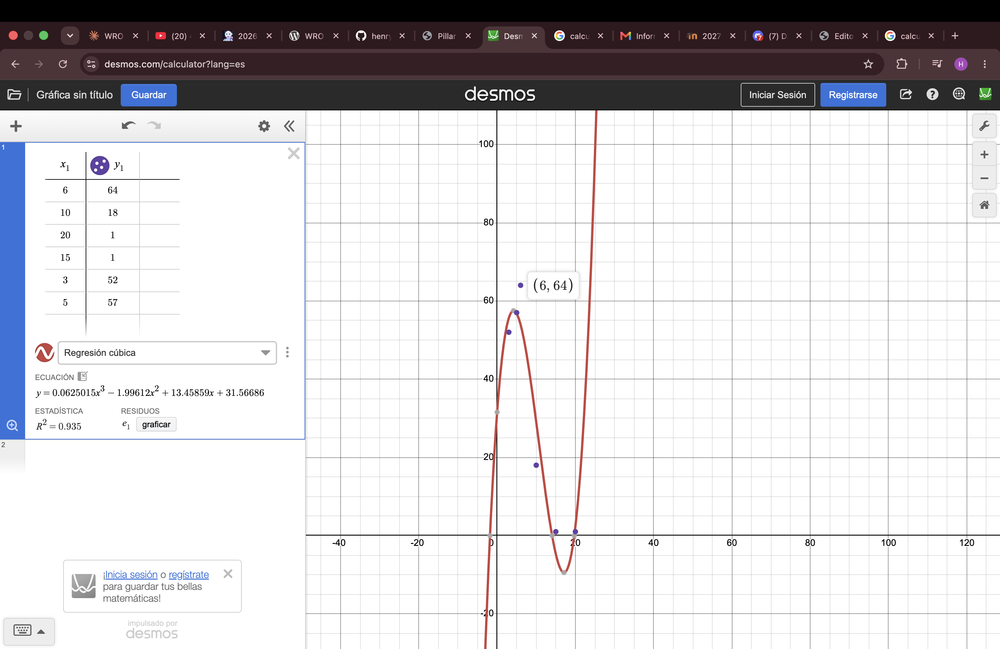

# Engineering Journal — Software and Electronics

> **Author:** Henry Riera Loza — software and electronics, WRO Future Engineers 2026
> **Period covered:** 15 September – 5 October 2026
> **Note:** this journal covers my part of the project (programming, sensors and electronics). The mechanical design and chassis are documented by my teammate.

This journal records, in chronological order, everything I worked on: what I built, what I tested, the problems I found, how I solved them (or plan to solve them), and why I chose each solution.

**Status marks:** ✅ solved / validated · 🔄 in progress · ❓ still open

---

## Contents

1. [Hardware I work with](#1-hardware-i-work-with)
2. [Phase 1 — Turning-direction logic with Sharp sensors (15–21 Sept)](#2-phase-1--turning-direction-logic-with-sharp-sensors-1521-september-2026)
3. [Phase 2 — (22 Sept)](#3-phase-2--22-september-2026)
4. [Phase 3 — New algorithm and TOF sensors (1–3 Oct)](#4-phase-3--new-algorithm-and-tof-sensors-13-october-2026)
5. [Phase 4 — Camera for the Obstacle Challenge (3–4 Oct)](#5-phase-4--camera-for-the-obstacle-challenge-34-october-2026)
6. [Phase 5 — Pillar detection finished (Sun 4 Oct)](#6-phase-5--pillar-detection-finished-sunday-4-october-2026)
7. [Test tool — WRO 2026 scenario roulette](#7-test-tool--wro-2026-scenario-roulette)
8. [Phase 6 — First tests on the new chassis (Mon 5 Oct)](#8-phase-6--first-tests-on-the-new-chassis-monday-5-october-2026)
9. [Rules research](#9-rules-research)
10. [Summary of problems and solutions](#10-summary-of-problems-and-solutions)
11. [Next steps](#11-next-steps)

---

## 1. Hardware I work with

| Part | Component | Connection |
|---|---|---|
| Main controller | Arduino Nano ESP32 (with headers) | — |
| Drive motor | N20 DC 12 V with encoder, drives the rear wheels through a differential | TB6612FNG driver: PWMA = D6, AIN1 = D7, AIN2 = D8, STBY = D5 (provisional, to confirm) |
| Steering | Ackermann on the front wheels, servo MG90 180° (replaced the SG90) | Signal on D9 |
| Distance sensors | 4 × TOF400C (VL53L1X chip) — replaced 4 × Sharp GP2Y0A21YK0F | I²C SDA = A4, SCL = A5 · XSHUT: FRONT = A1, BACK = A0, RIGHT = A2, LEFT = A3 |
| Gyroscope | BMI160 | I²C SDA = A4, SCL = A5 (same bus as the TOF sensors) |
| Start button | Push button | D10 |
| Battery | 380 mAh | — |
| Camera (Obstacle Challenge) | emakefun ESP32S3-CAM: ESP32-S3R8, 8 MB PSRAM, 8 MB flash, native USB-C, OV2640 camera | Separate board |

All code is written in English (variable names, functions and comments) so that it can be read by the judges and by other teams.

---

## 2. Phase 1 — Turning-direction logic with Sharp sensors (15–21 September 2026)

### 2.1 The goal

In the Open Challenge the driving direction (clockwise or counter-clockwise) is chosen randomly before each round. The car therefore has to decide **by itself** which way to turn at the corners.

### 2.2 Starting setup

- 4 Sharp GP2Y0A21YK0F analog infrared sensors: FRONT = A1, BACK = A0, LEFT = A3, RIGHT = A2.
- Read as voltage with the 12-bit ADC of the Nano ESP32 (3.3 V) and converted to distance with `distance = 27.86 × V^-1.15`.

### Problem 1 — The chassis was not ready ✅

- **Problem:** during this week my teammates were still building the chassis, so I could not test the software on the car.
- **Solution:** I tested the decision logic with a **manual simulation**: I moved the sensors by hand, simulating straights and corners, and read the decisions on the Serial Monitor.
- **Why:** this allowed me to develop and test the algorithm in parallel with the mechanical work, instead of waiting for the chassis.

### Problem 2 — Standard deviation could not tell a wall from an open side ✅ (discarded)

- **Idea:** an open side (no wall) should give noisier readings than a wall, so I calculated the standard deviation of the voltage and of the distance for LEFT and RIGHT.
- **Test code:** `test_std_distancia_LR.ino`.
- **What I observed:** the real data overlapped a lot. Sometimes an open side had a standard deviation as low as a real wall.
- **Decision:** I dropped this method.
- **Why:** if the values for "wall" and "open" overlap, no threshold can separate them reliably.

### Problem 3 — Sharp sensors were not reliable beyond ~50–60 cm ✅

- **Idea:** compare the LEFT and RIGHT distances and turn toward the side with more space.
- **Test code:** `test_pared_LR_distancia.ino`.
- **What I observed:** beyond ~50–60 cm the readings were not reliable, and comparing the two numbers gave wrong decisions.
- **Why it happens:** the conversion `V^-1.15` is non-linear. At long distances a small amount of voltage noise becomes a large distance error.
- **Solution (short term):** stop comparing magnitudes. Each side answers only **WALL** or **OPEN**, separately (binary classification). Threshold: distance ≤ 50 cm = WALL, otherwise OPEN.
- **Solution (long term):** replace the Sharp sensors with TOF laser sensors, which do not have this non-linear noise (done in Phase 3).

### 2.3 Algorithm version A — binary decision (my idea) ✅

Test codes: `estado_LR_binario.ino`, `direccion_giro_memoria.ino`, `simulacro_giro_back.ino`.

1. While driving with walls on both sides, if one side stops detecting a wall **before** the FRONT sensor detects a wall, the car turns toward that side. The decision is **saved** and not calculated again.
2. If that does not happen and FRONT reaches a wall while only one side shows a wall, the car turns to the **opposite** side of that wall.

### 2.4 Algorithm version B — sudden-jump detection ✅ (validated)

Test codes: `deteccion_cambio_brusco.ino`, `sharp_turn_direction.ino` (English version), `logica_validada_cambio_brusco.ino` (final validated version).

1. At the start, average **10 readings per side** (one every 50 ms) to get the initial state of LEFT and RIGHT.
2. Then, in every cycle, compare the current reading with the **previous** reading.
3. If one side increases suddenly by more than a threshold, the wall has ended. The car decides to turn toward that side, **only once**.

**Tuning in real tests:**

| Parameter | First value | Final value | Reason |
|---|---|---|---|
| Jump threshold (`UMBRAL_SALTO`) | 25 cm | **10 cm** | With 25 cm it did not work well in practice; with 10 cm it worked |
| Wall threshold (`UMBRAL_PARED`) | — | **62 cm** | Used for the initial state |

**Why this method is better:** a jump is a sudden change in **one** sensor. It does not depend on comparing two noisy sensors with each other, which was the problem in Problem 3.

### Problem 4 — The "fixed reference" correction made it worse ✅ (reverted)

- **Problem:** in theory, version B has a weakness: the reference is updated every cycle (~150 ms), so a slow, gradual change is never detected. A version with a **fixed** reference was proposed to fix this.
- **What I observed:** I tested it in practice and the fixed-reference version worked **worse**.
- **Decision:** I went back to the original version (moving reference, `UMBRAL_PARED = 62.0`, `UMBRAL_SALTO = 10.0`), which is the validated logic.
- **Why:** I decide based on what works in the real test, not on what looks better on paper.

### Problem 5 — The RIGHT sensor read a wall where there was none ❓

- **What I observed:** in one test, the RIGHT sensor read WALL (~37–45 cm) when, according to the setup, it should not have seen a wall.
- **Possible causes:** a calibration problem of that specific sensor, or a real nearby object that I did not notice.
- **Status:** not resolved. The Sharp sensors were later replaced by TOF sensors.

### 2.5 Architecture agreed for the Open Challenge

At the end of this phase I agreed on the general structure of the program:

- A **state machine**.
- An initial blind advance (~20 cm or until FRONT detects a wall).
- Straight driving controlled with the **gyroscope heading**, with lateral distance as a secondary correction.
- Corner detection, with the turning direction decided **only once** (saved).
- Turns executed **by gyroscope angle, not by time**, ignoring the distance sensors during the turn.
- A counter of **12 corners** (4 corners × 3 laps) to finish.

---

## 3. Phase 2 — (22 September 2026)

On the day of the national final I was still working on the code, including motor and servo tests.

### 3.1 Motor driver test ✅

- **Code:** `rear_motors_full_speed.ino` — runs the rear motor at maximum speed (PWM 255) all the time, without sensor logic.
- **Purpose:** check the wiring of the TB6612FNG driver.

### Problem 6 — The servo libraries did not work on the Nano ESP32 ✅

- **What I observed:**
  - The **ESP32Servo** library was not installed in my Arduino IDE.
  - My ESP32 core is the old **2.x** version, which does not have `ledcAttach`. A version using `ledcSetup` + `ledcAttachPin` + `ledcWrite` (`steering_servo_test_ledc.ino`) did not work either: the board kept running the previous code or the upload failed.
- **Solution:** I wrote **`servo_simple.ino`**, which generates the servo pulse by hand with `digitalWrite` + `delayMicroseconds` (50 Hz, pulse 500–2500 µs), without any library.
- **Why:** it does not depend on any library or core version, so it works on any setup.

### Problem 7 — The steering centre was at 120°, not 90° ✅

- **What I observed:** with `servo_simple`, the wheels were straight at **120°**, not at the theoretical 90°.
- **Solution:** 120° is used as the centre in the code. Left and right were set provisionally at **90° and 150°**, to be adjusted to the real mechanical limits.
- **Why:** the centre depends on how the servo is mounted on the chassis, so it must be measured, not assumed.

### Problem 8 — The SG90 servo moved inside its mount ✅

- **What I observed:** the SG90 was only held with nuts. When it moved, the servo body moved slightly too, so part of the turn was lost in the movement of the servo itself and the steering was not clean.
- **Solution:** the SG90 was replaced by an **MG90** servo (180°).
- **Why:** if the servo moves inside its mount, the same command gives different wheel angles, and that cannot be fixed with code.

### Problem 9 — Pins written without the D prefix caused erratic behaviour ✅

- **What I observed:** on the Nano ESP32, writing a pin as a plain number (for example `2` instead of `D2`) caused erratic behaviour, such as phantom resets with a button.
- **Why:** on the Nano ESP32, the plain number refers to a different physical GPIO.
- **Solution:** always write the pins with the **D** prefix (`D6`, `D9`, `D10`, …).

### Problem 10 — The first Serial Monitor messages were lost ✅

- **What I observed:** text printed at the very beginning of `setup()` did not appear in the Serial Monitor.
- **Why:** the Nano ESP32 uses native USB, and the serial port takes a moment to connect after power-on.
- **Solution:** wait for the connection at the start of `setup()`:

```cpp
unsigned long start = millis();
while (!Serial && millis() - start < 5000) delay(10);
```

### 3.2 Front sensor test

- **Code:** `front_sensor_test.ino` — prints the voltage, the distance and WALL/OPEN for the FRONT sensor (A1), with an initial threshold of 62 cm to adjust with tests.

---

## 4. Phase 3 — New algorithm and TOF sensors (1–3 October 2026)

### 4.1 Hardware changes

- The Sharp sensors were replaced by **4 × TOF400C** laser sensors, to avoid the non-linear noise of Problem 3.
- The SG90 servo was replaced by the **MG90** (Problem 8).

### 4.2 New Open Challenge algorithm (1 October)

**Code:** `open_challenge.ino` (first complete version) → `open_challenge_v2.ino`. All tunable values are grouped at the top of the file.

**State machine:** `WAITING` → `STRAIGHT` → `TURNING` → `FINISHED`

| State | What the car does |
|---|---|
| `WAITING` | Calibrates the gyroscope (200 samples) and waits for the start button |
| `STRAIGHT` | Does **not** try to centre itself between the walls. It saves the LEFT and RIGHT distances at the start (and at the start of every new straight) and keeps exactly those distances with a lateral PID controller |
| `TURNING` | Servo at the limit toward the corner, motor still running. The gyroscope measures the degrees turned since the start of the turn. At **90°**: servo back to the centre, counter + 1, new distance references |
| `FINISHED` | When the counter reaches 12, the motor stops |

**Lateral control (STRAIGHT):**

```
errorL        = distL − refDistL
errorR        = distR − refDistR
lateralError  = errorL − errorR
correction    = KP × lateralError + KD × derivative
```

Initial values: **KP = 0.8, KD = 0.3** (to tune on the track).

**Corner detection:** in each cycle, compare `distL` with the previous cycle. If the jump is larger than `JUMP_THRESHOLD_MM` (initial value **150 mm**), a corner is detected on that side. The FRONT sensor is only used as an **emergency** backup (FRONT < 150 mm).

**New references for each straight:** after every turn, wait 150 ms and take new readings as references. This way the car learns its position in each section, wherever it ended up after the turn.

### 4.3 Hardware tests, one component at a time

I tested every component on its own before combining them.

#### Problem 11 — Wrong library for the TOF sensors ✅

- **Problem:** the first codes (`open_challenge`, `open_challenge_v2`, `hardware_test`, `all_sensors_test`) used the Adafruit **VL53L0X** library.
- **What I found:** the TOF400C uses the **VL53L1X** chip, not the VL53L0X.
- **Solution:** I changed to the **"VL53L1X" library by Pololu** (`init()`, `setAddress()`, `setDistanceMode(Long)`, `startContinuous()`, `read()`).

#### Problem 12 — The I²C bus froze the program ✅

- **What I observed (1 Oct):** with `all_sensors_test`, the program froze when starting the first TOF. With `i2c_diagnostic`, it froze while scanning the I²C bus **even with all TOF sensors off** (XSHUT in LOW). This pointed to a blocked bus: SDA/SCL pulled to GND, a crossed cable, or a damaged module.
- **Solution:** I added `Wire.setTimeOut(50)` so the program does not freeze if the bus gets stuck, and diagnosed by disconnecting the modules one by one (`i2c_line_check`).
- **Status:** solved — the four sensors work together (Problem 14).

#### 4.3.1 FRONT TOF + gyroscope (2 Oct) ✅

- **Code:** `front_and_gyro_test.ino`. The FRONT TOF and the gyroscope worked together, with the TOF at the default address **0x29**.
- `back_and_gyro_test.ino`: BACK TOF (XSHUT = A0) + BMI160, also at 0x29.
- **Next problem:** to read the 4 TOF sensors at the same time, each one needs a different address.

#### Problem 13 — The TOF sensors only reached ~40 cm ✅

- **What I observed (2 Oct):** the sensor only measured up to ~400 mm, although it should reach about 4 m.
- **Solution:** `tof_range_diagnostic.ino`, with a longer measurement time (100 ms timing budget), an optional narrow measurement area (ROI), and printing of the status, signal and ambient light, to find out whether the sensor was seeing the floor, needed more measuring time, or had too much ambient light.
- **Result:** in the final test code (`tof_sensors_test`) the sensors measure correctly using Long mode, a 100 ms timing budget and a narrow ROI.

#### 4.3.2 Rear motor test (2 Oct) ✅

- **Code:** `rear_motor_loop_test.ino` — loop: **FORWARD 2 s → STOP 1 s → BACKWARD 2 s → STOP 1 s**, with `MOTOR_SPEED = 150`.
- How the TB6612FNG controls the motor (H-bridge):

| AIN1 | AIN2 | Result |
|---|---|---|
| HIGH | LOW | Forward |
| LOW | HIGH | Backward |
| LOW | LOW | Stop by coasting (free wheel) — used in this test |
| HIGH | HIGH | Active brake — useful for stopping exactly at the finish |

#### Problem 14 — The gyroscope library only returned 0 ✅

- **Tests (2 Oct):**
  - `gyro_yaw_test.ino` — my version, which reads the BMI160 registers directly over I²C (range ±500 °/s), calibrates the offset with the robot still, and integrates the Z rotation speed to get the yaw angle.
  - `gyro_yaw_test_library.ino` — a cleaner version with the **DFRobot_BMI160** library (range ±2000 °/s).
- **What I observed:** my manual version printed correct values. The DFRobot version **only printed 0**, did not report any reading error, and was slower (~15–20 ms per reading because of internal delays).
- **Decision:** keep the manual version.
- **Why:** it works, it is faster, and it does not hide errors.
- **How it works:**
  1. **Calibration:** with the car still, take many readings and average them. That average is the error of the sensor at rest, and it is subtracted from every later reading (like the "tare" button of a scale).
  2. **Angle:** in each cycle, `yaw += rotation speed × time since the last reading`.
- **3 Oct:** I validated `gyro_yaw_test` and saved it as the gyroscope test for this journal.

#### Problem 15 — All four TOF sensors had the same I²C address ✅

- **What I observed:** with one TOF it worked at address 0x29, but with several sensors on I got **"no update" / -1** readings.
- **Why:**
  - All VL53L1X sensors start at the same address, **0x29**. If several are on at the same time, they answer together.
  - I also thought XSHUT was inverted, but it is **not**: **LOW = off, HIGH = on**. That mistake left three sensors on at 0x29 at the same time.
- **Solution (my own method):**
  1. At startup, turn all 4 sensors off (XSHUT LOW).
  2. Turn them on **one by one**, and give each one a unique address with `setAddress` before turning on the next one:
     LEFT = **0x30**, RIGHT = **0x31**, BACK = **0x32**, FRONT = **0x33**.
  3. Then all 4 sensors run in continuous mode.
- **Final test code:** `tof_sensors_test.ino` (3 Oct):
  - Long mode, 100 ms timing budget, 100 ms period.
  - ROI (measurement area) 4 wide × 13 high.
  - Accepts readings with status "SignalFail" if the value is greater than 0 (a weak signal from an angled or dark surface usually still gives a good distance).
  - **Median filter** of the last 5 valid readings, to remove spikes.
  - **Offset per sensor** in cm, to correct a fixed error measured with a ruler.
  - Prints in the order FRONT | BACK | LEFT | RIGHT, in cm.
- **Result:** the 4 TOF sensors read correctly at the same time.

### Problem 16 — The TOF beam passed over the wall ✅

- **Mounting at that time (3 Oct):**
  - Sensors about **0.8 cm** from the floor, tilted **8° upward**.
  - Side sensors also rotated **30° horizontally**, so they detect the wall and the corner earlier.
  - The track walls are **10 cm** high.
- **What I observed:** with 8° of tilt, the measurement cone passed **over** the wall and the sensor read about **300 cm**. When I put something on top of the wall, the reading became correct.
- **What I need:** to measure a wall at a maximum of about **60–70 cm**. When the wall ends (a corner), the exact value does not matter.
- **Decision:** raise the sensors about **3 cm** and mount them at **0°** in the vertical axis.
- **Why:** at 0° the beam goes straight toward the wall instead of upward, so it no longer passes over the 10 cm wall.
- **Status:** my teammate is building the new chassis with the sensors moved.
- **Update (5 Oct):** on the new chassis the sensors were raised **about one finger width (~2 cm)** above their previous height. They now **detect the wall much better**. Together with the narrower measurement area found in section 8.2 (`ROI_HEIGHT = 6`), the cone no longer escapes over the wall.

### Problem 17 — The steering servo was damaged 🔄

- **What happened (3 Oct):** the current steering servo is damaged.
- **Solution:** my teammate is building a new chassis with a new servo and with the side TOF sensors moved so they detect correctly. Planned delivery: **5 October 2026**.
- **Next step:** measure again the centre (it was 120°) and the limits of the new servo.

---

## 5. Phase 4 — Camera for the Obstacle Challenge (3–4 October 2026)

In the Obstacle Challenge the car has to detect red and green pillars to know which side to pass them on, and park at the end. For that we use a camera.

### 5.1 The board

- **emakefun ESP32S3-CAM:** ESP32-S3R8, 8 MB octal PSRAM, 8 MB flash, native USB-C, RESET and BOOT buttons, flash LED on GPIO3, OV2640 camera.
- **Camera pins** (ESP32S3_EYE layout): SDA 4, SCL 5, XCLK 15, VSYNC 6, HREF 7, PCLK 13, Y2–Y9 = 11, 9, 8, 10, 12, 18, 17, 16.
- **Arduino IDE settings:**

| Option | Value |
|---|---|
| Board | ESP32S3 Dev Module |
| USB CDC On Boot | Enabled |
| Flash Size | 8MB (64Mb) |
| Partition Scheme | 8M with spiffs (3MB APP/1.5MB SPIFFS) |
| PSRAM | OPI PSRAM |

### Problem 18 — The generic camera example crashed in a loop ✅

- **What I observed:** Espressif's generic **CameraWebServer** example (with 4 MB / Huge APP) crashed in a loop with **"Guru Meditation LoadProhibited"**.
- **Solution:** I used the **manufacturer's example** (emakefun, release V0.0.1 CameraWebServer) with Flash 8MB and the "8M with spiffs" partition.
- **Saved as:** `camera_webserver_emakefun.ino` (with the Wi-Fi name and password replaced by placeholders). It uses `CAMERA_MODEL_ESP32S3_EYE`, XCLK 20 MHz, JPEG, frame buffers in PSRAM, `CAMERA_GRAB_LATEST` and a vertical flip of the image.
- **Result:** "esp_camera_init ok" — the camera starts correctly.

### Problem 19 — Code upload got stuck at "Connecting..." ✅

- **What I observed:** when the loaded code crashes, the upload stays at "Connecting...". Also, with native USB, the Serial Monitor loses what is printed in the first seconds after RESET.
- **Solution:** hold **BOOT**, press and release **RESET**, then release **BOOT** while "Connecting..." is shown.

### Problem 20 — The camera web page did not load completely ✅

- **What I observed:** the Wi-Fi connected (with a weak signal) and the board got an IP address. The web page only loaded the title ("ESP32 OV26…", which confirms the camera is an **OV2640**), and the rest did not load.
- **Decision:** stop using Wi-Fi and move to colour detection with output through the Serial Monitor.
- **Why:** wireless communication is not allowed during the competition rounds anyway, so the final system does not need Wi-Fi.

### 5.2 Plan for the vision system

| Block | Task | Status |
|---|---|---|
| **Block 1** | Colour detection sketch without Wi-Fi: find red and green blobs and print their position | ✅ done, tested and calibrated (see section 6) |
| **Block 2** | Turn decision on the Nano ESP32, tested first with fake data | 🔄 |
| **Block 3** | UART (cable) communication between the two boards | 🔄 |

**Block 1 — `color_detection_test.ino` (4 Oct):**
- Image of **160 × 120** pixels in RGB565, frame buffer in PSRAM, no Wi-Fi.
- Each pixel is converted to **HSV** (hue, saturation, brightness).
- Initial thresholds (to calibrate with the real cubes):
  - Red: H ≥ 340 or H ≤ 15, S ≥ 100, V ≥ 60
  - Green: H 80–160, S ≥ 80, V ≥ 50
- Blobs smaller than 30 pixels are ignored.
- Groups the pixels of each colour into blobs (BFS) and chooses the **closest** one (the blob that reaches lowest in the image).
- Prints x, height, bottom, number of pixels, the average HSV of the centre 10 × 10 pixels (to calibrate), and frames per second.
- Waits up to 15 s for the Serial Monitor to open.
- **Next step:** test with the red and green cubes and adjust the thresholds using the CENTER H/S/V values of red, green and the background.

There is also `camera_diagnostic.ino` (step-by-step check of PSRAM, camera I²C scan and frames per second). It did not show any output because of the Serial Monitor problem after RESET (Problem 19).

---

## 6. Phase 5 — Pillar detection finished (Sunday 4 October 2026)

**Result of the day: pillar detection is ready ✅.** The camera finds the red and green pillars, keeps only the closest one, separates two pillars of the same colour when one is behind the other, and tells which way to pass it. I checked every step live with my own camera through a web page that runs the same algorithm and compares its answer with the camera's.

**Tested on the robot:** at the end of the day the camera was **mounted on the robot**. I moved the robot by hand along the track with the camera assembled, and the detection **works**: it finds the pillars, picks the closest one and says which side to pass it on. The robot cannot steer yet (see 6.6), so this test was done by pushing it.

### 6.1 How the detection works

Every picture goes through the same five steps on the ESP32-S3 camera board, about **25 times per second**:

| Step | What it does | Why |
|---|---|---|
| 1. Take a picture | 160 × 120 pixels, RGB565 (2 bytes per pixel) | Small enough to process 25 times per second; big enough to see a pillar (see 6.3) |
| 2. Classify each pixel | Convert to **HSV** and mark it RED, GREEN or NOTHING | Hue separates the colours; minimum saturation and brightness throw away the white mat, black walls and shadows |
| 3. Group pixels into blobs | **BFS** (breadth-first search): start at a coloured pixel and "flood" every touching pixel of the same colour | A pillar is a group of pixels, not single pixels. Blobs under 30 pixels are noise |
| 4. Split pillars that touch | Inside each blob, keep only the **front pillar** | Two pillars of the same colour, one behind the other, look like one big blob in the picture |
| 5. Choose and decide | The closest pillar is the one whose base is **lowest** in the picture. Red → GO RIGHT, green → GO LEFT | Pillars stand on the floor, so a lower base means a closer pillar |

**Why HSV and not RGB.** In RGB the same red cube gives very different numbers in light and in shadow, because the three channels change together. HSV separates *which colour* (hue) from *how intense* (saturation) and *how bright* (value), so one hue range works in more lighting conditions. The conversion uses only integer maths, which is fast on the ESP32-S3.

**Why the "lowest base" is the closest pillar.** The camera looks forward and slightly down at a flat floor. Every pillar stands on that floor, so the closer it is, the lower its base appears in the picture. Pillar size is not as reliable: a pillar cut by the edge of the picture looks small even when it is close.

**How two touching pillars of the same colour are separated.** While the BFS floods a blob, it remembers for every column of the blob where it starts, where it ends and how many pixels it has. Then:

1. It finds the column that reaches lowest: that column belongs to the front pillar.
2. It grows left and right while the columns reach almost as low: within `BOTTOM_TOL` rows of that lowest point.
3. When a column "jumps up" by more than that, the pillar behind starts there, and it is cut off.

It works like a queue of people seen from the front: the person at the front has their feet lower in your view, even when the bodies overlap. **Tested:** with two pillars of the same colour, one behind the other, it picks the front one. `BOTTOM_TOL = 4` is the value that worked best in my tests.

**Correct side.** For each pillar the code computes the x position of its centre (−80 = far left, 0 = straight ahead, +79 = far right). A red pillar has to be passed on its right, so it must end up on the **left** of the picture. A green one must end up on the **right**. The pillar is on the correct side when its centre is outside the central zone (`SIDE_ZONE` = ±28 pixels) on that side.

### 6.2 Why we wrote the vision ourselves instead of using OpenCV

We considered three options:

| Option | Why we did not choose it |
|---|---|
| **OpenCV** | Made for computers with an operating system and a lot of memory. The ESP32-S3 has about 512 KB of internal RAM and 8 MB of PSRAM, and no operating system. There is no official OpenCV for Arduino on the ESP32, and the unofficial ports are large and hard to build in the Arduino IDE. |
| **Neural networks (Espressif ESP-WHO / ESP-DL)** | They need training data and a trained model, and they run slower. That is too much for finding two colours we already know. |
| **A phone or a Raspberry Pi for vision** | The rules allow it, but it adds weight, cost, another battery and a long boot time to a car limited to 30 × 20 cm and 1.5 kg. |

**Our case is simple and well defined.** The rules fix the colours (red RGB 238, 39, 55; green RGB 68, 214, 44), the pillar size (5 × 5 × 10 cm), a white mat and black walls. A colour threshold plus grouping of touching pixels is enough.

**What we gained by writing it ourselves:**
- **We understand and can explain every step**, which is what the documentation rubric asks for.
- **We can verify it:** we rewrote the exact same algorithm in the web page (6.4) and compared the results pixel by pixel. With a closed library that is not possible.
- **Speed and memory:** about **25 fps** using only about **82 KB** of RAM for the working arrays (colour map, visited map and the BFS queue).
- **No library problems.** In earlier phases three libraries failed us: ESP32Servo, the DFRobot BMI160 library that only returned 0, and the wrong VL53L0X library. The detection only uses `esp_camera`, the camera driver that comes with the ESP32 board package.

**What it cost us:** we had to write and test the HSV conversion and the BFS ourselves, and we do not have the advanced tools of OpenCV, such as shape filters or contours. Lighting changes the colours, so the thresholds must be calibrated on the real field. The calibration tool in 6.4 is our answer to that.

**Note:** we do use a library for the camera itself: `esp_camera`, which drives the hardware and delivers the pictures. What we wrote ourselves is the image processing (colours, blobs, closest pillar), because there is no good library for that on the ESP32-S3.

#### Should we switch to a library or a vision module? (decision, 4 October)

After the detection worked, we reviewed the question again with the hardware we have:

| Alternative | What we would gain | What we would lose |
|---|---|---|
| A ready-made vision camera (**OpenMV**, **Pixy2**, **HuskyLens**), which detects colour blobs by itself and sends the result by UART | Less code of our own; built-in noise filters and blob tools; faster to add new features | New hardware to buy and mount; a "black box" we cannot fully see or explain; start again with a system that already works |
| **Raspberry Pi + OpenCV** | The most powerful option: contours, shape filters, many tools | More weight, another battery, long boot time, more complexity on a 30 × 20 cm car |
| **Keep our own code** on the ESP32-S3 camera | Already works at 25 fps; verified pixel by pixel; we understand and can explain every step; no extra hardware | We write new features ourselves |

**Decision: keep our own code.** With our hardware it is the best option. The next tasks (the orange and blue floor lines, and the magenta parking pieces) are **more colours**, which is exactly what our code already does. We would only reconsider if we later need something that colour cannot solve.

### 6.3 Camera configuration and calibrated parameters

| Setting | Value | Why |
|---|---|---|
| Resolution | 160 × 120 (QQVGA) | 25 fps of detection. At 50 cm/s the car moves only about 2 cm between pictures |
| Pixel format | RGB565 (no JPEG) | We need the raw colours. JPEG would have to be decompressed first |
| Camera clock (XCLK) | 20 MHz | Faster pictures. Lower it to 10 MHz if the image gets noisy |
| Frame buffers | 2, in PSRAM | The camera fills one picture while the code processes the other |
| Grab mode | Always the latest picture | The car never reacts to an old picture |
| Orientation | Mirror + flip = rotate 180° | The camera is mounted upside down (Problem 23) |

**Parameters calibrated by hand** on the real pillars, with the web page in 6.4:

| Parameter | Value | Meaning |
|---|---|---|
| Red | hue ≥ 340 or ≤ 15, saturation ≥ 100, value ≥ 60 | Red sits where the hue circle wraps around (359 → 0), so it needs two ranges |
| Green | hue 80–160, saturation ≥ 80, value ≥ 50 | |
| `MIN_PIXELS` | 30 | Smaller blobs are noise |
| `BOTTOM_TOL` | 4 rows | How much "jump" separates two touching pillars |
| `IGNORE_TOP_ROWS` | 53 | Rows 0–52 are ignored (see below) |
| `NEAR_ROWS` | 41 | Rows 79–119 are ignored too |
| Search band | rows 53–78 | Only 26 of the 120 rows are searched |
| `SIDE_ZONE` | ±28 px | Centre zone 57 px wide. Outside it, on the pass side = correct side |

**Why we reduced the field of view.** The camera has a very wide field of view and could see things **outside the field**. For example, I put an **Ecuador flag** outside the track and the camera detected its red as a red pillar. That would make the car dodge something that is not on the track. So we limited the search to a **horizontal band** of the picture:
- **Above the band** (rows 0–52) is everything beyond the walls: people, flags, clothes, other robots.
- **Below the band** (rows 79–119) are the pillars that are already very close and being passed. The car only has to react to the pillars that are coming.

**Plan:** a smaller search area also leaves processing time free. I plan to use it to improve the image quality and to tell the orange and blue floor lines apart. The band depends on the height and angle of the camera, so it **must be measured again** when the camera is mounted on the new chassis.

### 6.4 Pillar Vision Lab — a web page to see what the camera sees

To find errors we needed to **see** what the algorithm does, not only read numbers on the Serial Monitor. So we built two things.

**`pillar_viewer.ino` (camera).** It runs the same detection and, about 10 times per second, sends a **packet** over USB with the picture, the colour map and the pillar it chose:

- 4 "magic" bytes (`AA 55 C3 3C`) that mark the start of each picture, so the page can find it in the continuous USB stream.
- A 25-byte header: size, orientation, the chosen pillar and the fps.
- The picture: 38,400 bytes.
- The colour map packed at 2 bits per pixel: 4,800 bytes instead of 19,200.

In total **43,225 bytes per picture**. Every 2 seconds it also sends a text line `status: camera X fps, N pictures sent`, so we know the camera is alive.

**`viewer.html` (Pillar Vision Lab).** It runs in Chrome, reads the USB port with the browser's Web Serial API (no software to install) and shows:
- The **live video** with the red and green pixels painted on top, a box on every blob, the split cut line, and the ignored rows darkened.
- The **four steps** of the algorithm side by side: picture → colours → blobs → closest.
- A **halo** around each pillar: **green** if it is already on the correct side, **red** if not yet.
- The decision (RED → GO RIGHT / GREEN → GO LEFT), its position and size, and a table of every blob and what happened to it (closest, split, candidate or noise).
- **H, S, V under the mouse**, to choose the colour thresholds.
- **A slider for every parameter of the code.** The lines can also be dragged on the picture. The page remembers the values, and "Copy as Arduino code" gives the lines ready to paste into the sketch.
- A **full screen** mode.

**How we know the camera and the page agree.** The page runs **its own copy of the algorithm** on every picture and compares its result with the camera's. When all 19,200 pixels and the chosen pillar are identical, it shows **"Matches the Arduino"**. We first tested this on the computer with a picture of random colours: all 19,200 pixels and the chosen pillar matched.

**Calibration.** I calibrated all the parameters of 6.3 **by hand** with this page, moving the real pillars in front of the camera and watching the result.

### 6.5 Problems and solutions

#### Problem 22 — False green strips and "FB-SIZE" errors ✅
- **What I observed:** the detection suddenly got worse. Flat green strips appeared at the bottom edge of the picture and won as "closest pillar", and the message `cam_hal: FB-SIZE: 30720 != 38400` appeared on almost every line. Pictures arrived with 24 rows missing, and the fps dropped from 25 to 17.
- **Cause:** the flat flex cable of the camera was badly inserted, so the signal arrived with errors.
- **Solution:** take the cable out and put it back correctly. The errors and the false strips disappeared.
- **Lesson:** if `FB-SIZE` appears often, check the cable first. On the car the cable must be fixed in place, because vibration can loosen it.

#### Problem 23 — The camera was mounted upside down ✅
- **What I observed:** in the web page the image appeared upside down.
- **Why it mattered:** the colours were fine, but left/right were swapped and so was near/far. The code chooses the pillar that is **lowest** in the picture as the closest, so with the picture upside down it could choose the **farthest** one.
- **Solution:** `MIRROR_HORIZONTAL = true` and `FLIP_VERTICAL = true` (rotate 180°). This does not rotate the picture in memory, which would be slow. It only changes the order in which pixels are read.

#### Problem 24 — The web page received only 64 bytes ✅
- **What I observed:** the page connected but received 64 bytes (one USB packet) and then nothing.
- **Cause:** the camera's USB output buffer is only 256 bytes by default. Each picture is 43 KB, so the board got stuck while sending.
- **Solution:** `Serial.setTxBufferSize(16384)` before `Serial.begin()` (16 KB). The page also turns on the DTR signal ("someone is listening") when it connects, like the Arduino Serial Monitor does.
- **How we found it:** we added the `status:` text lines and a page message that says how many bytes arrived. Without them, "no picture" looked the same whatever the cause.

#### Problem 25 — "frame buffer malloc failed": the camera did not start ✅
- **What I observed:** in the Serial Monitor: `cam_dma_config(509): frame buffer malloc failed` and `Camera config failed with error 0xffffffff`.
- **Cause:** **PSRAM was disabled** in Tools (it must be **OPI PSRAM**). Without PSRAM there was no space for the pictures. The setting probably changed when the sketch was reopened or after the Arduino IDE board updates.
- **Solution:** turn PSRAM on again. The code now checks `psramFound()` and prints whether PSRAM was found. If it was not, it warns and stores one picture in normal RAM (38 KB fits), so the camera still works.

#### Problem 26 — Uploading: the port changes name, is busy or disappears ✅
The camera board uses **native USB**: each time it resets, reconnects or is plugged into another port, the Mac can give it a different name. We had four different errors:

| Error | Cause | Solution |
|---|---|---|
| `could not open port /dev/cu.usbmodem3101 ... No such file or directory` | The port changed name (1101 → 3101 → …) | **Tools → Port** and choose the current `usbmodem` |
| `the port is busy` / `Failed to open serial port` | Another program had it open: the Serial Monitor or the web page | Only one program at a time: close the Serial Monitor or press Disconnect in the page |
| `Could not configure port: (6, 'Device not configured')` | The board reset in the middle of the upload | Upload mode by hand: hold **BOOT**, press and release **RESET**, release **BOOT** |
| A port named `usbmodemE8F6…` | That was **another board** (the Nano ESP32 uses its serial number as its name) | Plug in only the board being programmed, and check that **Tools → Board** says ESP32S3 Dev Module |

After uploading in BOOT mode, press **RESET** once so the new program starts.

#### Problem 27 — The published web page could not use USB ✅
- **What I observed:** the online version of the page said "USB is blocked here".
- **Cause:** the published page runs inside a protected frame that does not allow access to USB ports. Safari does not support the Web Serial API at all.
- **Solution:** open `viewer.html` from the [`src/obstacle-challenge/pillar_viewer`](../src/obstacle-challenge/pillar_viewer) folder in **Google Chrome** or **Microsoft Edge**.

#### Problem 28 — The sketch file was emptied while it was open in the Arduino IDE ✅
- **What I observed:** `pillar_viewer.ino` was found almost empty after it had been updated from outside the editor while it was still open in the Arduino IDE.
- **Solution:** when a sketch is updated outside the Arduino IDE, close its tab **without saving** and open it again. A master copy of every sketch is also kept in the project.

### 6.6 Hardware status at the end of the day

| Part | Status |
|---|---|
| Camera | ✅ Mounted on the robot; detection tested by moving the robot by hand |
| Steering servo | ❌ Not available yet: the car cannot steer, so the decision cannot move the wheels yet |
| Side TOF sensors | ❌ Do not work correctly because of their mounting angle (see Problem 16); my teammate will remount them |

Because of this, the next software steps are the ones that can be tested without steering: the floor lines, the UART link between the camera and the Nano with the steering angle printed instead of applied, and the parking detection.

### 6.7 What this phase gives the rubric

| Rubric criterion | Evidence in this phase |
|---|---|
| Power and sensor architecture | Camera settings with reasons (6.3), field-of-view reduction justified with a real false detection (the flag), hand calibration with the web page, failure modes and fixes (Problems 22, 23, 25) |
| Software architecture and strategy | The five steps of the algorithm with the reason for each one (6.1), the split of touching pillars, and the correct-side check |
| Systems thinking and decisions | "We chose our own code instead of OpenCV because…" (6.2), trade-offs of resolution against speed and of the search band against the full picture, risks with their mitigations |
| Testing and reproducibility | A tool that shows every step live and checks itself against the camera ("Matches the Arduino", 19,200 of 19,200 pixels), measured fps, and every sketch and the page kept in the repository folder |

---

## 7. Test tool — WRO 2026 scenario roulette

To test the robot on realistic tracks we built a web page that **draws random scenarios exactly as the judges do**, following the official procedure: coin tosses, a die and the 36-card deck.

**What it does:**
- **Open Challenge:** driving direction, start section, start zone, and the width of each straight (1000 or 600 mm).
- **Obstacle Challenge:** driving direction, start and parking section, the straight with the single pillar, and one card for each of the other 3 straights.
- **A to-scale drawing of the field**, made from the official 2026 playfield file: the section lines at 1000 / 1500 / 2000 mm, the **24 pillar seats** (50 mm squares in 85 mm circles, in two rows at 400 and 600 mm from the outer wall), the orange and blue corner lines, the inner walls, the start zone with the robot's heading, and the parking pieces. Just by looking at it you can place everything on the real field.
- An **Open Challenge attempt log** with the official score, and a chart of how the score improves with each robot version.
- A **seed**, so the same scenario can be repeated.

**Checked against the rulebook (4 Oct).** We compared every step of the draw with the figures of the rulebook and found **three errors** in the first version, which would have produced impossible scenarios:
1. The single pillar was placed in a **corner**. Figure 8b puts it in a **straight**, on the middle seat of the outer row. This is also why card 9 or card 10, which use that same seat, is removed from the deck.
2. **Card 15** was missing one green pillar.
3. The start zones next to the inner wall are **zones 1 and 4** (Figure 7c), not 3 and 6. On a narrow straight the robot could have been placed inside the wall.

After the fix we generated **600 scenarios** (300 Open, 300 Obstacle) and checked them automatically: no start zone inside a wall, no seat with two pillars, never more than 7 red or 7 green pillars, no repeated card, and the pillars of the parking section always in the inner row. **0 violations.**

The only step the rulebook does not describe is how the driving direction is drawn, so the page uses a coin toss. National organizers can adapt the procedure.

---

## 8. Phase 6 — First tests on the new chassis (Monday 5 October 2026)

**Result of the day:** the new chassis arrived and I started testing it part by part. I found the best measurement area (ROI) for the TOF sensors with a measured experiment, but the day ended with three hardware problems: the steering did not complete its movement, a TOF wire came unsoldered, and the Nano ESP32 overheated after a code upload. Because of the last one, the driving test I prepared (`drive_until_left_open`) could **not** be run yet.

I write everything down, including what went wrong, because the failures show what we must fix in the hardware before the car can drive, and because the order of events helps to find the cause.

### 8.1 What happened, in order

1. **Steering servo test** → the servo did not complete its movement (Problem 29).
2. **Right TOF sensor** → one of its wires came unsoldered and the sensor stopped answering (Problem 30).
3. **ROI experiment** with the TOF sensors → best values found: height 6, width 1 (section 8.2).
   - The TOF sensors were also **raised about one finger width (~2 cm)** on the new chassis. After that they detect the walls **much better** (Problem 16 solved).
4. **Upload of new code** with the robot powered on and the USB connected → the upload failed and the main chip of the Nano ESP32 got hot (Problem 31). I did not change any wiring before this step.
5. **Driving test** `drive_until_left_open` → not run (Problem 32).

### 8.2 Experiment: choosing the TOF measurement area (ROI)

**Why:** the VL53L1X does not measure a single point. It looks through a grid of 16 × 16 light receivers, and the ROI (region of interest) chooses how many of them are used: `ROI_WIDTH` (horizontal) and `ROI_HEIGHT` (vertical). A big ROI sees a wide cone; a small one sees a narrow cone. In Problem 16 the cone passed **over** the 10 cm wall, so the vertical size of the cone is important for us.

**What I measured:** for each value of `ROI_HEIGHT` I measured the difference between two readings:
- the reading with a **wall at 60 cm** (the farthest wall distance the car needs to see), and
- the reading with **no wall** (open side).

A **large difference** means the sensor can clearly tell "wall" from "open", which is exactly what the corner detection needs. A small difference means the two cases look almost the same.

| ROI_HEIGHT | Difference wall / no wall |
|---|---|
| 3 | 52 |
| 5 | 57 |
| **6** | **64** ← best |
| 10 | 18 |
| 15 | 1 |
| 20 | 1 |



*x axis: `ROI_HEIGHT`; y axis: difference between "wall at 60 cm" and "no wall". Plotted in Desmos.*

**How to read the result:**
- **Height above ~10 → almost no difference.** The cone is so tall that, with no wall, it still hits something (the floor or objects behind), so "open" looks like "wall". This matches what we saw in Problem 16.
- **Height below 6 → the difference drops again.** Fewer receivers are used, so less light comes back, the signal is weaker and the readings are noisier.
- **Height 6 is the best balance:** narrow enough not to see the floor or pass over the wall, but with enough signal to measure well.

**Decision:** `ROI_HEIGHT = 6` and `ROI_WIDTH = 1`.

**Honest limits of this test (to check next):**
- The Desmos curve is a cubic regression (R² = 0.935). I used it only to **see** the trend. With 6 points a cubic curve has no physical meaning (for example it goes below zero between 15 and 20, which is impossible). The decision is based on the **measured points**, not on the curve.
- I did not test heights 7, 8 and 9. The best value could be between 6 and 10, so I will test those.
- The ST datasheet gives **4 × 4 as the minimum ROI**. The Pololu library accepts smaller values without an error, and width 1 gave the best results in my tests, but it is outside the official range. I will repeat the test with width 4 and compare how stable the readings are before fixing the value for the competition.

### 8.3 Problems and solutions

#### Problem 29 — The steering servo did not complete its movement 🔄
- **What I observed:** the servo did not reach the full left/right angles; in some tests it moved only toward one side.
- **Probable cause:** the Ackermann linkage of the new chassis is **too tight** (too much friction), so the servo does not have the force to move it through the whole range. A second possible cause is that the servo arm was mounted far from the middle of its range, so one direction is almost at the servo's end stop.
- **Why I did not force it:** a servo that pushes against a blocked mechanism heats up and can strip its gears. This already happened to the previous servo (Problem 17).
- **What I prepared:** `servo_calibration.ino` ([`src/hardware-tests/servo_calibration`](../src/hardware-tests/servo_calibration)). From the Serial Monitor I type an angle (or `a` / `d` to move 1°) and the servo holds it, so I can find the real centre and the limits without forcing anything.
- **Next steps:** my teammate loosens the linkage; mount the servo arm with the servo at **90°** and the wheels straight, so there is the same range to both sides; then measure centre and limits, leaving 2–3° of margin before each mechanical stop.

#### Problem 30 — A wire of the right TOF sensor came unsoldered 🔄
- **What I observed:** the right sensor stopped answering (TIMEOUT). One of its wires had come off its solder joint.
- **Why it matters:** the sensor itself is probably fine, but a loose wire on a moving car can touch another pin and cause a short circuit (see Problem 31).
- **Solution:** solder the wire again and fix all sensor wires with tape, hot glue or cable ties so vibration cannot pull them.
- **Lesson:** after any mechanical work, run `tof_sensors_test` and check that the four sensors print `OK` before driving.

#### Problem 31 — The Nano ESP32 overheated after a code upload ❓
- **What happened:** the robot was powered on by its battery. I connected the USB cable and uploaded new code. The upload failed (`dfu-util: error get_status: LIBUSB_ERROR_PIPE`, and on the next attempts `No DFU capable USB device available`, exit status 74), and the **u-blox NORA-W106 module** (the module that contains the ESP32-S3 chip of the Nano) became hot. I had not changed any wiring before this.
- **What I did:** disconnected the USB cable and the battery immediately, so a possible short circuit could not keep damaging the board.
- **Possible causes (not confirmed yet):**
  1. A **short circuit in the robot wiring**, for example the loose wire of Problem 30 touching a pin, or a sensor shorting the 3.3 V line to GND. The chip heats up because too much current flows.
  2. A pin received a **higher voltage than it accepts** (5 V or battery voltage on a 3.3 V pin), which can damage the chip permanently.
  3. Connecting USB with the battery on is normally safe on the Nano ESP32, so this is the least likely cause, but from now on I will avoid it.
- **Test plan to find the cause:**
  1. Remove the Nano from the robot, with **nothing** connected to its pins, and connect only the USB.
  2. If it stays cool and the port appears → the Nano is fine and the short circuit is in the robot. With a multimeter, measure between 3.3 V and GND of the robot wiring (without the Nano) to find it.
  3. If it heats up alone → the Nano is damaged and must be replaced, **but only after** the short in the robot is found, or the new board would be damaged too.
- **New safety rule:** to upload code, the battery is **off** and only the USB powers the Nano. Battery on only for driving tests, with the USB disconnected.

#### Problem 32 — The first driving test could not be run 🔄
- **The test:** `drive_until_left_open.ino` ([`src/hardware-tests/drive_until_left_open`](../src/hardware-tests/drive_until_left_open)). The car drives straight and stops (short brake) when the LEFT TOF reads more than **170 cm** two times in a row, which means the left wall has ended. It is the first step toward the corner detection of the Open Challenge.
- **Why it was not run:** the Nano failed during the upload (Problem 31), and the steering was not working (Problem 29).
- **Next step:** run it as soon as the Nano and the steering are fixed.

### 8.4 What this day gives the rubric

| Rubric criterion | Evidence from this day |
|---|---|
| Power and sensor architecture | A measured ROI experiment with a clear metric (difference wall / no wall), a plot, and an explanation of why big and small ROIs fail |
| Systems thinking and engineering decisions | A failure analysis of the overheating with possible causes, a test plan and a new safety rule for uploading code |
| Mobility and mechanical design | The steering problem traced to the linkage friction and the servo arm position, with a safe calibration method |
| Reproducibility | Test code for the servo and for driving, and a clear list of what must be checked before driving |

---

## 9. Rules research

I checked the official WRO 2026 Future Engineers rules (PDF) to make sure our approach is allowed:

- **Separate programs** for the Open Challenge and the Obstacle Challenge are allowed.
- **Rule 9.9** forbids entering data about the track through physical adjustments before a round. It does not forbid choosing between challenges known in advance.
- Only **one start button** and **one power switch** are required. The "single program" restriction applies only to EV3, not to custom controllers like Arduino or ESP32.
- **No wireless communication** is allowed during rounds, which is why the camera will communicate with the Nano by cable (UART).
- The code and the documentation must be published in a **public GitHub repository**.

---

## 10. Summary of problems and solutions

| # | Problem | Solution | Status |
|---|---|---|---|
| 1 | Chassis not ready | Manual simulation, moving the sensors by hand | ✅ |
| 2 | Standard deviation did not separate wall / open | Method discarded | ✅ |
| 3 | Sharp unreliable beyond ~50–60 cm | Binary WALL/OPEN per side; later TOF sensors | ✅ |
| 4 | Fixed-reference "fix" worked worse | Reverted to the validated version (10 cm / 62 cm) | ✅ |
| 5 | RIGHT sensor saw a wall that was not there | Not resolved; Sharp replaced | ❓ |
| 6 | Servo libraries did not work | Manual pulse (`servo_simple`) | ✅ |
| 7 | Steering centre at 120°, not 90° | Measured and used in the code | ✅ |
| 8 | SG90 moved inside its mount | Replaced by MG90 | ✅ |
| 9 | Pins without the D prefix | Always use `D` | ✅ |
| 10 | First Serial messages lost | Wait for Serial in `setup()` | ✅ |
| 11 | Wrong TOF library (VL53L0X) | Pololu VL53L1X library | ✅ |
| 12 | I²C bus froze the program | `Wire.setTimeOut(50)` + test modules one by one | ✅ |
| 13 | TOF only reached ~40 cm | Long mode, 100 ms budget, narrow ROI | ✅ |
| 14 | Gyroscope library returned only 0 | Own register-level code | ✅ |
| 15 | All TOF at the same address | Turn on one by one + `setAddress` (0x30–0x33) | ✅ |
| 16 | TOF beam passed over the wall | Sensors raised ~2 cm (one finger) + ROI height 6; detection much better | ✅ |
| 17 | Steering servo damaged | New chassis and servo; re-measure the centre | 🔄 |
| 18 | Generic camera example crashed | Manufacturer's example, 8 MB settings | ✅ |
| 19 | Upload stuck at "Connecting..." | BOOT + RESET | ✅ |
| 20 | Camera web page did not load | Drop Wi-Fi; detection through Serial | ✅ |
| 21 | STBY pin of the motor driver not confirmed | Check on the car (D5 provisional) | ❓ |
| 22 | False green strips and "FB-SIZE" errors | Re-insert the camera flex cable | ✅ |
| 23 | Camera mounted upside down | Mirror + flip in the code (rotate 180°) | ✅ |
| 24 | Web page received only 64 bytes | USB output buffer to 16 KB + DTR from the page | ✅ |
| 25 | "frame buffer malloc failed" | Turn PSRAM on (OPI PSRAM); code checks PSRAM | ✅ |
| 26 | Upload port changed name / busy / disappeared | Choose the current port, one program at a time, BOOT + RESET, one board plugged in | ✅ |
| 27 | Published web page could not use USB | Use the local `viewer.html` in Chrome or Edge | ✅ |
| 28 | Sketch emptied while open in the Arduino IDE | Close without saving and reopen; master copy in the project | ✅ |
| 29 | Servo did not complete its movement | Loosen the Ackermann linkage, remount the arm at 90°, calibrate with `servo_calibration` | 🔄 |
| 30 | Right TOF wire came unsoldered | Solder again and fix the wires against vibration | 🔄 |
| 31 | Nano ESP32 overheated after an upload | Disconnect; test the Nano alone; find the short in the robot; upload only with the battery off | ❓ |
| 32 | First driving test not run | Run `drive_until_left_open` after fixing 29 and 31 | 🔄 |

---

## 11. Next steps

- [ ] Find the cause of the Nano ESP32 overheating (test the Nano alone, then look for the short in the robot) — Problem 31.
- [ ] Loosen the steering linkage, remount the servo arm at 90° and measure centre and limits with `servo_calibration`.
- [ ] Solder the right TOF wire again and fix all wires against vibration.
- [ ] Repeat the ROI test with heights 7, 8 and 9, and with width 4, before fixing the final values.
- [ ] Run `drive_until_left_open` (first driving test).
- [x] Raise the TOF sensors (~2 cm higher): they detect the walls much better ✅
- [ ] Confirm the STBY pin of the motor driver.
- [ ] Update `open_challenge_v2` to the Pololu VL53L1X library and the address method of Problem 15.
- [ ] Test the Open Challenge on the track and tune KP, KD and the jump threshold.
- [x] Camera Block 1: pillar detection tested and calibrated (section 6).
- [x] Mount the camera on the robot and test the detection by moving the robot by hand ✅
- [ ] Fix the camera flex cable in place, and check the search band (`IGNORE_TOP_ROWS`, `NEAR_ROWS`) and the side zone on the track with the camera in its final position.
- [ ] Get the steering servo and remount the side TOF sensors (needed before the car can drive).
- [ ] Detect the orange and blue floor lines, using the processing time freed by the smaller search band.
- [ ] Camera Blocks 2 and 3: UART between the two boards and the steering decision on the Nano ESP32 (print the servo angle until the servo arrives).
- [ ] Detect the parking lot (magenta pieces).
- [ ] Calibrate the colours again on the competition field, under its lighting, with Pillar Vision Lab.
- [ ] Add Serial Monitor screenshots and the manual-simulation video as evidence.
