# Engineering Journal — Software and Electronics

> **Author:** Henry Riera Loza — software and electronics, WRO Future Engineers 2026
> **Period covered:** 15 September – 24 November 2026 (September–October in sections 2–13, November in sections 17–24)
> **Note:** this journal covers my part of the project (programming, sensors and electronics). The PCB, wiring and power system designed by my teammate are documented in [schemes/README.md](../schemes/README.md), and the whole car is summarised in the [main README](../README.md).

This journal records, in chronological order, everything I worked on: what I built, what I tested, the problems I found, how I solved them (or plan to solve them), and why I chose each solution.

**Status marks:** ✅ solved / validated · 🔄 in progress · ❓ still open

> **Reading note (23 Nov).** This journal is a diary: older sections keep the numbers that were true on their date. Where an old number differs from the code (gyro calibration with 1000 samples, `straight_pillars` constants, the 1.06 gyro scale, the 12-turn decision tree), the current code and the READMEs win. The reconciliation is in §21.

---

## Contents

1. [Hardware I work with](#1-hardware-i-work-with)
2. [Phase 1 — Turning-direction logic with Sharp sensors (15–21 Sept)](#2-phase-1--turning-direction-logic-with-sharp-sensors-1521-september-2026)
3. [Phase 2 — (22 Sept)](#3-phase-2--22-september-2026)
4. [Phase 3 — New algorithm and TOF sensors (1–3 Oct)](#4-phase-3--new-algorithm-and-tof-sensors-13-october-2026)
5. [Phase 4 — Camera for the Obstacle Challenge (3–4 Oct)](#5-phase-4--camera-for-the-obstacle-challenge-34-october-2026)
6. [Phase 5 — Pillar detection finished (Sun 4 Oct)](#6-phase-5--pillar-detection-finished-sunday-4-october-2026)
7. [Test tool — WRO 2026 scenario roulette](#7-test-tool--wro-2026-scenario-roulette)
8. [Phase 6 — First tests on the new chassis (Mon 5 Oct)](#8-phase-6--first-tests-on-the-new-chassis-monday-5-october-2026)
9. [Phase 7 — Chassis v3, rack-and-pinion steering and silicone tyres (8–18 Oct)](#9-phase-7--chassis-v3-rack-and-pinion-steering-and-silicone-tyres-818-october-2026)
10. [Phase 8 — Smooth wall following with the gyroscope (20 Oct)](#10-phase-8--smooth-wall-following-with-the-gyroscope-tuesday-20-october-2026)
11. [Phase 9 — From one corner to the full loop (21–24 Oct)](#11-phase-9--from-one-corner-to-the-full-loop-2124-october-2026)
12. [Phase 10 — The side sensors could not see the black wall (24–25 Oct)](#12-phase-10--the-side-sensors-could-not-see-the-black-wall-2425-october-2026)
13. [Phase 11 — Obstacle Challenge: from pixels to centimetres (26–27 Oct)](#13-phase-11--obstacle-challenge-from-pixels-to-centimetres-2627-october-2026)
14. [Rules research](#14-rules-research)
15. [Summary of problems and solutions](#15-summary-of-problems-and-solutions)
16. [Next steps](#16-next-steps)
17. [Phase 12 — November: failures, a new camera and a restart of the Open Challenge (29 Oct – 20 Nov)](#17-phase-12--november-failures-a-new-camera-and-a-restart-of-the-open-challenge-29-oct--20-nov-2026)
18. [Phase 13 — 21 November: gyro calibration, the dodge-crash fix, and stopping on the floor line](#18-phase-13--21-november-gyro-calibration-the-dodge-crash-fix-and-stopping-on-the-floor-line)
19. [Phases 14–18 — 22–23 November (sections 19–23)](#22-phase-17--23-november-evening-final-code-link-and-status)
20. [Phase 19 — 24 November: documentation checked against the code and the rubric](#24-phase-19--24-november-documentation-checked-against-the-code-and-the-rubric)
21. [Archive of earlier Open Challenge designs (moved from the README)](#25-archive-of-earlier-open-challenge-designs)

---

## 1. Hardware I work with

| Part | Component | Connection |
|---|---|---|
| Main controller | Arduino Nano ESP32 (with headers) until 8 October; since then a **classic Arduino Nano (ATmega328P)**, same pinout (Problem 31) | — |
| Drive motor | N20 DC 12 V with encoder, drives the rear wheels through a differential | TB6612FNG driver: PWMA = D6, AIN1 = D7, AIN2 = D8, STBY = tied to +5 V on the PCB (confirmed from the schematic; the D5 line in the test code is not needed) |
| Steering | Ackermann on the front wheels (chassis 1 and 2); **parallel rack and pinion** since chassis v3 (section 9). Servo MG90 180° (replaced the SG90) | Signal on D9 |
| Distance sensors | 4 × TOF400C (VL53L1X chip) — replaced 4 × Sharp GP2Y0A21YK0F | I²C SDA = A4, SCL = A5 · XSHUT: FRONT = A1, BACK = A0, RIGHT = A2, LEFT = A3 |
| Gyroscope | BMI160 | I²C SDA = A4, SCL = A5 (same bus as the TOF sensors) |
| Start button | Push button | D10 |
| Battery | 3S HV LiPo 380 mAh (11.4 V nominal, 13.05 V fully charged) | — |
| Camera (Obstacle Challenge) | emakefun ESP32S3-CAM: ESP32-S3R8, 8 MB PSRAM, 8 MB flash, native USB-C, OV2640 camera | Separate board |

All code is written in English (variable names, functions and comments) so that it can be read by the judges and by other teams.

---

## 2. Phase 1 — Turning-direction logic with Sharp sensors (15–21 September 2026)

### 2.1 The goal

In the Open Challenge the driving direction (clockwise or counter-clockwise) is chosen randomly before each round. The car therefore has to decide **by itself** which way to turn at the corners.

### 2.2 Starting setup

- 4 Sharp GP2Y0A21YK0F analog infrared sensors: FRONT = A1, BACK = A0, LEFT = A3, RIGHT = A2.
- Read as voltage with the 12-bit ADC of the Nano ESP32 (3.3 V) and converted to distance with `distance = 27.86 × V^-1.15`.

### Problem 1 — The chassis was not ready ✅

- **Problem:** during this week my teammates were still building the chassis, so I could not test the software on the car.
- **Solution:** I tested the decision logic with a **manual simulation**: I moved the sensors by hand, simulating straights and corners, and read the decisions on the Serial Monitor.
- **Why:** this allowed me to develop and test the algorithm in parallel with the mechanical work, instead of waiting for the chassis.

### Problem 2 — Standard deviation could not tell a wall from an open side ✅ (discarded)

- **Idea:** an open side (no wall) should give noisier readings than a wall, so I calculated the standard deviation of the voltage and of the distance for LEFT and RIGHT.
- **Test code:** `test_std_distancia_LR.ino`.
- **What I observed:** the real data overlapped a lot. Sometimes an open side had a standard deviation as low as a real wall.
- **Decision:** I dropped this method.
- **Why:** if the values for "wall" and "open" overlap, no threshold can separate them reliably.

### Problem 3 — Sharp sensors were not reliable beyond ~50–60 cm ✅

- **Idea:** compare the LEFT and RIGHT distances and turn toward the side with more space.
- **Test code:** `test_pared_LR_distancia.ino`.
- **What I observed:** beyond ~50–60 cm the readings were not reliable, and comparing the two numbers gave wrong decisions.
- **Why it happens:** the conversion `V^-1.15` is non-linear. At long distances a small amount of voltage noise becomes a large distance error.
- **Solution (short term):** stop comparing magnitudes. Each side answers only **WALL** or **OPEN**, separately (binary classification). Threshold: distance ≤ 50 cm = WALL, otherwise OPEN.
- **Solution (long term):** replace the Sharp sensors with TOF laser sensors, which do not have this non-linear noise (done in Phase 3).

### 2.3 Algorithm version A — binary decision (my idea) ✅

Test codes: `estado_LR_binario.ino`, `direccion_giro_memoria.ino`, `simulacro_giro_back.ino`.

1. While driving with walls on both sides, if one side stops detecting a wall **before** the FRONT sensor detects a wall, the car turns toward that side. The decision is **saved** and not calculated again.
2. If that does not happen and FRONT reaches a wall while only one side shows a wall, the car turns to the **opposite** side of that wall.

### 2.4 Algorithm version B — sudden-jump detection ✅ (validated)

Test codes: `deteccion_cambio_brusco.ino`, `sharp_turn_direction.ino` (English version), `logica_validada_cambio_brusco.ino` (final validated version).

1. At the start, average **10 readings per side** (one every 50 ms) to get the initial state of LEFT and RIGHT.
2. Then, in every cycle, compare the current reading with the **previous** reading.
3. If one side increases suddenly by more than a threshold, the wall has ended. The car decides to turn toward that side, **only once**.

**Tuning in real tests:**

| Parameter | First value | Final value | Reason |
|---|---|---|---|
| Jump threshold (`UMBRAL_SALTO`) | 25 cm | **10 cm** | With 25 cm it did not work well in practice; with 10 cm it worked |
| Wall threshold (`UMBRAL_PARED`) | — | **62 cm** | Used for the initial state |

**Why this method is better:** a jump is a sudden change in **one** sensor. It does not depend on comparing two noisy sensors with each other, which was the problem in Problem 3.

### Problem 4 — The "fixed reference" correction made it worse ✅ (reverted)

- **Problem:** in theory, version B has a weakness: the reference is updated every cycle (~150 ms), so a slow, gradual change is never detected. A version with a **fixed** reference was proposed to fix this.
- **What I observed:** I tested it in practice and the fixed-reference version worked **worse**.
- **Decision:** I went back to the original version (moving reference, `UMBRAL_PARED = 62.0`, `UMBRAL_SALTO = 10.0`), which is the validated logic.
- **Why:** I decide based on what works in the real test, not on what looks better on paper.

### Problem 5 — The RIGHT sensor read a wall where there was none ❓

- **What I observed:** in one test, the RIGHT sensor read WALL (~37–45 cm) when, according to the setup, it should not have seen a wall.
- **Possible causes:** a calibration problem of that specific sensor, or a real nearby object that I did not notice.
- **Status:** not resolved. The Sharp sensors were later replaced by TOF sensors.

### 2.5 Architecture agreed for the Open Challenge

At the end of this phase I agreed on the general structure of the program:

- A **state machine**.
- An initial blind advance (~20 cm or until FRONT detects a wall).
- Straight driving controlled with the **gyroscope heading**, with lateral distance as a secondary correction.
- Corner detection, with the turning direction decided **only once** (saved).
- Turns executed **by gyroscope angle, not by time**, ignoring the distance sensors during the turn.
- A counter of **12 corners** (4 corners × 3 laps) to finish.

---

## 3. Phase 2 — (22 September 2026)

On the day of the national final I was still working on the code, including motor and servo tests.

### 3.1 Motor driver test ✅

- **Code:** `rear_motors_full_speed.ino` — runs the rear motor at maximum speed (PWM 255) all the time, without sensor logic.
- **Purpose:** check the wiring of the TB6612FNG driver.

### Problem 6 — The servo libraries did not work on the Nano ESP32 ✅

- **What I observed:**
  - The **ESP32Servo** library was not installed in my Arduino IDE.
  - My ESP32 core is the old **2.x** version, which does not have `ledcAttach`. A version using `ledcSetup` + `ledcAttachPin` + `ledcWrite` (`steering_servo_test_ledc.ino`) did not work either: the board kept running the previous code or the upload failed.
- **Solution:** I wrote **`servo_simple.ino`**, which generates the servo pulse by hand with `digitalWrite` + `delayMicroseconds` (50 Hz, pulse 500–2500 µs), without any library.
- **Why:** it does not depend on any library or core version, so it works on any setup.

### Problem 7 — The steering centre was at 120°, not 90° ✅

- **What I observed:** with `servo_simple`, the wheels were straight at **120°**, not at the theoretical 90°.
- **Solution:** 120° is used as the centre in the code. Left and right were set provisionally at **90° and 150°**, to be adjusted to the real mechanical limits.
- **Why:** the centre depends on how the servo is mounted on the chassis, so it must be measured, not assumed.

### Problem 8 — The SG90 servo moved inside its mount ✅

- **What I observed:** the SG90 was only held with nuts. When it moved, the servo body moved slightly too, so part of the turn was lost in the movement of the servo itself and the steering was not clean.
- **Solution:** the SG90 was replaced by an **MG90** servo (180°).
- **Why:** if the servo moves inside its mount, the same command gives different wheel angles, and that cannot be fixed with code.

### Problem 9 — Pins written without the D prefix caused erratic behaviour ✅

- **What I observed:** on the Nano ESP32, writing a pin as a plain number (for example `2` instead of `D2`) caused erratic behaviour, such as phantom resets with a button.
- **Why:** on the Nano ESP32, the plain number refers to a different physical GPIO.
- **Solution:** always write the pins with the **D** prefix (`D6`, `D9`, `D10`, …).

### Problem 10 — The first Serial Monitor messages were lost ✅

- **What I observed:** text printed at the very beginning of `setup()` did not appear in the Serial Monitor.
- **Why:** the Nano ESP32 uses native USB, and the serial port takes a moment to connect after power-on.
- **Solution:** wait for the connection at the start of `setup()`:

```cpp
unsigned long start = millis();
while (!Serial && millis() - start < 5000) delay(10);
```

### 3.2 Front sensor test

- **Code:** `front_sensor_test.ino` — prints the voltage, the distance and WALL/OPEN for the FRONT sensor (A1), with an initial threshold of 62 cm to adjust with tests.

---

## 4. Phase 3 — New algorithm and TOF sensors (1–3 October 2026)

### 4.1 Hardware changes

- The Sharp sensors were replaced by **4 × TOF400C** laser sensors, to avoid the non-linear noise of Problem 3.
- The SG90 servo was replaced by the **MG90** (Problem 8).

### 4.2 New Open Challenge algorithm (1 October)

**Code:** `open_challenge.ino` (first complete version) → `open_challenge_v2.ino`. All tunable values are grouped at the top of the file.

**State machine:** `WAITING` → `STRAIGHT` → `TURNING` → `FINISHED`

| State | What the car does |
|---|---|
| `WAITING` | Calibrates the gyroscope (200 samples) and waits for the start button |
| `STRAIGHT` | Does **not** try to centre itself between the walls. It saves the LEFT and RIGHT distances at the start (and at the start of every new straight) and keeps exactly those distances with a lateral PID controller |
| `TURNING` | Servo at the limit toward the corner, motor still running. The gyroscope measures the degrees turned since the start of the turn. At **90°**: servo back to the centre, counter + 1, new distance references |
| `FINISHED` | When the counter reaches 12, the motor stops |

**Lateral control (STRAIGHT):**

```
errorL        = distL − refDistL
errorR        = distR − refDistR
lateralError  = errorL − errorR
correction    = KP × lateralError + KD × derivative
```

Initial values: **KP = 0.8, KD = 0.3** (to tune on the track).

**Corner detection:** in each cycle, compare `distL` with the previous cycle. If the jump is larger than `JUMP_THRESHOLD_MM` (initial value **150 mm**), a corner is detected on that side. The FRONT sensor is only used as an **emergency** backup (FRONT < 150 mm).

**New references for each straight:** after every turn, wait 150 ms and take new readings as references. This way the car learns its position in each section, wherever it ended up after the turn.

### 4.3 Hardware tests, one component at a time

I tested every component on its own before combining them.

#### Problem 11 — Wrong library for the TOF sensors ✅

- **Problem:** the first codes (`open_challenge`, `open_challenge_v2`, `hardware_test`, `all_sensors_test`) used the Adafruit **VL53L0X** library.
- **What I found:** the TOF400C uses the **VL53L1X** chip, not the VL53L0X.
- **Solution:** I changed to the **"VL53L1X" library by Pololu** (`init()`, `setAddress()`, `setDistanceMode(Long)`, `startContinuous()`, `read()`).

#### Problem 12 — The I²C bus froze the program ✅

- **What I observed (1 Oct):** with `all_sensors_test`, the program froze when starting the first TOF. With `i2c_diagnostic`, it froze while scanning the I²C bus **even with all TOF sensors off** (XSHUT in LOW). This pointed to a blocked bus: SDA/SCL pulled to GND, a crossed cable, or a damaged module.
- **Solution:** I added `Wire.setTimeOut(50)` so the program does not freeze if the bus gets stuck, and diagnosed by disconnecting the modules one by one (`i2c_line_check`).
- **Status:** solved — the four sensors work together (Problem 14).

#### 4.3.1 FRONT TOF + gyroscope (2 Oct) ✅

- **Code:** `front_and_gyro_test.ino`. The FRONT TOF and the gyroscope worked together, with the TOF at the default address **0x29**.
- `back_and_gyro_test.ino`: BACK TOF (XSHUT = A0) + BMI160, also at 0x29.
- **Next problem:** to read the 4 TOF sensors at the same time, each one needs a different address.

#### Problem 13 — The TOF sensors only reached ~40 cm ✅

- **What I observed (2 Oct):** the sensor only measured up to ~400 mm, although it should reach about 4 m.
- **Solution:** `tof_range_diagnostic.ino`, with a longer measurement time (100 ms timing budget), an optional narrow measurement area (ROI), and printing of the status, signal and ambient light, to find out whether the sensor was seeing the floor, needed more measuring time, or had too much ambient light.
- **Result:** in the final test code (`tof_sensors_test`) the sensors measure correctly using Long mode, a 100 ms timing budget and a narrow ROI.

#### 4.3.2 Rear motor test (2 Oct) ✅

- **Code:** `rear_motor_loop_test.ino` — loop: **FORWARD 2 s → STOP 1 s → BACKWARD 2 s → STOP 1 s**, with `MOTOR_SPEED = 150`.
- How the TB6612FNG controls the motor (H-bridge):

| AIN1 | AIN2 | Result |
|---|---|---|
| HIGH | LOW | Forward |
| LOW | HIGH | Backward |
| LOW | LOW | Stop by coasting (free wheel) — used in this test |
| HIGH | HIGH | Active brake — useful for stopping exactly at the finish |

#### Problem 14 — The gyroscope library only returned 0 ✅

- **Tests (2 Oct):**
  - `gyro_yaw_test.ino` — my version, which reads the BMI160 registers directly over I²C (range ±500 °/s), calibrates the offset with the robot still, and integrates the Z rotation speed to get the yaw angle.
  - `gyro_yaw_test_library.ino` — a cleaner version with the **DFRobot_BMI160** library (range ±2000 °/s).
- **What I observed:** my manual version printed correct values. The DFRobot version **only printed 0**, did not report any reading error, and was slower (~15–20 ms per reading because of internal delays).
- **Decision:** keep the manual version.
- **Why:** it works, it is faster, and it does not hide errors.
- **How it works:**
  1. **Calibration:** with the car still, take many readings and average them. That average is the error of the sensor at rest, and it is subtracted from every later reading (like the "tare" button of a scale).
  2. **Angle:** in each cycle, `yaw += rotation speed × time since the last reading`.
- **3 Oct:** I validated `gyro_yaw_test` and saved it as the gyroscope test for this journal.

#### Problem 15 — All four TOF sensors had the same I²C address ✅

- **What I observed:** with one TOF it worked at address 0x29, but with several sensors on I got **"no update" / -1** readings.
- **Why:**
  - All VL53L1X sensors start at the same address, **0x29**. If several are on at the same time, they answer together.
  - I also thought XSHUT was inverted, but it is **not**: **LOW = off, HIGH = on**. That mistake left three sensors on at 0x29 at the same time.
- **Solution (my own method):**
  1. At startup, turn all 4 sensors off (XSHUT LOW).
  2. Turn them on **one by one**, and give each one a unique address with `setAddress` before turning on the next one:
     LEFT = **0x30**, RIGHT = **0x31**, BACK = **0x32**, FRONT = **0x33** (this was the address set of the test sketches; the driving programs `open_challenge` and `obstacle_challenge` use 0x2A, 0x2B, 0x2C, 0x2D).
  3. Then all 4 sensors run in continuous mode.
- **Final test code:** `tof_sensors_test.ino` (3 Oct):
  - Long mode, 100 ms timing budget, 100 ms period.
  - ROI (measurement area) 4 wide × 13 high.
  - Accepts readings with status "SignalFail" if the value is greater than 0 (a weak signal from an angled or dark surface usually still gives a good distance).
  - **Median filter** of the last 5 valid readings, to remove spikes.
  - **Offset per sensor** in cm, to correct a fixed error measured with a ruler.
  - Prints in the order FRONT | BACK | LEFT | RIGHT, in cm.
- **Result:** the 4 TOF sensors read correctly at the same time.

### Problem 16 — The TOF beam passed over the wall ✅

- **Mounting at that time (3 Oct):**
  - Sensors about **0.8 cm** from the floor, tilted **8° upward**.
  - Side sensors also rotated **30° horizontally**, so they detect the wall and the corner earlier.
  - The track walls are **10 cm** high.
- **What I observed:** with 8° of tilt, the measurement cone passed **over** the wall and the sensor read about **300 cm**. When I put something on top of the wall, the reading became correct.
- **What I need:** to measure a wall at a maximum of about **60–70 cm**. When the wall ends (a corner), the exact value does not matter.
- **Decision:** raise the sensors about **3 cm** and mount them at **0°** in the vertical axis.
- **Why:** at 0° the beam goes straight toward the wall instead of upward, so it no longer passes over the 10 cm wall.
- **Status:** my teammate is building the new chassis with the sensors moved.
- **Update (5 Oct):** on the new chassis the sensors were raised **1.5 cm** (measured by my teammate; I first estimated it as one finger width, ~2 cm) above their previous height. They now **detect the wall much better**. Together with the narrower measurement area found in section 8.2 (`ROI_HEIGHT = 6`), the cone no longer escapes over the wall.

### Problem 17 — The steering servo was damaged ✅ (see Problem 33)

- **What happened (3 Oct):** the current steering servo is damaged.
- **Solution:** my teammate is building a new chassis with a new servo and with the side TOF sensors moved so they detect correctly. Planned delivery: **5 October 2026**.
- **Next step:** measure again the centre (it was 120°) and the limits of the new servo.

---

## 5. Phase 4 — Camera for the Obstacle Challenge (3–4 October 2026)

In the Obstacle Challenge the car has to detect red and green pillars to know which side to pass them on, and park at the end. For that we use a camera.

### 5.1 The board

- **emakefun ESP32S3-CAM:** ESP32-S3R8, 8 MB octal PSRAM, 8 MB flash, native USB-C, RESET and BOOT buttons, flash LED on GPIO3, OV2640 camera.
- **Camera pins** (ESP32S3_EYE layout): SDA 4, SCL 5, XCLK 15, VSYNC 6, HREF 7, PCLK 13, Y2–Y9 = 11, 9, 8, 10, 12, 18, 17, 16.
- **Arduino IDE settings:**

| Option | Value |
|---|---|
| Board | ESP32S3 Dev Module |
| USB CDC On Boot | Enabled |
| Flash Size | 8MB (64Mb) |
| Partition Scheme | 8M with spiffs (3MB APP/1.5MB SPIFFS) |
| PSRAM | OPI PSRAM |

### Problem 18 — The generic camera example crashed in a loop ✅

- **What I observed:** Espressif's generic **CameraWebServer** example (with 4 MB / Huge APP) crashed in a loop with **"Guru Meditation LoadProhibited"**.
- **Solution:** I used the **manufacturer's example** (emakefun, release V0.0.1 CameraWebServer) with Flash 8MB and the "8M with spiffs" partition.
- **Saved as:** `camera_webserver_emakefun.ino` (with the Wi-Fi name and password replaced by placeholders). It uses `CAMERA_MODEL_ESP32S3_EYE`, XCLK 20 MHz, JPEG, frame buffers in PSRAM, `CAMERA_GRAB_LATEST` and a vertical flip of the image.
- **Result:** "esp_camera_init ok" — the camera starts correctly.

### Problem 19 — Code upload got stuck at "Connecting..." ✅

- **What I observed:** when the loaded code crashes, the upload stays at "Connecting...". Also, with native USB, the Serial Monitor loses what is printed in the first seconds after RESET.
- **Solution:** hold **BOOT**, press and release **RESET**, then release **BOOT** while "Connecting..." is shown.

### Problem 20 — The camera web page did not load completely ✅

- **What I observed:** the Wi-Fi connected (with a weak signal) and the board got an IP address. The web page only loaded the title ("ESP32 OV26…", which confirms the camera is an **OV2640**), and the rest did not load.
- **Decision:** stop using Wi-Fi and move to colour detection with output through the Serial Monitor.
- **Why:** wireless communication is not allowed during the competition rounds anyway, so the final system does not need Wi-Fi.

### 5.2 Plan for the vision system

| Block | Task | Status |
|---|---|---|
| **Block 1** | Colour detection sketch without Wi-Fi: find red and green blobs and print their position | ✅ done, tested and calibrated (see section 6) |
| **Block 2** | Turn decision on the Nano ESP32, tested first with fake data | 🔄 |
| **Block 3** | UART (cable) communication between the two boards | 🔄 |

**Block 1 — `color_detection_test.ino` (4 Oct):**
- Image of **160 × 120** pixels in RGB565, frame buffer in PSRAM, no Wi-Fi.
- Each pixel is converted to **HSV** (hue, saturation, brightness).
- Initial thresholds (to calibrate with the real cubes):
  - Red: H ≥ 340 or H ≤ 15, S ≥ 100, V ≥ 60
  - Green: H 80–160, S ≥ 80, V ≥ 50
- Blobs smaller than 30 pixels are ignored.
- Groups the pixels of each colour into blobs (BFS) and chooses the **closest** one (the blob that reaches lowest in the image).
- Prints x, height, bottom, number of pixels, the average HSV of the centre 10 × 10 pixels (to calibrate), and frames per second.
- Waits up to 15 s for the Serial Monitor to open.
- **Next step:** test with the red and green cubes and adjust the thresholds using the CENTER H/S/V values of red, green and the background.

There is also `camera_diagnostic.ino` (step-by-step check of PSRAM, camera I²C scan and frames per second). It did not show any output because of the Serial Monitor problem after RESET (Problem 19).

---

## 6. Phase 5 — Pillar detection finished (Sunday 4 October 2026)

**Result of the day: pillar detection is ready ✅.** The camera finds the red and green pillars, keeps only the closest one, separates two pillars of the same colour when one is behind the other, and tells which way to pass it. I checked every step live with my own camera through a web page that runs the same algorithm and compares its answer with the camera's.

**Tested on the robot:** at the end of the day the camera was **mounted on the robot**. I moved the robot by hand along the track with the camera assembled, and the detection **works**: it finds the pillars, picks the closest one and says which side to pass it on. The robot cannot steer yet (see 6.6), so this test was done by pushing it.

### 6.1 How the detection works

Every picture goes through the same five steps on the ESP32-S3 camera board, about **25 times per second**:

| Step | What it does | Why |
|---|---|---|
| 1. Take a picture | 160 × 120 pixels, RGB565 (2 bytes per pixel) | Small enough to process 25 times per second; big enough to see a pillar (see 6.3) |
| 2. Classify each pixel | Convert to **HSV** and mark it RED, GREEN or NOTHING | Hue separates the colours; minimum saturation and brightness throw away the white mat, black walls and shadows |
| 3. Group pixels into blobs | **BFS** (breadth-first search): start at a coloured pixel and "flood" every touching pixel of the same colour | A pillar is a group of pixels, not single pixels. Blobs under 30 pixels are noise |
| 4. Split pillars that touch | Inside each blob, keep only the **front pillar** | Two pillars of the same colour, one behind the other, look like one big blob in the picture |
| 5. Choose and decide | The closest pillar is the one whose base is **lowest** in the picture. Red → GO RIGHT, green → GO LEFT | Pillars stand on the floor, so a lower base means a closer pillar |

**Why HSV and not RGB.** In RGB the same red cube gives very different numbers in light and in shadow, because the three channels change together. HSV separates *which colour* (hue) from *how intense* (saturation) and *how bright* (value), so one hue range works in more lighting conditions. The conversion uses only integer maths, which is fast on the ESP32-S3.

**Why the "lowest base" is the closest pillar.** The camera looks forward and slightly down at a flat floor. Every pillar stands on that floor, so the closer it is, the lower its base appears in the picture. Pillar size is not as reliable: a pillar cut by the edge of the picture looks small even when it is close.

**How two touching pillars of the same colour are separated.** While the BFS floods a blob, it remembers for every column of the blob where it starts, where it ends and how many pixels it has. Then:

1. It finds the column that reaches lowest: that column belongs to the front pillar.
2. It grows left and right while the columns reach almost as low: within `BOTTOM_TOL` rows of that lowest point.
3. When a column "jumps up" by more than that, the pillar behind starts there, and it is cut off.

It works like a queue of people seen from the front: the person at the front has their feet lower in your view, even when the bodies overlap. **Tested:** with two pillars of the same colour, one behind the other, it picks the front one. `BOTTOM_TOL = 4` is the value that worked best in my tests.

**Correct side.** For each pillar the code computes the x position of its centre (−80 = far left, 0 = straight ahead, +79 = far right). A red pillar has to be passed on its right, so it must end up on the **left** of the picture. A green one must end up on the **right**. The pillar is on the correct side when its centre is outside the central zone (`SIDE_ZONE` = ±28 pixels) on that side.

### 6.2 Why we wrote the vision ourselves instead of using OpenCV

We considered three options:

| Option | Why we did not choose it |
|---|---|
| **OpenCV** | Made for computers with an operating system and a lot of memory. The ESP32-S3 has about 512 KB of internal RAM and 8 MB of PSRAM, and no operating system. There is no official OpenCV for Arduino on the ESP32, and the unofficial ports are large and hard to build in the Arduino IDE. |
| **Neural networks (Espressif ESP-WHO / ESP-DL)** | They need training data and a trained model, and they run slower. That is too much for finding two colours we already know. |
| **A phone or a Raspberry Pi for vision** | The rules allow it, but it adds weight, cost, another battery and a long boot time to a car limited to 30 × 20 cm and 1.5 kg. |

**Our case is simple and well defined.** The rules fix the colours (red RGB 238, 39, 55; green RGB 68, 214, 44), the pillar size (5 × 5 × 10 cm), a white mat and black walls. A colour threshold plus grouping of touching pixels is enough.

**What we gained by writing it ourselves:**
- **We understand and can explain every step**, which is what the documentation rubric asks for.
- **We can verify it:** we rewrote the exact same algorithm in the web page (6.4) and compared the results pixel by pixel. With a closed library that is not possible.
- **Speed and memory:** about **25 fps** using only about **82 KB** of RAM for the working arrays (colour map, visited map and the BFS queue).
- **No library problems.** In earlier phases three libraries failed us: ESP32Servo, the DFRobot BMI160 library that only returned 0, and the wrong VL53L0X library. The detection only uses `esp_camera`, the camera driver that comes with the ESP32 board package.

**What it cost us:** we had to write and test the HSV conversion and the BFS ourselves, and we do not have the advanced tools of OpenCV, such as shape filters or contours. Lighting changes the colours, so the thresholds must be calibrated on the real field. The calibration tool in 6.4 is our answer to that.

**Note:** we do use a library for the camera itself: `esp_camera`, which drives the hardware and delivers the pictures. What we wrote ourselves is the image processing (colours, blobs, closest pillar), because there is no good library for that on the ESP32-S3.

#### Should we switch to a library or a vision module? (decision, 4 October)

After the detection worked, we reviewed the question again with the hardware we have:

| Alternative | What we would gain | What we would lose |
|---|---|---|
| A ready-made vision camera (**OpenMV**, **Pixy2**, **HuskyLens**), which detects colour blobs by itself and sends the result by UART | Less code of our own; built-in noise filters and blob tools; faster to add new features | New hardware to buy and mount; a "black box" we cannot fully see or explain; start again with a system that already works |
| **Raspberry Pi + OpenCV** | The most powerful option: contours, shape filters, many tools | More weight, another battery, long boot time, more complexity on a 30 × 20 cm car |
| **Keep our own code** on the ESP32-S3 camera | Already works at 25 fps; verified pixel by pixel; we understand and can explain every step; no extra hardware | We write new features ourselves |

**Decision: keep our own code.** With our hardware it is the best option. The next tasks (the orange and blue floor lines, and the magenta parking pieces) are **more colours**, which is exactly what our code already does. We would only reconsider if we later need something that colour cannot solve.

### 6.3 Camera configuration and calibrated parameters

| Setting | Value | Why |
|---|---|---|
| Resolution | 160 × 120 (QQVGA) | 25 fps of detection. At 50 cm/s the car moves only about 2 cm between pictures |
| Pixel format | RGB565 (no JPEG) | We need the raw colours. JPEG would have to be decompressed first |
| Camera clock (XCLK) | 20 MHz | Faster pictures. Lower it to 10 MHz if the image gets noisy |
| Frame buffers | 2, in PSRAM | The camera fills one picture while the code processes the other |
| Grab mode | Always the latest picture | The car never reacts to an old picture |
| Orientation | Mirror + flip = rotate 180° | The camera is mounted upside down (Problem 23) |

**Parameters calibrated by hand** on the real pillars, with the web page in 6.4:

| Parameter | Value | Meaning |
|---|---|---|
| Red | hue ≥ 340 or ≤ 15, saturation ≥ 100, value ≥ 60 | Red sits where the hue circle wraps around (359 → 0), so it needs two ranges |
| Green | hue 80–160, saturation ≥ 80, value ≥ 50 | |
| `MIN_PIXELS` | 30 | Smaller blobs are noise |
| `BOTTOM_TOL` | 4 rows | How much "jump" separates two touching pillars |
| `IGNORE_TOP_ROWS` | 53 | Rows 0–52 are ignored (see below) |
| `NEAR_ROWS` | 41 | Rows 79–119 are ignored too |
| Search band | rows 53–78 | Only 26 of the 120 rows are searched |
| `SIDE_ZONE` | ±28 px | Centre zone 57 px wide. Outside it, on the pass side = correct side |

**Why we reduced the field of view.** The camera has a very wide field of view and could see things **outside the field**. For example, I put an **Ecuador flag** outside the track and the camera detected its red as a red pillar. That would make the car dodge something that is not on the track. So we limited the search to a **horizontal band** of the picture:
- **Above the band** (rows 0–52) is everything beyond the walls: people, flags, clothes, other robots.
- **Below the band** (rows 79–119) are the pillars that are already very close and being passed. The car only has to react to the pillars that are coming.

**Plan:** a smaller search area also leaves processing time free. I plan to use it to improve the image quality and to tell the orange and blue floor lines apart. The band depends on the height and angle of the camera, so it **must be measured again** when the camera is mounted on the new chassis.

### 6.4 Pillar Vision Lab — a web page to see what the camera sees

> *20 November: Pillar Vision Lab and `pillar_viewer.ino` were removed from `main`; the camera is now tested with [`camera_test`](../src/hardware-tests/camera_test) and [`camera_viewer.html`](../src/tools/camera_viewer/camera_viewer.html). The originals stay in the [git history](https://github.com/henryalejandrorieraloza-sudo/WRO-2026-Future-Engineers-Journal/tree/7442dd52b04163d51598f534a4f5270128001dc8/src/obstacle-challenge/pillar_viewer).*

To find errors we needed to **see** what the algorithm does, not only read numbers on the Serial Monitor. So we built two things.

**`pillar_viewer.ino` (camera).** It runs the same detection and, about 10 times per second, sends a **packet** over USB with the picture, the colour map and the pillar it chose:

- 4 "magic" bytes (`AA 55 C3 3C`) that mark the start of each picture, so the page can find it in the continuous USB stream.
- A 25-byte header: size, orientation, the chosen pillar and the fps.
- The picture: 38,400 bytes.
- The colour map packed at 2 bits per pixel: 4,800 bytes instead of 19,200.

In total **43,225 bytes per picture**. Every 2 seconds it also sends a text line `status: camera X fps, N pictures sent`, so we know the camera is alive.

**`viewer.html` (Pillar Vision Lab).** It runs in Chrome, reads the USB port with the browser's Web Serial API (no software to install) and shows:
- The **live video** with the red and green pixels painted on top, a box on every blob, the split cut line, and the ignored rows darkened.
- The **four steps** of the algorithm side by side: picture → colours → blobs → closest.
- A **halo** around each pillar: **green** if it is already on the correct side, **red** if not yet.
- The decision (RED → GO RIGHT / GREEN → GO LEFT), its position and size, and a table of every blob and what happened to it (closest, split, candidate or noise).
- **H, S, V under the mouse**, to choose the colour thresholds.
- **A slider for every parameter of the code.** The lines can also be dragged on the picture. The page remembers the values, and "Copy as Arduino code" gives the lines ready to paste into the sketch.
- A **full screen** mode.

**How we know the camera and the page agree.** The page runs **its own copy of the algorithm** on every picture and compares its result with the camera's. When all 19,200 pixels and the chosen pillar are identical, it shows **"Matches the Arduino"**. We first tested this on the computer with a picture of random colours: all 19,200 pixels and the chosen pillar matched.

**Calibration.** I calibrated all the parameters of 6.3 **by hand** with this page, moving the real pillars in front of the camera and watching the result.

### 6.5 Problems and solutions

#### Problem 22 — False green strips and "FB-SIZE" errors ✅
- **What I observed:** the detection suddenly got worse. Flat green strips appeared at the bottom edge of the picture and won as "closest pillar", and the message `cam_hal: FB-SIZE: 30720 != 38400` appeared on almost every line. Pictures arrived with 24 rows missing, and the fps dropped from 25 to 17.
- **Cause:** the flat flex cable of the camera was badly inserted, so the signal arrived with errors.
- **Solution:** take the cable out and put it back correctly. The errors and the false strips disappeared.
- **Lesson:** if `FB-SIZE` appears often, check the cable first. On the car the cable must be fixed in place, because vibration can loosen it.

#### Problem 23 — The camera was mounted upside down ✅
- **What I observed:** in the web page the image appeared upside down.
- **Why it mattered:** the colours were fine, but left/right were swapped and so was near/far. The code chooses the pillar that is **lowest** in the picture as the closest, so with the picture upside down it could choose the **farthest** one.
- **Solution:** `MIRROR_HORIZONTAL = true` and `FLIP_VERTICAL = true` (rotate 180°). This does not rotate the picture in memory, which would be slow. It only changes the order in which pixels are read.

#### Problem 24 — The web page received only 64 bytes ✅
- **What I observed:** the page connected but received 64 bytes (one USB packet) and then nothing.
- **Cause:** the camera's USB output buffer is only 256 bytes by default. Each picture is 43 KB, so the board got stuck while sending.
- **Solution:** `Serial.setTxBufferSize(16384)` before `Serial.begin()` (16 KB). The page also turns on the DTR signal ("someone is listening") when it connects, like the Arduino Serial Monitor does.
- **How we found it:** we added the `status:` text lines and a page message that says how many bytes arrived. Without them, "no picture" looked the same whatever the cause.

#### Problem 25 — "frame buffer malloc failed": the camera did not start ✅
- **What I observed:** in the Serial Monitor: `cam_dma_config(509): frame buffer malloc failed` and `Camera config failed with error 0xffffffff`.
- **Cause:** **PSRAM was disabled** in Tools (it must be **OPI PSRAM**). Without PSRAM there was no space for the pictures. The setting probably changed when the sketch was reopened or after the Arduino IDE board updates.
- **Solution:** turn PSRAM on again. The code now checks `psramFound()` and prints whether PSRAM was found. If it was not, it warns and stores one picture in normal RAM (38 KB fits), so the camera still works.

#### Problem 26 — Uploading: the port changes name, is busy or disappears ✅
The camera board uses **native USB**: each time it resets, reconnects or is plugged into another port, the Mac can give it a different name. We had four different errors:

| Error | Cause | Solution |
|---|---|---|
| `could not open port /dev/cu.usbmodem3101 ... No such file or directory` | The port changed name (1101 → 3101 → …) | **Tools → Port** and choose the current `usbmodem` |
| `the port is busy` / `Failed to open serial port` | Another program had it open: the Serial Monitor or the web page | Only one program at a time: close the Serial Monitor or press Disconnect in the page |
| `Could not configure port: (6, 'Device not configured')` | The board reset in the middle of the upload | Upload mode by hand: hold **BOOT**, press and release **RESET**, release **BOOT** |
| A port named `usbmodemE8F6…` | That was **another board** (the Nano ESP32 uses its serial number as its name) | Plug in only the board being programmed, and check that **Tools → Board** says ESP32S3 Dev Module |

After uploading in BOOT mode, press **RESET** once so the new program starts.

#### Problem 27 — The published web page could not use USB ✅
- **What I observed:** the online version of the page said "USB is blocked here".
- **Cause:** the published page runs inside a protected frame that does not allow access to USB ports. Safari does not support the Web Serial API at all.
- **Solution:** open `viewer.html` (today [`camera_viewer.html`](../src/tools/camera_viewer/camera_viewer.html); the original page is in the [history](https://github.com/henryalejandrorieraloza-sudo/WRO-2026-Future-Engineers-Journal/tree/7442dd52b04163d51598f534a4f5270128001dc8/src/obstacle-challenge/pillar_viewer)) in **Google Chrome** or **Microsoft Edge**.

#### Problem 28 — The sketch file was emptied while it was open in the Arduino IDE ✅
- **What I observed:** `pillar_viewer.ino` was found almost empty after it had been updated from outside the editor while it was still open in the Arduino IDE.
- **Solution:** when a sketch is updated outside the Arduino IDE, close its tab **without saving** and open it again. A master copy of every sketch is also kept in the project.

### 6.6 Hardware status at the end of the day

| Part | Status |
|---|---|
| Camera | ✅ Mounted on the robot; detection tested by moving the robot by hand |
| Steering servo | ❌ Not available yet: the car cannot steer, so the decision cannot move the wheels yet |
| Side TOF sensors | ❌ Do not work correctly because of their mounting angle (see Problem 16); my teammate will remount them |

Because of this, the next software steps are the ones that can be tested without steering: the floor lines, the UART link between the camera and the Nano with the steering angle printed instead of applied, and the parking detection.

### 6.7 What this phase gives the rubric

| Rubric criterion | Evidence in this phase |
|---|---|
| Power and sensor architecture | Camera settings with reasons (6.3), field-of-view reduction justified with a real false detection (the flag), hand calibration with the web page, failure modes and fixes (Problems 22, 23, 25) |
| Software architecture and strategy | The five steps of the algorithm with the reason for each one (6.1), the split of touching pillars, and the correct-side check |
| Systems thinking and decisions | "We chose our own code instead of OpenCV because…" (6.2), trade-offs of resolution against speed and of the search band against the full picture, risks with their mitigations |
| Testing and reproducibility | A tool that shows every step live and checks itself against the camera ("Matches the Arduino", 19,200 of 19,200 pixels), measured fps, and every sketch and the page kept in the repository folder |

---

## 7. Test tool — WRO 2026 scenario roulette

To test the robot on realistic tracks we built a web page that **draws random scenarios exactly as the judges do**, following the official procedure: coin tosses, a die and the 36-card deck.

**Code:** [`src/tools/scenario-roulette/index.html`](../src/tools/scenario-roulette/index.html) · **Open online:** [WRO 2026 Scenario Roulette](https://henryalejandrorieraloza-sudo.github.io/WRO-2026-Future-Engineers-Journal/src/tools/scenario-roulette/)

**What it does:**
- **Open Challenge:** driving direction, start section, start zone, and the width of each straight (1000 or 600 mm).
- **Obstacle Challenge:** driving direction, start and parking section, the straight with the single pillar, and one card for each of the other 3 straights.
- **A to-scale drawing of the field**, made from the official 2026 playfield file: the section lines at 1000 / 1500 / 2000 mm, the **24 pillar seats** (50 mm squares in 85 mm circles, in two rows at 400 and 600 mm from the outer wall), the orange and blue corner lines, the inner walls, the start zone with the robot's heading, and the parking pieces. Just by looking at it you can place everything on the real field.
- An **Open Challenge attempt log** with the official score, and a chart of how the score improves with each robot version.
- A **seed**, so the same scenario can be repeated.

**Checked against the rulebook (4 Oct).** We compared every step of the draw with the figures of the rulebook and found **three errors** in the first version, which would have produced impossible scenarios:
1. The single pillar was placed in a **corner**. Figure 8b puts it in a **straight**, on the middle seat of the outer row. This is also why card 9 or card 10, which use that same seat, is removed from the deck.
2. **Card 15** was missing one green pillar.
3. The start zones next to the inner wall are **zones 1 and 4** (Figure 7c), not 3 and 6. On a narrow straight the robot could have been placed inside the wall.

After the fix we generated **600 scenarios** (300 Open, 300 Obstacle) and checked them automatically: no start zone inside a wall, no seat with two pillars, never more than 7 red or 7 green pillars, no repeated card, and the pillars of the parking section always in the inner row. **0 violations.**

The only step the rulebook does not describe is how the driving direction is drawn, so the page uses a coin toss. National organizers can adapt the procedure.

---

## 8. Phase 6 — First tests on the new chassis (Monday 5 October 2026)

**Result of the day:** the new chassis arrived and I started testing it part by part. I found the best measurement area (ROI) for the TOF sensors with a measured experiment, but the day ended with three hardware problems: the steering did not complete its movement, a TOF wire came unsoldered, and the Nano ESP32 overheated after a code upload. Because of the last one, the driving test I prepared (`drive_until_left_open`) could **not** be run yet.

I write everything down, including what went wrong, because the failures show what we must fix in the hardware before the car can drive, and because the order of events helps to find the cause.

### 8.1 What happened, in order

1. **Steering servo test** → the servo did not complete its movement (Problem 29).
2. **Right TOF sensor** → one of its wires came unsoldered and the sensor stopped answering (Problem 30).
3. **ROI experiment** with the TOF sensors → best values found: height 6, width 1 (section 8.2).
   - The TOF sensors were also **raised about one finger width (~2 cm)** on the new chassis. After that they detect the walls **much better** (Problem 16 solved).
4. **Upload of new code** with the robot powered on and the USB connected → the upload failed and the main chip of the Nano ESP32 got hot (Problem 31). I did not change any wiring before this step.
5. **Driving test** `drive_until_left_open` → not run (Problem 32).

### 8.2 Experiment: choosing the TOF measurement area (ROI)

**Why:** the VL53L1X does not measure a single point. It looks through a grid of 16 × 16 light receivers, and the ROI (region of interest) chooses how many of them are used: `ROI_WIDTH` (horizontal) and `ROI_HEIGHT` (vertical). A big ROI sees a wide cone; a small one sees a narrow cone. In Problem 16 the cone passed **over** the 10 cm wall, so the vertical size of the cone is important for us.

**What I measured:** for each value of `ROI_HEIGHT` I measured the difference between two readings:
- the reading with a **wall at 60 cm** (the farthest wall distance the car needs to see), and
- the reading with **no wall** (open side).

A **large difference** means the sensor can clearly tell "wall" from "open", which is exactly what the corner detection needs. A small difference means the two cases look almost the same.

| ROI_HEIGHT | Difference wall / no wall |
|---|---|
| 3 | 52 |
| 5 | 57 |
| **6** | **64** ← best |
| 10 | 18 |
| 15 | 1 |
| 20 | 1 |

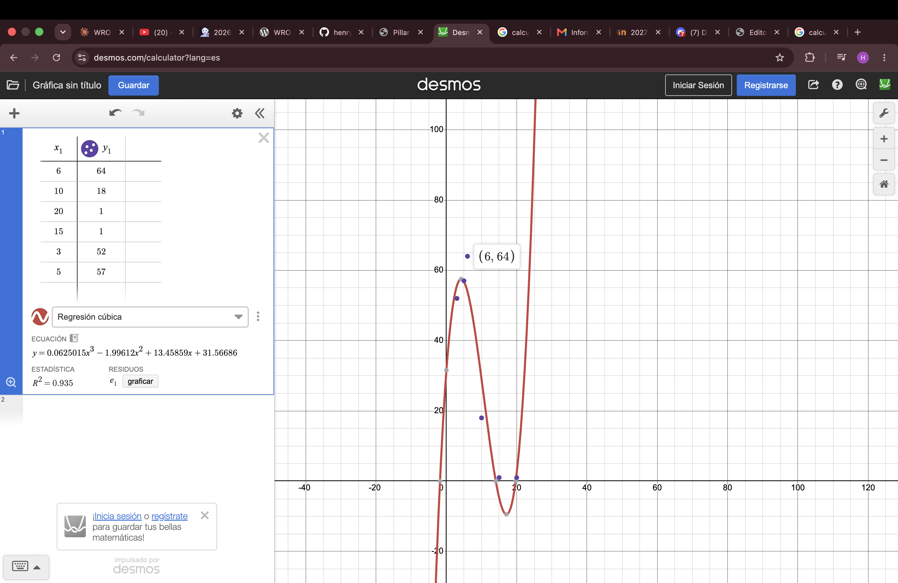

*x axis: `ROI_HEIGHT`; y axis: difference between "wall at 60 cm" and "no wall". Plotted in Desmos.*

**How to read the result:**
- **Height above ~10 → almost no difference.** The cone is so tall that, with no wall, it still hits something (the floor or objects behind), so "open" looks like "wall". This matches what we saw in Problem 16.
- **Height below 6 → the difference drops again.** Fewer receivers are used, so less light comes back, the signal is weaker and the readings are noisier.
- **Height 6 is the best balance:** narrow enough not to see the floor or pass over the wall, but with enough signal to measure well.

**Decision:** `ROI_HEIGHT = 6` and `ROI_WIDTH = 1`.

> **Update 25 Oct:** this decision was overturned by better data. A large difference between "wall" and "no wall" did not mean the reading was the correct distance: on the black wall, with the sensors angled 30°, ROI 1 × 6 gave about 2 m at every distance. The new choice is **ROI 16 × 8 with the sensors straight** — see [Phase 10](#12-phase-10--the-side-sensors-could-not-see-the-black-wall-2425-october-2026).

**Honest limits of this test (to check next):**
- The Desmos curve is a cubic regression (R² = 0.935). I used it only to **see** the trend. With 6 points a cubic curve has no physical meaning (for example it goes below zero between 15 and 20, which is impossible). The decision is based on the **measured points**, not on the curve.
- I did not test heights 7, 8 and 9. The best value could be between 6 and 10, so I will test those.
- The ST datasheet gives **4 × 4 as the minimum ROI**. The Pololu library accepts smaller values without an error, and width 1 gave the best results in my tests, but it is outside the official range. I will repeat the test with width 4 and compare how stable the readings are before fixing the value for the competition.

### 8.3 Problems and solutions

#### Problem 29 — The steering servo did not complete its movement ✅ (steering redesigned, section 9)
- **What I observed:** the servo did not reach the full left/right angles; in some tests it moved only toward one side.
- **Probable cause:** the Ackermann linkage of the new chassis is **too tight** (too much friction), so the servo does not have the force to move it through the whole range. A second possible cause is that the servo arm was mounted far from the middle of its range, so one direction is almost at the servo's end stop.
- **Why I did not force it:** a servo that pushes against a blocked mechanism heats up and can strip its gears. This already happened to the previous servo (Problem 17).
- **What I prepared:** `servo_calibration.ino` ([`src/hardware-tests/servo_calibration`](https://github.com/henryalejandrorieraloza-sudo/WRO-2026-Future-Engineers-Journal/tree/06f5685ccd94ee9dd8e3f550c635fe16d0a5c412/src/hardware-tests/servo_calibration)). From the Serial Monitor I type an angle (or `a` / `d` to move 1°) and the servo holds it, so I can find the real centre and the limits without forcing anything.
- **Next steps:** my teammate loosens the linkage; mount the servo arm with the servo at **90°** and the wheels straight, so there is the same range to both sides; then measure centre and limits, leaving 2–3° of margin before each mechanical stop.

#### Problem 30 — A wire of the right TOF sensor came unsoldered 🔄
- **What I observed:** the right sensor stopped answering (TIMEOUT). One of its wires had come off its solder joint.
- **Why it matters:** the sensor itself is probably fine, but a loose wire on a moving car can touch another pin and cause a short circuit (see Problem 31).
- **Solution:** solder the wire again and fix all sensor wires with tape, hot glue or cable ties so vibration cannot pull them.
- **Lesson:** after any mechanical work, run `tof_gyro_sensors_test` and check that the four sensors print `OK` before driving.

#### Problem 31 — The Nano ESP32 overheated after a code upload 🔄
- **What happened:** the robot was powered on by its battery. I connected the USB cable and uploaded new code. The upload failed (`dfu-util: error get_status: LIBUSB_ERROR_PIPE`, and on the next attempts `No DFU capable USB device available`, exit status 74), and the **u-blox NORA-W106 module** (the module that contains the ESP32-S3 chip of the Nano) became hot. I had not changed any wiring before this.
- **What I did:** disconnected the USB cable and the battery immediately, so a possible short circuit could not keep damaging the board.
- **Possible causes (not confirmed yet):**
  1. A **short circuit in the robot wiring**, for example the loose wire of Problem 30 touching a pin, or a sensor shorting the 3.3 V line to GND. The chip heats up because too much current flows.
  2. A pin received a **higher voltage than it accepts** (5 V or battery voltage on a 3.3 V pin), which can damage the chip permanently.
  3. Connecting USB with the battery on is normally safe on the Nano ESP32, so this is the least likely cause, but from now on I will avoid it.
- **Test plan to find the cause:**
  1. Remove the Nano from the robot, with **nothing** connected to its pins, and connect only the USB.
  2. If it stays cool and the port appears → the Nano is fine and the short circuit is in the robot. With a multimeter, measure between 3.3 V and GND of the robot wiring (without the Nano) to find it.
  3. If it heats up alone → the Nano is damaged and must be replaced, **but only after** the short in the robot is found, or the new board would be damaged too.
- **New safety rule:** to upload code, the battery is **off** and only the USB powers the Nano. Battery on only for driving tests, with the USB disconnected.
- **Update (8 Oct):** the Nano ESP32 did not recover. It was replaced by a **classic Arduino Nano (ATmega328P)**, which fits the same PCB headers with the same pin numbers. The code was moved to the standard `Servo.h` library, which works on this board. The exact cause of the failure is still not confirmed, so the safety rule stays.

#### Problem 32 — The first driving test could not be run 🔄
- **The test:** `drive_until_left_open.ino` ([`src/hardware-tests/drive_until_left_open`](https://github.com/henryalejandrorieraloza-sudo/WRO-2026-Future-Engineers-Journal/tree/06f5685ccd94ee9dd8e3f550c635fe16d0a5c412/src/hardware-tests/drive_until_left_open)). The car drives straight and stops (short brake) when the LEFT TOF reads more than **170 cm** two times in a row, which means the left wall has ended. It is the first step toward the corner detection of the Open Challenge.
- **Why it was not run:** the Nano failed during the upload (Problem 31), and the steering was not working (Problem 29).
- **Next step:** run it as soon as the Nano and the steering are fixed.

### 8.4 What this day gives the rubric

| Rubric criterion | Evidence from this day |
|---|---|
| Power and sensor architecture | A measured ROI experiment with a clear metric (difference wall / no wall), a plot, and an explanation of why big and small ROIs fail |
| Systems thinking and engineering decisions | A failure analysis of the overheating with possible causes, a test plan and a new safety rule for uploading code |
| Mobility and mechanical design | The steering problem traced to the linkage friction and the servo arm position, with a safe calibration method |
| Reproducibility | Test code for the servo and for driving, and a clear list of what must be checked before driving |

---

### 8.5 Final strategy defined (Wednesday 7 October 2026)

After the tests on the new chassis we fixed the strategy for both challenges. The full description, with diagrams, is in the [main README §8 and §9](../README.md#8-open-challenge-strategy).

**Open Challenge — what changed and why**

| Before (1 October) | Now (7 October) | Why |
|---|---|---|
| New distance references at the start of every straight | References `L_ref` / `R_ref` measured **once at the start**; after the first corner the car keeps the same distance to the **outer wall** | The outer wall never moves, so the same distance gives the same path in every section and every lap; the inner wall can be at 60 or 100 cm |
| Jump threshold with the old sensor setup | Jump detection with the ROI found by experiment (**ROI_WIDTH = 1, ROI_HEIGHT = 6**, §8.2) | That ROI gave the largest difference between wall and no wall, so the jump is clear |
| FRONT sensor as emergency backup for corners | Corners only by the side jump | Keep one clear corner rule that we can tune and test |
| Stop immediately after 12 corners | After the 12th turn: **drive a short distance, then brake** | The whole car must end inside the starting section |
| — | Jump detection ignored for a short distance after each turn | Avoid counting the same corner twice while the car straightens |

The turn always ends when the gyroscope says the car has rotated **exactly 90°**.

**Obstacle Challenge — new strategy**

- Steer until the closest pillar is in the **correct third of the image** (red → left third, so the car passes on its right; green → right third), then keep driving.
- When the camera detects a **floor line** at a corner, turn 90° with the gyroscope and increase the corner counter. We use the lines instead of the TOF jump because pillars near the walls could create false jumps.
- The side TOF sensors have priority: if a wall is too close, steer away from it.
- **Parking:** still being designed.

**Next:** implement both strategies on the Nano, tune `JUMP_THRESHOLD`, Kp/Kd and the final-straight distance on the track, and add floor-line detection to the camera code.

## 9. Phase 7 — Chassis v3, rack-and-pinion steering and silicone tyres (8–18 October 2026)

> The mechanical design in this phase was done by my teammate **Eduardo Rivadeneira**; I document it here because every change affected the software (steering limits, calibration, motor direction). All printed parts are in [`models/`](../models/README.md).

### 9.1 From Ackermann to rack and pinion

| Version | CAD | Printed | Steering |
|---|---|---|---|
| v1 | 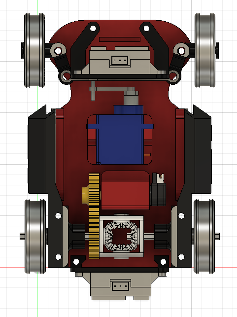 | 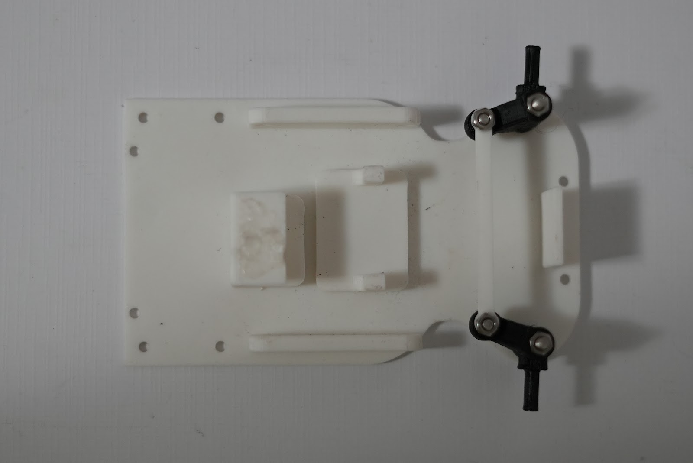 | Classic Ackermann |
| v2 | 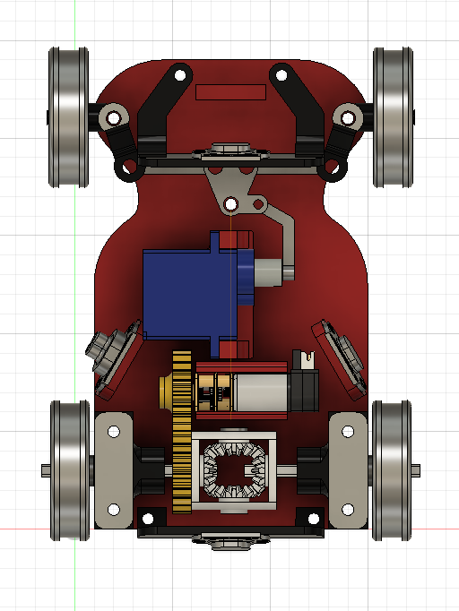 | 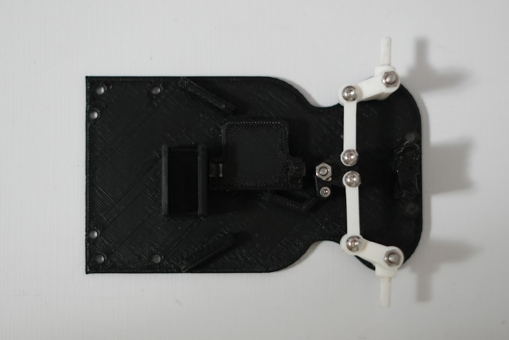 | Ackermann with a steering rack |
| v3 | 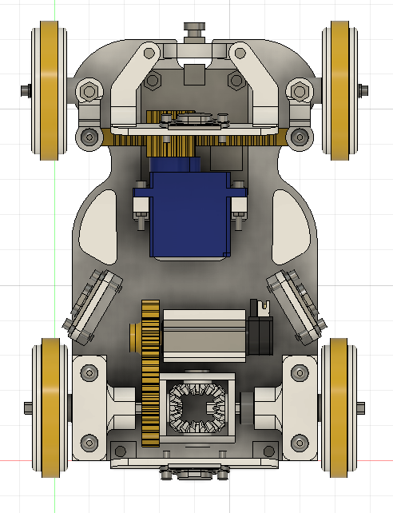 | 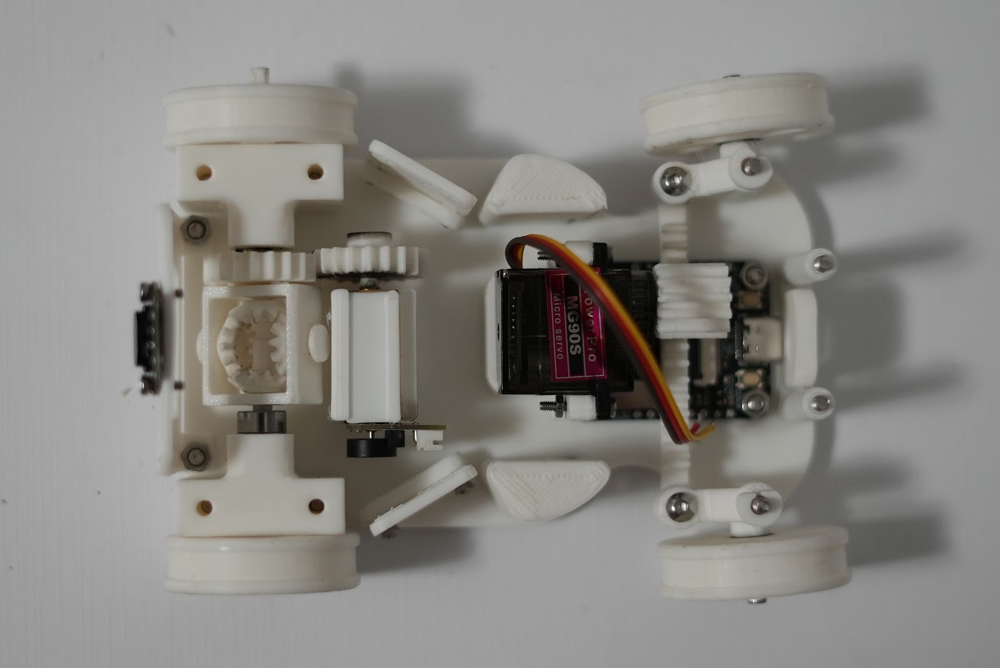 | **Parallel steering, rack and pinion** |

#### Problem 33 — The Ackermann steering destroyed three servos ✅
- **What happened:** on chassis 1 and 2 the Ackermann linkage had many printed joints and too much friction. The servo could not complete its travel (Problem 29) and, pushing against the linkage, **three servos were damaged** (Problem 17 was the first one).
- **Last case (10 Oct):** the new MG90 buzzed loudly and did not move after the wall-following PID tests, which used limits of 75° / 145°. That day the 3S battery was also unbalanced (the charger was only charging 2 of the 3 cells) and the rear motor did not move either, so a low voltage may have made it worse.
- **Decision:** change the mechanism, not the servo again. Chassis v3 uses **parallel steering with a rack and pinion**: a **12-tooth pinion, module 1 mm**, on the servo moves a **module 1 mm rack** connected to both knuckles.
- **Why:** fewer joints and almost no friction, so the servo is never blocked; the mechanism is much simpler and more reliable to print. Each degree of servo rotation moves the rack π × 12 mm / 360 ≈ 0.105 mm, always the same amount.
- **Trade-off:** parallel steering loses the Ackermann geometry, so the inner front wheel slips a little in turns. At our mass (248 g) and speed this is small compared with a servo that breaks.
- **Effect on the software:** new provisional values (15 Oct): centre 120°, **left limit 180°, right limit 50°** (left is now the larger angle), and on the new chassis `INVERT_STEER = true` and `MOTOR_REVERSED = true`. Tested with `servo_only_test` and `wall_keep_both_pid`.

### 9.2 Other changes from v2 to v3

| Change | Why |
|---|---|
| Tolerances corrected | Moving parts were either too loose or stuck; now they have just enough clearance to turn freely |
| Sizes adapted in the CAD (base v3) | v2 needed improvised adaptations; now they are part of the design |
| New camera mount and servo mount | Better fit, screwed to the base |
| **No tape**, every joint screwed | Tape showed that the design was not finished and let the geometry move |
| Side TOF sensors **1.5 cm** higher | Confirmed measurement of the change of Problem 16 |

Chassis v3: **13 cm long, 9 cm wide, 6 cm high**. The final car (chassis v4 with the front protrusion) is **17.5 cm long** and weighs **248 g** (see [models/README.md](../models/README.md)). N20 motor of **1000 rpm** driving a differential with a **1 : 1** gear ratio.

#### Problem 34 — A drive gear skipped when the motor reversed suddenly ✅
- **What I observed (10 Oct):** when the motor jumped suddenly to reverse, one gear of the drive train skipped.
- **Solution:** during a run the motor only drives **forward**; to stop it uses the short brake (not reverse). The wall-keeping sketches (`wall_keep_both_pid`, `wall_follow_nearest_pid`) only have a `motorForward()` function, so the motor can never jump into reverse.

### 9.3 Custom silicone tyres

The tyres are cast in printed moulds with **C25 silicone rubber** (parts A and B):

| | | | |
|---|---|---|---|
| 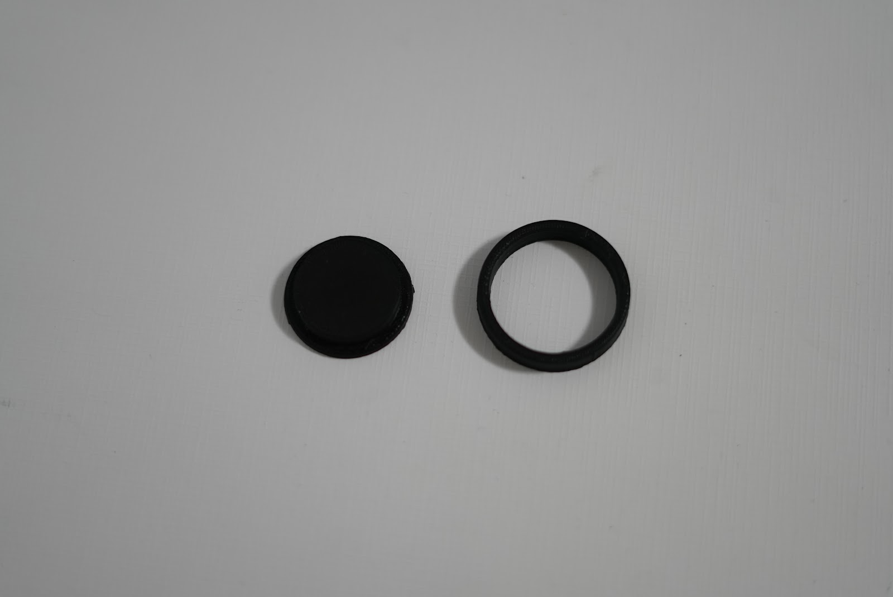 | 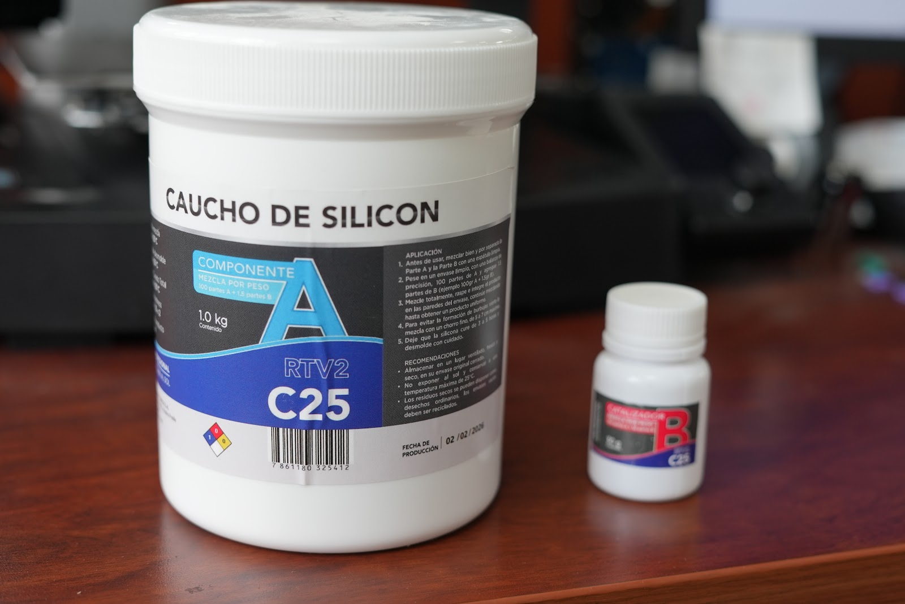 | 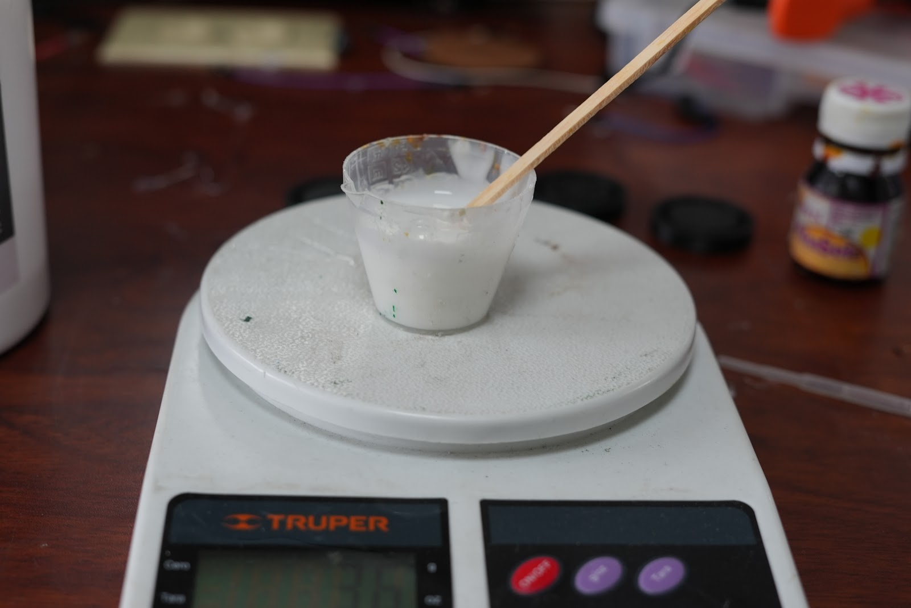 | 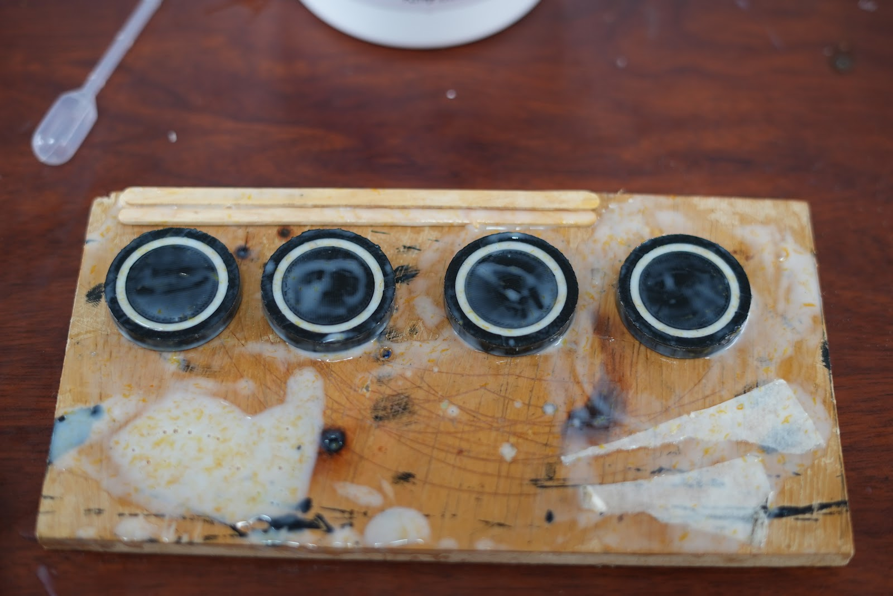 |
| Printed moulds | C25 silicone, parts A and B | 30 g of part A | Mixed and poured |

1. Weigh **30 g** of part A.
2. Add **23 drops** of part B. The amount comes from **B = ¾ · A** (A in grams, B in drops): ¾ × 30 = 22.5 → 23.
3. Mix until most bubbles are gone and pour into the moulds.
4. Wait **5–6 hours** until hard, then remove them.

**Why:** more grip than printed plastic, so the car slips less when it accelerates, brakes and turns, and the gyro turns and encoder distances stay accurate. The fixed formula makes every batch the same.

### 9.4 Power change: TOF sensors on the 5 V buck rail

The four TOF400C sensors are powered from the **+5 V buck rail**, like the camera and the other sensors. The classic Nano works with 5 V logic, so the 5 V sensors connect to it directly. The power budget was recalculated ([schemes §4.2](../schemes/README.md#42-power-budget)): typical ≈ 2.2 W (≈ 1.6 h per charge), peak ≈ 10.5 W. **Open risk:** the servo's current peaks now share the 5 V rail with the sensors. The 3 A buck margin should keep the rail steady, but this must be measured (the servo stall was later calculated at ≈ 1.27 A, not 650 mA; §24.10). Next step: measure the 5 V rail with a multimeter while the servo stalls and all four sensors are ranging.

This reverses the earlier plan to power the sensors from the Nano's 3.3 V pin, whose small regulator would have carried the sensors' current.

### 9.5 What this phase gives the rubric

| Rubric criterion | Evidence |
|---|---|
| Mobility and mechanical design | Three CAD + printed iterations, gear geometry (module 1, 12 teeth), torque and speed reasoning, trade-off Ackermann vs parallel |
| Power and sensor architecture | Recalculated power budget and a new failure point (servo peaks on the shared 5 V rail) with a test and a margin check |
| Systems thinking | A mechanical problem (friction) caused electrical damage (servos) and changed software constants: one decision fixed all three |
| Reproducibility | 28 STL files (26 printed parts + 2 tyre moulds), STEP assembly, tyre recipe and assembly order published in `models/` |

---

## 10. Phase 8 — Smooth wall following with the gyroscope (Tuesday 20 October 2026)

> **Result:** ✅ the car now drives along the nearest wall **straight and smooth**, at the same speed as before (`MOTOR_SPEED = 60`). Sketch: [`wall_follow_nearest_gyro`](https://github.com/henryalejandrorieraloza-sudo/WRO-2026-Future-Engineers-Journal/tree/f5aa0e6825ab4aaec6edc42665a4e4d067a71765/src/open-challenge/wall_follow_nearest_gyro).

The goal of the day was simple: at the start, pick the nearest side wall and keep exactly that distance, without zigzag and without slowing the car down. It took five versions to get there. Each version fixed one problem and showed the next one.

### 10.1 Iterations, in order

| Version | What changed | What the car did |
|---|---|---|
| 1. `wall_follow_nearest_pid` (15 Oct) | PID on the side distance, KP 0.5, KD 0.03, ±2 cm dead band | **Zigzag** (Problem 35) |
| 2. Smooth PID | KP 0.2, distance filter, servo limited to 2° per loop, max correction 25°, soft dead band | No zigzag, but **too slow** to correct |
| 3. Smooth PD v2 | KP 0.35, KD 0.08 on a filtered derivative, servo 5° per loop | Faster, but it moved **like a river**: long S-shaped waves (Problem 36) |
| 4. Less delay | TOF budget 50 → 33 ms, filters faster, servo 10° per loop, no dead band, KP 0.4, KD 0.12 | Corrected sooner, but stayed **a bit to one side** (Problem 37) |
| 5. + KI | KI 0.03 with a cap of 15° | Better, but still a small wave (Problem 38) |
| 6. **Gyroscope** ✅ | Two loops: distance → small target heading, gyroscope → steering | **Straight and smooth** |

### 10.2 Problems and solutions

#### Problem 35 — Zigzag while following the wall ✅
- **What happened:** with KP = 0.5, a drift of only 4 cm turned the servo 20°. The car overshot the reference again and again.
- **First fix:** lower KP, filter the readings and limit how fast the servo can move. The zigzag disappeared, but the car became too slow to correct.

#### Problem 36 — The car moved like a river (long S-shaped waves) ✅ (solved in Problem 38)
- **Why it happened:** the side TOF measures **distance**, not **where the car is pointing**. Inside the dead band the servo went back to the centre while the car was still tilted, so it crossed the band diagonally and overshot on the other side. When the car is tilted, the TOF also measures diagonally and the wall looks farther than it is, which makes the next correction too big.
- **Lesson:** the D term only "sees" the tilt through how the distance changes, which is slow and noisy.

#### Problem 37 — Too much delay: the correction arrived late ✅
- **What happened:** every smoothing step added delay: 50 ms per TOF measurement, slow filters and the servo speed limit. When the car finally corrected, it was already far, and the correction came as a sudden "whip".
- **Fix:** timing budget 33 ms (minimum in Long mode), faster filters (0.8 distance / 0.5 derivative), servo 10° per loop, no dead band. Then a small KI (0.03, capped at 15°) removed the constant offset to one side.

#### Problem 38 — A side distance sensor alone cannot drive perfectly straight ✅
- **Decision:** use the **BMI160 gyroscope**, which measures the heading directly, in a **two-loop (cascade) controller**:
  1. **Outer loop (distance, every TOF reading):** the distance error asks for a **small target heading**, at most **8°** toward or away from the wall (`K_DIST = 0.08`, `KI_DIST = 0.02`).
  2. **Inner loop (gyroscope, about 200 times per second):** steers the car to that heading (`K_HEADING = 2.0`) and brakes the rotation (`K_RATE = 0.15`).
- **Why it works:** the gyroscope corrects as soon as the car starts to rotate, **before** the distance changes. When the car reaches the right distance, the target heading returns to 0° and the gyroscope straightens it, so it does not overshoot.
- **Other details:** the gyroscope is calibrated for 1.5 s with the car still (300 samples); the TOF is read only when it has new data (`dataReady()`), so the loop never waits; the Serial Monitor prints only 10 times per second so printing does not slow the control loop.
- **Signs checked before driving:** turning the car left by hand must make `yaw` go up (`YAW_REVERSED`), and the wheels must steer the other way (`STEER_LEFT_IS_BIGGER = false` on our car).

#### Problem 39 — Upload failed: the port disappeared ✅
- **Error:** `cannot open port /dev/cu.usbserial-310: No such file or directory`. The sketch compiled correctly (12 448 bytes, 40 % of the Nano).
- **Cause:** the Nano had reconnected with a different port name.
- **Fix:** choose the current port again in *Tools → Port*; upload with the battery, motor and servo disconnected (same rule as Problem 26).

### 10.3 What this phase gives the rubric

| Rubric criterion | Evidence |
|---|---|
| Software and algorithms | Five measured iterations from a simple PID to a cascade controller, each with the reason for the change |
| Systems thinking | The limit was not the gains but the sensor: a distance sensor cannot measure heading, so a second sensor (gyroscope) solved it |
| Reproducibility | All gains and signs are grouped at the top of the sketch, with the test to check each sign |

**Next:** stop the car with the short brake when a side distance becomes larger than a threshold (the wall ended → a corner), as the first step of the 90° gyro turn.

---

## 11. Phase 9 — From one corner to the full loop (21–24 October 2026)

> **Result:** ✅ one complete corner validated on the track ("works excellent"): the car decides the turn side, turns 90°, checks the turn and follows the inner wall. 🔄 The 13-turn loop runs, but showed that the side sensors were giving us wrong data (Phase 10).

### 11.1 What we built, in order

| Date | Version | What it added | Result |
|---|---|---|---|
| 21 Oct | [`corner_turn_front_trigger`](https://github.com/henryalejandrorieraloza-sudo/WRO-2026-Future-Engineers-Journal/tree/f5aa0e6825ab4aaec6edc42665a4e4d067a71765/src/open-challenge/corner_turn_front_trigger) | Gyro wall following + opening memory + FRONT < 1400 mm starts the 90° turn | ✅ Never hit a wall; very rarely chose the wrong side |
| 21 Oct (night) | [`corner_turn_timed`](https://github.com/henryalejandrorieraloza-sudo/WRO-2026-Future-Engineers-Journal/tree/f5aa0e6825ab4aaec6edc42665a4e4d067a71765/src/open-challenge/corner_turn_timed) | No front sensor: brake after `RUN_MS`, turn toward the opening or toward the farther side; integral on the heading loop | ✅ Validated |
| 22–23 Oct | One-corner version (10 iterations) | After the turn, a separate function `sideWallRun()` with three phases: **0** find the inner wall, **1** deviate to a target distance, **2** precise P+I+D on that wall; brake when it ends. FRONT/BACK check after the first turn | ✅ "Works excellent" |
| 24 Oct | Open Challenge loop | Repeats straight → corner → 90° turn up to `TOTAL_TURNS`, absolute headings (90°, 180°, 270°…), FRONT/BACK check only on the first turn, final straight of 1 s and brake | 🔄 Runs, but drifted toward the inner wall lap after lap |

### 11.2 Problems and solutions

#### Problem 40 — The car stopped in the middle of the straight after the turn ✅
- **What happened:** a single false reading at the end of the corner was taken as "inner wall found", the car started a 20° deviate manoeuvre, the sensor tilted with the car, lost the wall and the car braked.
- **Fix:** 3 readings in a row to confirm the wall, ignore the first 300 ms after the turn, deviate angle lowered to 12°, and the "wall ended" jump only counts in phase 2 (when the car is already following the wall).

#### Problem 41 — After the turn the car did not see the end of the wall and kept going ✅
- **Fix:** an independent brake for a jump of more than 500 mm (`jumpStop`), active only in phase 2.

#### Problem 42 — The car sometimes turned to the wrong side at the first corner 🔄 (root cause found in Problem 46)
- **What we tried:**
  1. A 500 mm jump **before** the turn as a second way to find the opening (`checkJumpOpening()`) → false positives with the far wall → disabled (`PJ_USE_JUMP = false`).
  2. Opening threshold raised to 2600 mm, `RUN_MS` to 1600 ms.
  3. Compare the sides only with **valid** readings: invalid readings had been counted as 4000 mm and inflated the average of a real wall. Now the car waits still until it has 10 valid readings per side (a side that cannot get them in 2 s counts as open).
  4. FRONT/BACK check after the first turn: if BACK > FRONT the turn was wrong → undo it backwards and turn to the other side. An invalid close reading had been counted as "far", which made the check unreliable → fixed.
- **Why it was still not 100 %:** the side sensors were not measuring the wall at all at long distances (Phase 10).

#### Problem 43 — In the loop, every lap the car got closer to the inner wall until it hit it ✅
- **What happened:** the error grew turn after turn, so it was not the PID of one straight but something carried from one straight to the next.
- **Fixes, in order:**
  1. Integral of the wall PID only active close to the target, frozen (not reset) outside that zone → it stopped "charging up" while the car was far from the target.
  2. Asymmetric gains: gentle toward the wall, stronger away from it, and a **danger zone** that forces the maximum lean away when the car is too close.
  3. Strong filtered D term to stop the car travelling diagonally into the wall.
  4. **Root cause:** each new straight heading was `previous + 90°` from the gyroscope. A gyro error of ~1.5° per turn becomes > 8° after 6 turns, more than the wall PID can correct (±8°). **Solution:** the wall itself is the heading reference. While the car is on target and the distance is not changing (parallel to the wall), its yaw is the real direction of the wall; the next turn starts from that value (`REALIGN_WITH_WALL`). The gyro error is erased at every straight and can no longer accumulate. Each lap "starts fresh", like the first straight.
- Other settings decided: target distance 600 mm, 500 ms straight after the wall ends before turning, deviate manoeuvre only on the first straight.
- **Rules check (25 Oct):** the loop was tested with `TOTAL_TURNS = 13`. Starting in the starting section, 3 laps are exactly **12** corners; after the 12th turn the car is back in the starting straight. A 13th turn would carry it out of the starting section, and rule 9.24.3 ends the round without the 3 points for stopping. The competition value is `TOTAL_TURNS = 12`.

#### Problem 44 — Close or far: after the turn the car chose wrong when deciding too early ✅
- **What happened:** right after the turn the car is still in the corner area; the inner-side sensor sees the **tip** of the inner wall diagonally, not the wall beside it.
- **Fix:** `SW_MIN_MS = 1000` (decide 1 s after the turn). With this it chose close / far correctly almost every time.

#### Problem 45 — The car did not detect the hole (end of the inner wall) 🔄 (explained in Problem 46)
- **Cause in the code:** when the wall ends, the sensor usually gives an **invalid** reading (status error, value −1), and the hole detection ignored invalid readings, so its counter never increased.

### 11.3 What this phase gives the rubric

| Rubric criterion | Evidence |
|---|---|
| Software and algorithms | Ten measured iterations of one corner; the "wall as heading reference" idea solved an error that no PID gain could solve |
| Systems thinking | The drift was traced to a sensor (gyroscope scale error) and solved by using a second reference (the wall) |
| Risk | The FRONT/BACK check is a safety net that undoes a wrong turn instead of hitting a wall |

---

## 12. Phase 10 — The side sensors could not see the black wall (24–25 October 2026)

> **Result:** ✅ we found, with data, the cause behind Problems 42, 44 and 45: with the side sensors angled 30° and the ROI 1 × 6, the TOF **did not see the black wall**; it was measuring the floor and far reflections at ~2 m. With the sensor **straight (facing the wall squarely) and ROI 16 × 8**, it measures the wall within 1–2 cm, with 30/30 valid readings, up to ~45 cm. This changes the Open Challenge algorithm: it becomes **simpler**.

### 12.1 First sign: the numbers did not make sense

With [`tof_left_right_print`](https://github.com/henryalejandrorieraloza-sudo/WRO-2026-Future-Engineers-Journal/tree/06f5685ccd94ee9dd8e3f550c635fe16d0a5c412/src/hardware-tests/tof_left_right_print) (only LEFT and RIGHT, robot settings: ROI 1 × 6, 33 ms) **every reading was "signal fail"**:

| Test | LEFT min / max / mean | RIGHT min / max / mean |
|---|---|---|
| 1 — "far" wall on the left | 219.6 / 243.7 / **230.7 cm** | 173.2 / 198.4 / 186.9 cm |
| 2 — "close" wall on the left | 85.0 / 112.8 / **98.4 cm** | 176.0 / 203.4 / 188.3 cm |

We used a 165 cm threshold between both cases and it worked "quite well", but the hole was never detected (Problem 45) and the right side read ~187 cm in both tests. Something was wrong with the sensor itself, so we stopped tuning thresholds and measured.

### 12.2 Experiment 1 — ROI and timing budget, car parallel to the wall (sensor at 30°)

Sketch: [`tof_roi_budget_test`](https://github.com/henryalejandrorieraloza-sudo/WRO-2026-Future-Engineers-Journal/tree/06f5685ccd94ee9dd8e3f550c635fe16d0a5c412/src/hardware-tests/tof_roi_budget_test). Car still, black track wall at a known distance (tape measure), 30 readings per configuration. Median of the readings (all of them "signal fail" or invalid):

| Real distance | 1×6, 33 ms (robot) | 4×4, 33 ms | 8×8, 33 ms | 8×8, 50 ms | 16×16 |
|---|---|---|---|---|---|
| 30 cm | 198 | 215 | 112 | 80 | all invalid |
| 40 cm | 201 | 220 | 128 | 88 | all invalid |
| 50 cm | 207 | 219 | 150 | 107 | all invalid |
| 60 cm | 216 | 227 | 171 | 131 | all invalid |
| **No wall** | **217** | **227** | **177** | **138** | all invalid |

**Conclusion:** with the robot settings, a wall at 30 cm and **no wall** gave almost the same number (~2 m). "Far wall" and "nothing" looked identical, which explains the wrong-side decisions (Problem 42) and the hole that was never detected (Problem 45). The 230 cm "far wall" of §12.1 was probably not the wall.

### 12.3 Experiment 2 — what is wrong: the sensor, the angle or the wall?

Same position (wall at ~30 cm, sensor at 30°), three changes:

| Condition | 1×6 33 ms | 1×6 50 ms | 8×8 33 ms | 8×8 50 ms | 16×16 33 ms | 16×16 50 ms |
|---|---|---|---|---|---|---|
| Black wall, sensor at 30° | ~198 ✗ | ~163 ✗ | ~112 ✗ | ~80 ✗ | invalid | invalid |
| **White matte sheet** on the wall, sensor at 30° | invalid | 35.6 ✓ (30/30) | 34.4 ✓ (30/30) | 34.6 ✓ (30/30) | 35.4 ✓ (30/30) | 35.6 ✓ (30/30) |
| Black wall, **sensor straight** (facing the wall) | invalid | invalid | invalid | 33.4 ✓ (23/30) | **32.0 ✓ (30/30)** | **32.1 ✓ (30/30)** |

(Expected value at 30°: 30 / cos 30° ≈ 35 cm. Spread of every ✓ result: less than 1 cm.)

**Conclusions:**
1. **The sensor works.** With the white sheet it measured 34–36 cm, all "range valid", with less than 1 cm of spread.
2. **The black wall at 30° reflects the laser away, like a mirror,** so almost no light comes back. With the sensor **straight**, the same black wall is measured correctly.
3. **ROI 1 × 6 is the worst setting:** it was invalid even with the white sheet. It is below the 4 × 4 minimum of the ST datasheet. Our ROI experiment of §8.2 measured differences between "wall" and "no wall" without checking that the numbers were correct distances, and it already listed this as a limit to check.
4. **"Signal fail" readings lie:** they gave believable numbers that were wrong (63 cm with the wall at 30 cm). From now on they are never used as distances.

### 12.4 Experiment 3 — sensor straight: which ROI, and how far?

Black wall, sensor straight, 50 ms. Median (valid readings out of 30):

| ROI (width × height) | 40 cm real | 60 cm real | 80 cm real |
|---|---|---|---|
| 16×16 | 35.7 (30/30) | 51.0 (30/30) | — |
| **16×8** | **38.1 (30/30)** | **59.2 (8/30)** | invalid |
| 16×6 | 38.5 (29/30) | invalid | 75.7 ✗ (1 "signal fail") |
| 8×16 | 35.8 (30/30) | 51.5 (1/30) | invalid |
| 6×16 | 36.1 (10/30) | invalid | invalid |
| 4×16 | invalid | invalid | 65.5 ✗ ("signal fail", false) |
| 16×4 | invalid | invalid | invalid |

**Conclusions:**
1. **The error is always too short and grows with distance** (16×16: −4 cm at 40, −9 cm at 60). This is what happens when the floor enters the cone: the taller the cone, the more floor it sees.
2. **16 × 8 is the best:** wide and low, it measures the real distance (38.1 at 40 cm; a second test gave 38.9) with less than 1 cm of spread.
3. **Reliable range with the black wall: about 45 cm.** At 60 cm, 16×8 gives only 8/30 valid readings; at 80 cm nothing narrow is valid.
4. **Fix on the car:** side sensors **straight (0°)** instead of 30°, centre of the sensor at about **5 cm** from the floor (half of the 10 cm wall) and level. With a 16×8 cone (about ±7° vertical) the beam at 50 cm then covers roughly −1 to +11 cm, almost all of it on the wall.

### 12.5 Why we had angled the sensors, and why we changed our mind

We angled the side sensors 30° forward ([CHANGELOG v0.9](../CHANGELOG.md), 20 Oct) so that they would see the end of a wall **earlier**. The data shows the price: on the black competition wall, an angled beam gets almost no light back, so the sensor gives us no information at all. Seeing the corner a little earlier is useless if the reading is wrong. A straight sensor sees the end of the wall a bit later, but the code already handles this (the car keeps driving straight for a short time before the 90° turn, and the gyroscope does the turn). **We chose correct data over early data.**

### 12.6 How this changes the algorithm: simpler

With the straight sensors and ROI 16 × 8, **each reading is either "wall" (valid and accurate) or "no wall" (invalid)**. The car no longer has to guess distances it cannot measure. Provisional rules (to confirm after remounting the sensors, at 30, 45 and 60 cm):

| Reading | Meaning |
|---|---|
| "Range valid" and ≤ 550 mm (`WALL_MAX_MM`) | **WALL**, and the distance is reliable |
| Anything else ("signal fail", other status, > 550 mm) | **NO WALL** (its number is never used) |

Why 550 mm: at 400 mm 100 % of the readings were valid in both tests; at 600 mm only 0–27 %.

Decisions use a **window of the last 8 readings**, never a single one:

| WALL readings out of 8 | Result |
|---|---|
| 6 or more (≥ 75 %) | **WALL**: distance = median of the valid readings |
| 2 or fewer (≤ 25 %) | **NO WALL** |
| 3 to 5 | **NOT SURE**: no decision, wait for more readings |

What becomes simpler:

| Before | Now |
|---|---|
| Opening = side reading > 2400–2600 mm | Opening = that side becomes **NO WALL** |
| Turn side = compare two noisy far averages (~2 m) | Turn side = the side **without** a wall |
| Close / far threshold of 165–185 cm, calibrated with bad readings | Close / far = valid readings or not |
| Hole = jump of more than 500 mm | Hole = the wall being followed becomes **NO WALL** |
| "Signal fail" accepted as a distance | Never used |
| Target distance 600 mm (outside the reliable range) | The car always drives **close to a wall** (< ~45 cm), where the sensor is accurate |

### 12.7 Safety comes first

A simpler algorithm does not mean a riskier one. Our priority for the competition is to **finish the three laps safely and stop in the starting section**, even if the run is slower. Points for completed laps are lost if the car hits a wall; a few seconds are not. These safety rules stay in every version:

- **Never guess:** if the window says NOT SURE, the car slows down or stops and measures again with the car still (median of several readings) before deciding the turn side.
- **Front safety always on:** if the FRONT sensor sees something too close, the car brakes, also during the first straight and during turns, and it does not depend on the BACK sensor.
- **FRONT/BACK check after the first turn:** a wrong first turn is undone instead of continuing into a wall.
- **Time limits:** every straight and every phase has a timeout; if it is reached, the car brakes instead of driving blind.
- **Speed chosen for reliability:** slower after turns and during decisions (`SW_SPEED`), so the sensors have time to give enough valid readings.
- **The wall corrects the heading every straight** (Problem 43), so a small gyro error can never grow into a crash in the third lap.
- **Active brake** (both TB6612FNG inputs HIGH) at the end, and the motor only drives forward during a run (Problem 34), except the controlled undo of a wrong first turn.

#### Problem 46 — The side TOF sensors could not see the black wall at 30° ✅ (cause found; remounting in progress 🔄)
- **Cause:** angled beam (30°) on a black wall + ROI 1 × 6 (below the datasheet minimum) + sensor too low (floor in the cone).
- **Solution:** sensors straight (0°) at ~5 cm from the floor, ROI 16 × 8, only "range valid" readings, decisions by valid / invalid with a window of 8 readings.
- **Pending:** remount the sensors and repeat the test at 30, 45 and 60 cm with 16×8 at 50, 100 and 140 ms (more time = more light) to fix the final values.

### 12.8 Decisions reviewed against the data and the rules (25 October)

After Phase 10 we went through every setting of the Open Challenge code and asked: *is there a measurement, a geometric reason or a rule behind this value?* These had none, or had one that the new data proved wrong:

| Setting before | Problem with it | Now | Justification |
|---|---|---|---|
| `TOTAL_TURNS = 13` | No reason recorded | **12** | 3 laps × 4 corners; a 13th turn leaves the starting section and loses the 3 stop points (rule 9.24.3) |
| Target distance to the inner wall 600 mm | Outside the sensor's reliable range (~450 mm on the black wall) | **≈ 250 mm** (provisional) | Centres the 95 mm car in a 600 mm corridor and keeps ≥ 155 mm from the outer wall even at the −100 mm tolerance (rules 8, 9.18) |
| Opening / hole thresholds 2400, 2600, 3000 mm; close / far 1650–1850 mm; front stop 1400 mm | Tuned on readings that were floor reflections at ~2 m, not the wall | **Removed**: valid / invalid decisions | Journal §12.2: wall at 30 cm and no wall both read ~2 m |
| "Signal fail" accepted as a distance | Gave believable wrong numbers | **Only "range valid"** | 63 cm read with the wall at 30 cm; 65.5 cm with the wall at 80 cm |
| One reading decides (`SIDE_CONFIRM = 1`, `SW_WALL_CONFIRM = 1`) | A single bad reading changed the turn side | **Window of 8 readings, NOT SURE band** | 30/30 valid at 40 cm, 0/30 without wall, 0–27 % at 60 cm |
| ROI 1 × 6 | Below the 4 × 4 minimum of the ST datasheet; invalid even on a white sheet | **16 × 8** | Journal §12.3–12.4 |
| Side sensors angled 30° | Black wall reflects the beam away | **0°** | 198 cm vs 32.0 cm for the same 30 cm wall |
| 500 ms straight before each turn | No reason recorded | Kept for now, **to become a distance** | 500 ms at 0.3–0.5 m/s ≈ 15–25 cm, more than the 13 cm car, so the rear clears the inner corner; time depends on speed and battery, so the encoder will replace it |
| Gyro calibration with 200, 300 or 1000 samples in different sketches | Inconsistent, no reason | **1000 samples (≈ 3 s)** | More samples = more exact offset; done while the car waits for the start button, so it costs no race time and needs no team input (rules 9.9, 9.11) |
| Encoder wired to D2 / D3 but never read | Looked like an unused part | **Explained and planned** | Needed for the two distances that time cannot measure well: before each turn and the final straight inside the starting section |
| Long mode in the driving code, Short mode in the sensor test | Inconsistent | **To compare in the next test** | With a useful range of only ~45 cm, Short mode (more robust to ambient light according to the datasheet) may be better |

The full list of settings with their reasons is in the [README §10.4](../README.md#104-why-each-setting-has-its-value).

### 12.9 What this phase gives the rubric

| Rubric criterion | Evidence |
|---|---|
| Sensor architecture | Sensor placement justified with measured data and field geometry (black 10 cm wall, cone size, floor) |
| Engineering decisions | "Why straight instead of 30°": correct data over early data, with three experiments and a control (white sheet) |
| Software | The algorithm is simplified because the sensor data is now trustworthy; safety rules kept explicitly |
| Honesty / iteration | Our own earlier ROI experiment (§8.2) was overturned by better data, and we explain why |

### 12.10 Next algorithm: encoder delays and a fixed decision tree (Sunday 25 October, night)

After reviewing the rules and the sensor data, I compared several ways to drive the Open Challenge before writing new code.

**Why not reinforcement learning?** RL needs thousands of attempts; on the real track each attempt means placing the car, waiting and charging the battery, and a simulator would not model what actually goes wrong for us (black walls that the TOF cannot see, the USB vs battery difference, the steering centre at 120°). The task can be written as clear rules, so a state machine with PID is more reliable, easier to debug and easier to explain. We considered PID, feedforward, geometric path tracking (Pure Pursuit), LQR, MPC, imitation learning and RL; we keep **state machine + cascade PID**, and the encoder improves it.

**What changes.** Every wait that was measured in **time** becomes a distance measured with the **encoder** (already wired, not used yet). A timed delay covers more distance with a full battery than with a low one, and the car behaved differently on USB than on battery. The full decision tree is in [§25.3](#253-decision-tree-with-encoder-delays-planned-25-october-was-readme-87):

1. **First straight:** follow the nearest wall; when one side opens, store it as the direction of the round, wait N encoder turns, turn 90°.
2. **After the first turn:** follow the outer wall until the inner wall appears, then start searching for openings.
3. **Loop:** follow the inner wall → opening → N encoder turns → 90° turn → M encoder turns without searching (so the corner itself is not taken as an opening) → follow the inner wall again.
4. **After 12 turns:** X encoder turns, active brake, stay still.

**Open questions to measure:** encoder ticks per millimetre, turning radius at full lock, and where the opening appears for a 1000 mm and a 600 mm next corridor (the opening appears later before a narrow corridor, so one fixed N may not fit both).

---

## 13. Phase 11 — Obstacle Challenge: from pixels to centimetres (26–27 October 2026)

After the Open Challenge decision tree I moved to the Obstacle Challenge. In two days the camera went from "there is a red pillar on the left" to "the pillar is 31 cm ahead and 9 cm to the right", the car passed every straight-with-pillars case on the track, and the camera learned to measure the floor lines in centimetres. The method is explained with all formulas in [README §9](../README.md#9-obstacle-challenge-strategy).

### 13.1 What I built, in order

1. **320 × 240 pictures (26 Oct).** The algorithm only looks at a band of the picture, so I doubled the resolution and process only that band. The pictures had more noise than at 160 × 120.
2. **Magenta parking walls.** The camera saw the magenta walls dull (H ~330–354°), right next to red. A shape filter did not separate them; a majority vote did (Problem 48).
3. **First driving test** (`obstacle_first_test`): wheels to full lock toward the pillar's side until the pillar is on its correct side, straight until it leaves the picture, a few encoder cm more, back to the start heading, stop at the blue line.
4. **Camera v2 (27 Oct):** red flickered much more than green, so I froze the camera, detected pillars on 4 × 4 blocks and added a time filter (Problem 50).
5. **Distance in cm.** `straight_measure` (motor off) printed the camera's estimate while I placed pillars with a tape measure (Problem 51). The camera reaches ~50 cm, sees a centred pillar down to 3 cm, and loses a pillar passed at the safe distance through its side **15 cm** ahead.
6. **`straight_pillars`**: the odometry map + steering law, simulated first (camera delay, noise, 20–40 cm/s), then on the track. The car reacted late (Problem 53), then the encoder constant was wrong (Problem 54); after both fixes **every case passed**.
7. **Floor lines (night of 27 Oct):** camera v3 detects the orange and blue lines with a "long and thin" test and sends 4 more fields; `line_test` on the Nano printed what the camera saw while I measured the row → distance table (Problems 55–58).

### 13.2 Measurements

**Pillar distance** (`straight_measure`, `FOCAL_PX = 112`):

| Pillar position | Real | Camera said |
|---|---|---|
| Centred | 30 cm | 35 cm ahead |
| Centred | 50 cm | 59 cm ahead, −3 cm side |
| Edge 10 cm from the car (centre 16.75 cm to the side) | 50 cm | 51 cm ahead, ±18 cm side (same both sides) |
| Centred | 80 cm | not detected (search band ends at ~50 cm) |

→ `FOCAL_PX = 100`, the value that fits all of them best.

**Encoder:** pushing the car by hand, 980 ticks = 66 / 65.5 / 63.5 cm (average 65 cm) → **15.1 ticks per cm**.

**Floor line, row straight ahead → distance** (`line_test`):

| Distance | 2 cm* | 5 cm | 8 cm* | 10 cm | 15 cm | 16 cm | 18 cm | 22 cm |
|---|---|---|---|---|---|---|---|---|
| Row | 192 | 176 | 158 | 153 | 145 | 145 | 143 | 141 |

\* car parallel to the wall, as it really arrives at a corner; the others with the line in front of the car. Fit: **distance = 276.2 / (row − 129.2) − 1.8**, error ≤ 1 cm at every point. With an empty floor the camera reports no line (no false lines).

**What the camera said about the line at 20 and 25 cm** (camera Serial Monitor): at 20 cm `ORANGE yes | center 141 | len 60–77 | thick 2 | px 103–133`; at 25 cm `ORANGE no (few pixels) | px 22–39`.

### 13.3 The math, step by step

Everything the car does in the Obstacle Challenge comes from a few ideas of trigonometry. This section explains each one from the beginning, with the reason it is used and a worked example with real numbers from our car. (The same formulas, shorter, are in [README §9.3–9.6](../README.md#93-from-pixels-to-centimetres).)

#### 13.3.1 Tangent and arctangent (`tan`, `atan`)

In a right triangle, the **tangent** of an angle is the opposite side divided by the adjacent side:

```
            •  (object)
           /|
          / |  opposite
         /  |
        / a |
 (car) •----+
         adjacent

 tan(a)  = opposite / adjacent
 atan(r) = the angle whose tangent is r      (the inverse: from a ratio back to the angle)
```

- If we know the angle and one side, `tan` gives the other side.
- If we know both sides, `atan` gives the angle.

We use it in both directions: the camera turns **pixels into an angle** (`atan`), and the steering turns **"how far to the side / how far ahead" into a heading** (`atan2`).

#### 13.3.2 The pinhole camera: from a pixel to an angle

A camera behaves like a box with a tiny hole. Light from an object goes straight through the hole and lands on the sensor. The distance from the hole to the sensor, measured in pixels, is the **focal length f** (`FOCAL_PX = 100` for our camera).

```
   sensor          hole                        world
     |              •
 xc  |            / |                            • pillar
 px  |  ←  f  →  /  |            side (cm)       |
     |----------•---+--------------------------- + --- straight ahead
                    |←———————— ahead (cm) ——————→|
```

The two triangles (inside the camera and outside) have the **same angle a**, so their sides are proportional (similar triangles):

```
tan(a) = xc / f = side / ahead
```

- `xc` is how many pixels the pillar is from the real centre line of the picture.
- So `a = atan(xc / f)` is the angle between the car's direction and the pillar.
- And `side = ahead · xc / f`: once we know how far ahead the pillar is, we know how far to the side.

**Why `X_CENTER_OFFSET = 12`:** a pillar placed exactly in front of the car appeared 12 px right of the middle of the picture. The camera is turned a little: atan(12 / 100) ≈ 7°. So `xc = x − 12`, measured from the line the car really drives along.

#### 13.3.3 Distance from the width (similar triangles again)

The same proportion works for sizes: an object `S` cm wide at a distance `D` looks `f · S / D` pixels wide. We know the real width of a pillar, so we can solve for the distance:

```
width_px = f · S / ahead      →      ahead = f · S / width_px
```

**Why `S = 5 · (cos a + sin a)` and not just 5 cm:** a pillar is a 5 × 5 cm square seen from above. Straight on, only its front face shows: 5 cm. From an angle `a`, a second face also shows, and the total width the camera sees is the projection of the square:

```
 straight on (a = 0°):  ▮  front face only       → 5 · (1 + 0)        = 5.0 cm
 a = 20°:               ▮▯ front + part of side  → 5 · (0.94 + 0.34)  = 6.4 cm
 a = 45°:               ◆  two faces equally     → 5 · (0.71 + 0.71)  = 7.1 cm
```

Without this correction a pillar to the side would look wider, and the formula would say it is **closer** than it really is.

**Worked example (red pillar 20 px wide, centre at x = +40 px):**

```
xc     = 40 − 12                    = 28 px
a      = atan(28 / 100)             = 15.6°
S      = 5 · (cos 15.6° + sin 15.6°) = 5 · (0.963 + 0.269) = 6.2 cm
ahead  = 100 · 6.2 / 20             = 31 cm   (to the front face)
side   = 31 · 28 / 100              = 8.7 cm  (to the right)
```

**How `f = 100` was chosen:** with 112, real 30 cm read 35 cm and real 50 cm read 59 cm (about 15 % too long). Since `ahead` is proportional to `f`, lowering `f` shortens every distance by the same factor; 100 was the value that fit all the measurements (centred and to the side) best.

#### 13.3.4 The map: rotating between "car view" and "map view" (`cos`, `sin`)

The camera says where the pillar is **from the car** (`fwd` ahead, `left` to the left). The map needs it **on the track** (x along the straight, y across it). If the car is turned by the heading `h`, its "ahead" and "left" directions on the map are:

```
ahead direction = ( cos h,  sin h)
left  direction = (−sin h,  cos h)
```

So a point `fwd` ahead and `left` to the left of the car is at:

```
pillarX = carX + fwd · cos h − left · sin h
pillarY = carY + fwd · sin h + left · cos h
```

This is a **rotation**: the same idea as turning a sheet of paper. With h = 0 it is just `pillarX = carX + fwd`, `pillarY = carY + left`. The opposite rotation (`relativeToCar`) gives where a stored pillar is from the car now:

```
fwd  =  (pillarX − carX) · cos h + (pillarY − carY) · sin h
left = −(pillarX − carX) · sin h + (pillarY − carY) · cos h
```

**Example:** car at (50, −5) turned h = −10° (to the right), pillar seen 30 cm ahead and 4 cm to the left:

```
pillarX = 50 + 30 · 0.985 − 4 · (−0.174) = 50 + 29.5 + 0.7 = 80.2 cm
pillarY = −5 + 30 · (−0.174) + 4 · 0.985 = −5 − 5.2 + 3.9  = −6.3 cm
```

`fwd = ahead + 2.5`, because the camera measures to the **front face** and the map stores the **centre** of the pillar; `left = −side`, because the camera counts the right as positive and the map counts the left as positive.

#### 13.3.5 Odometry: adding small steps

Every loop the encoder says how many ticks the wheel turned. With 15.1 ticks per cm, `ds = ticks / 15.1` cm. During that small step the car moved in the direction of its heading, so the same rotation gives:

```
carX += ds · cos h
carY += ds · sin h
```

`h` is the **average** of the heading before and after the step. In a curve the heading changes during the step; using the middle value is more exact than using the start or the end (the error per step becomes much smaller).

**Why the encoder constant mattered so much:** with the wrong 19.6 ticks per cm, every `ds` was 15.1 / 19.6 = 0.77 of the real distance: the map thought the car had moved 23 % less, so pillars on the map "stayed" ahead longer and the car reacted late.

**Averaging repeated detections (`BLEND = 0.3`):** when the camera sees a pillar already on the map, the stored position moves 30 % toward the new one: `x = x + 0.3 · (new − x)`. After n new detections, the first one weighs only 0.7ⁿ (after 5: 17 %). Recent measurements (taken closer, so more exact) count more, and the noise of single pictures is smoothed.

#### 13.3.6 How much to turn: `atan2`

The car wants to reach a lateral position `goalY` before the pillar. The straight path from the car to that point has a slope `(goalY − carY) / look`, where `look` is the distance ahead left to get there. The heading of that path is its angle:

```
heading = atan2(goalY − carY, look)

          goal •
              /|
             / | goalY − carY
            /  |
   car •---/---+
          ← look →
```

- `atan2(y, x)` is `atan(y / x)` but it also knows the signs of `y` and `x`, so it gives a negative angle (turn right) when the goal is to the right, and it never divides by zero.
- **`look = max(12, pillarX − 2.5 − carX − 10)`:** the distance from the car to 10 cm **before** the pillar's front face. The car should already be at the safe side when it gets there. The minimum of 12 cm stops the angle from growing huge right next to the pillar (a tiny `look` would give almost 90°).
- **Limited to ±45°:** in the simulation, 35° was not enough to reach the second pillar; more than 45° makes the car lose speed and turn too sharply.

**`goalY` for each colour** (17 cm = 4.5 half car + 10 gap + 2.5 half pillar):

```
red   (pillar must stay on the LEFT):   goalY = min(carY, pillarY − 17)
green (pillar must stay on the RIGHT):  goalY = max(carY, pillarY + 17)
```

`min` / `max` mean "if I am already farther than 17 cm, stay where I am": the car never moves back toward the pillar.

**Worked example:** car at (0, 0), red pillar centre at (40, +10):

```
goalY   = min(0, 10 − 17)          = −7 cm   (7 cm to the right)
look    = 40 − 2.5 − 0 − 10        = 27.5 cm
heading = atan2(−7, 27.5)          = −14.3°  (to the right)
```

#### 13.3.7 From heading to wheels: the gyro PD

`heading` is where the car should point; `yaw` (gyroscope) is where it points now. The servo moves in proportion to the difference (P), minus a term that brakes the turn when the car is already turning fast (D):

```
steering = KP · (heading − yaw) − KD · yawRate        KP = 2.0, KD = 0.10
```

Example: heading −14.3°, yaw 0°, not turning yet → steering = 2.0 · (−14.3) = −28.6° (servo 28.6° to the right of centre). As the car turns, `yaw` approaches −14.3° and the steering goes back to the centre by itself; if it is turning at −60 °/s, the D term adds +6° to soften it, so the car does not overshoot. The servo may move at most 300 °/s and ±60° from its centre.

#### 13.3.8 The floor line: from a row to centimetres

The floor is a flat plane below the camera. A point on the floor `d` cm ahead is seen below the horizon at an angle whose tangent is `height / d`. With the pinhole model (§13.3.2) that angle becomes a number of rows below the horizon row:

```
row − horizon = f · height / d      →      d = (f · height) / (row − horizon)
```

So the distance is **one constant divided by (row − horizon)**. We measured 9 points and found the best values (least squares fit):

```
d = 276.2 / (row − 129.2) − 1.8
```

- `129.2` is the **horizon row**: the floor infinitely far away.
- `276.2 = f · height`. If the vertical focal length is also about 100 px, the lens is about 2.8 cm above the floor: that is why the camera sees the floor almost edge-on.
- `−1.8` is a small correction for where we measured from (the lens is not exactly at the front of the car).

**Why the far line is so hard to see:** the derivative of the formula says how many cm one row is worth: `276.2 / (row − 129.2)²`. At 10 cm (row 153) one row is 0.5 cm; at 22 cm (row 141) one row is **2 cm**, so a 2 cm line is only ~1–2 rows tall and its colour mixes with the floor.

#### 13.3.9 The line's row straight ahead: least squares

The bright glare in the middle of the picture leaves holes in the line exactly at the centre columns. Instead of reading one column, the camera takes the bottom edge of the line in the 40 columns on each side of the centre (x = 172) and fits the straight line `row = a · dx + b` (dx = column − 172) that passes as close as possible to all those points (least squares). `b` is then the row at the centre:

```
n = number of columns, sums over those columns:
b = ( Σrow · Σdx² − Σdx · Σ(dx · row) ) / ( n · Σdx² − (Σdx)² )
```

If a few columns are missing in the middle, the line through the others still passes through the right place. It also works when the line crosses the picture diagonally (the car arriving parallel to the wall).

#### 13.3.10 Corner geometry (from the official mat)

Both lines of a corner start at the corner of the inner wall and reach the outer wall 42 cm from the corner. Taking the corner square as 100 × 100 cm, the first line crosses the car's path at:

```
distance to the wall ahead = 100 − 0.58 · (distance from the car to the inner wall)
```

`0.58 = 58 / 100` is the slope of the line. For a car in the middle (50 cm from the inner wall): 100 − 29 = **71 cm**. If the car is 10 cm off the middle, the line moves only 0.58 · 10 ≈ **6 cm**, so the first line is a good marker of where the corner is even if we do not know the exact lane.

### 13.4 Problems and solutions

#### Problem 47 — The picture came out scrambled by rows again ✅
Same symptom as Problem 22. Re-seating the camera flex cable fixed it. The cable must be fixed in place before the competition.

#### Problem 48 — Red pillars and magenta parking walls looked alike ✅
In our camera the magenta walls are dull and their hue touches red. A shape filter (pillars taller than wide) did not work well. **Solution:** red and magenta pixels that touch are grouped, and if ≥ 70 % of the group is magenta, the whole group is a parking wall.

#### Problem 49 — The black wall was taken for the blue line ✅
**Solution:** a minimum number of pixels for each line colour, and later the long-and-thin test (Problem 56).

#### Problem 50 — Red flickered much more than green ✅
The camera kept changing its white balance and exposure as the scene changed. **Solution (camera v2):** white balance, exposure and gain frozen 5 s after power on; pillars found on 4 × 4 blocks (a block counts if ≥ 12 of its 16 pixels have the colour); a pillar appears after 2–3 of the last 4 pictures. Colours had to be re-tuned after the lock.

#### Problem 51 — Pillar distances were too long ✅
With `FOCAL_PX = 112` a pillar at 30 cm read 35 cm and at 50 cm read 59 cm. **Solution:** `FOCAL_PX = 100`. The formula also counts the two faces of the square pillar seen from an angle, and the camera's 12 px offset from the centre (README §9.3).

#### Problem 52 — "does not name a type" in the Arduino IDE ✅
A function with my own `struct` as a parameter did not compile: the IDE writes the function prototypes before the struct. **Solution:** the struct at the very top, and the functions receive plain numbers.

#### Problem 53 — The car reacted too late and hit the second pillar ✅
I measured that after passing a pillar the car drove **~25.5 cm** before straightening or reacting, so with a second pillar 100 cm later there was no room. **Solution:** as soon as the camera passes the pillar centre, the car already aims at the next pillar (without moving toward the pillar beside it), and the pillar is cleared 5 cm after its centre instead of ~16.5 cm.

#### Problem 54 — The encoder constant was wrong ✅
The 19.6 ticks per cm I had used made the map think every distance was **23 % shorter**. **Solution:** measured 15.1 ticks per cm (§13.2). After this, every straight-with-pillars case passed: *"funciona perfecto"*.

#### Problem 55 — The green pillar was taken for the blue line ✅
With the camera locked, the blue line looks dark grey-teal (H 85–200°), the same hue range as the green pillar. **Solution:** a **maximum** saturation for blue (`BLUE_MAX_SAT = 120`): the line has S 48–103, the pillar S ≥ 152. The web viewer still paints the pillar blue because it checks blue before green and has no maximum; the camera board checks green first.

#### Problem 56 — The line disappeared after 16 cm ✅ cause
At first the camera only searched lines from row 140 down, and the line was at row 143 at 16 cm. Searching higher (row 124) did **not** help: at 20 cm the line is only 2 rows tall and at 25 cm it has only 22–39 pixels. **Cause:** the camera is very low and sees the floor almost edge-on (perspective, horizon at row ~129). **Solution:** accept ~20–22 cm (lower minimums: orange 50 px, blue 60 px, length 40 px; search from row 136, where the line can still be seen and the wall edge cannot), put the line on the map and confirm it with 2 messages. Raising or tilting the camera would fix it at the source, but would make us recalibrate the pillars, which already work.

#### Problem 57 — The row straight ahead was sometimes missing ✅ (closed 28 Oct, §13.6)
The camera saw the line, but the 20 centre columns were empty: there is a bright glare in the middle of the picture where the orange loses its colour. A least-squares fit over 40 columns on each side was tried on the car on 28 Oct; it worked for the orange line but did not fix the blue one, and it was dropped with the other changes of that day (Problem 60). With the final v3.1 the centre row is read in the 20 centre columns again.

#### Problem 58 — The blue line was not detected at 15 cm (but it was at 20 cm) ✅ cause (28 Oct, §13.6)
The camera printed `too short` with 150–260 pixels: the blue line was cut into short pieces by the glare in the middle of the picture. Beyond ~9 cm the blue line is only a 1–2 px dark streak; its colour is gone. See Problems 59–62.

### 13.6 28 October: floor lines that survive the light

**Goal of the day:** close step 1 of the roadmap — both lines detected reliably and **never** a false line, because a false line makes the car turn in the middle of a straight.

**What happened, in order:**
1. The 27 Oct camera (centre-row fit) still gave `-1` at 16–18 cm for blue and missed it at 20–22 cm (`too short`, 150–260 px). The blue line was cut into pieces by the glare.
2. **Join pieces across 12 px gaps:** blue became `yes` everywhere — but with **5 400–6 700 px**, `thick` 19–32 and `low` 232–239 (the bottom of the picture), and the camera fell to **4.5 fps**. Floor specks that happen to be "blue" had been merged into one huge blob in front of the car (Problem 59).
3. **Join only aligned pieces** (pieces whose centre is within 5 px of the main piece's long axis, computed from the pixel covariance): back to 12.5 fps, but the empty floor still gave a false blue (`low 209`, len 74, 254 px).
4. **Back to the 27 Oct version that never gave false lines** (minimums 80 / 150 px, length 60, from row 140). It saw lines only very close, and sometimes took the black wall for blue.
5. **Looked at the pictures** (Pillar Vision Lab): near the car the blue line is a wide grey-teal band; far away it is a 1–2 px dark streak with yellow / purple fringes — exactly like the bottom edge of the black wall. **By colour they cannot be told apart.** What differs is what is above them: floor above a line, wall above the wall's edge → **floor-above check** (Problem 60). The wall was rejected (`above` 35–66 of 96–130 columns, under 60 %).
6. But the afternoon light had changed and a **false blue blob of 3 000–10 000 px** appeared on the empty floor, while the orange line disappeared. Resetting the camera on the empty floor did not fix it, so it was not the lock (Problem 61).
7. **Colour probe:** the camera prints H, S, V of two fixed boxes. Numbers instead of guesses (Problem 62):

| Probe on | H | S | V |
|---|---|---|---|
| Floor straight ahead (~5 cm) | 63–75 | 81–120 | 192–220 |
| Floor at the bottom of the picture | **60–85** | 89–130 | 128–164 |
| Orange line | 32–44 | 145–173 | 168–184 |
| Red pillar | 4–22 | 204–255 | 112–136 |
| Blue line | up to ~165 | 46–113 | from 72 |

The floor reached **H 85°**, exactly where blue started. → `BLUE_HUE_LOW = 110` (25° above the floor, far below the line). With the floor out of the blue range, the size minimums could go back to orange 50 px, blue 60 px, length 40 px.

**Result (camera v3.1):** empty floor in 3 places → no line; black wall → no line; orange from **16 cm** (row 144, formula 16.9 cm), blue from **9 cm** (row 155, formula 8.9 cm); 12.5 fps.

**What this means for the corners:** each line only has to be seen once (it goes on the map). The two lines of a corner cross the car's path ~71 cm and ~14 cm before the wall ahead, far apart, so the colour of the first line seen still gives the direction of the round. As an extra safety, the direction can be decided only with lines closer than 9 cm, where both colours are seen.

#### Problem 59 — Joining pieces made a giant false blue line ✅ reverted
Pixels up to 12 px apart were allowed to join (125 neighbours per pixel instead of 4). The floor near the car has many isolated "blue" specks; they joined into one 6 000 px blob and the camera fell from 12.5 to 4.5 fps. **Lesson:** a rule that joins things must also be checked on the empty floor, not only on the line.

#### Problem 60 — The bottom edge of the black wall looked like a far blue line ✅
Far away (> 9 cm) the blue line is a thin dark streak; so is the bottom edge of the wall. **Solution: floor-above check** — a painted line has white floor above it (V ≥ 130 in ≥ 60 % of its columns, darkest pixel 3–6 rows above its top edge); the wall's edge has dark wall above it. It uses brightness, which changes together for the floor and the line, so it does not depend on the exact light.

#### Problem 61 — In the afternoon the floor became "blue" and the orange line vanished ✅
The light from the window changed, and the floor right in front of the car (car shadow + lens vignetting) moved to H 85°, the first hue of blue. Resetting the camera did not help, so it was not the 5 s lock. **Solution:** blue starts at 110° (Problem 62 gave the numbers). **Lesson:** the competition room will have other light; the colours must be checked there (the probe makes it a 2-minute job).

#### Problem 62 — We were tuning colours from screenshots ✅
A screenshot of the viewer changes the tone and brightness a little, and twice we had no numbers at all. **Solution:** a colour probe in the camera's own status print (two fixed boxes, min–max of H, S and V). Four readings (floor, blue, orange, red) were enough to find the cause of Problem 61.

**What we learned about how we work:** in the morning several changes went in together (wider fit, lower minimums, joining pieces), and when a false line appeared we could not tell which change caused it. From now on: **one change, then the empty-floor test, then the next change.**

### 13.5 What this phase gives the rubric

| Rubric criterion | Evidence |
|---|---|
| Sensor use and calibration | Focal length, centre offset, encoder and row → cm, each measured with a tape measure and compared with the formula |
| Software / algorithm | Every formula explained from the beginning with worked examples (§13.3): pinhole model, rotation, odometry, `atan2` steering, PD, row → cm, least squares, corner geometry |
| Engineering decisions | "Correct third" replaced by a map, with the reason (pillar out of sight 15 cm before passing it); line measured in cm instead of "leaves the picture" |
| Iteration with data | Late reaction measured (25.5 cm), encoder error measured (23 %), line range limited by physics and shown with the camera's own numbers |
| Honesty | The line range is shorter than we wanted; we explain why and adapt the plan instead of hiding it |

---

## 14. Rules research

I checked the official WRO 2026 Future Engineers rules (PDF) to make sure our approach is allowed:

- **Separate programs** for the Open Challenge and the Obstacle Challenge are allowed.
- **Rule 9.9** forbids entering data about the track through physical adjustments before a round. It does not forbid choosing between challenges known in advance.
- Only **one start button** and **one power switch** are required. The "single program" restriction applies only to EV3, not to custom controllers like Arduino or ESP32.
- **No wireless communication** is allowed during rounds, which is why the camera will communicate with the Nano by cable (UART).
- The code and the documentation must be published in a **public GitHub repository**.

---

## 15. Summary of problems and solutions

| # | Problem | Solution | Status |
|---|---|---|---|
| 1 | Chassis not ready | Manual simulation, moving the sensors by hand | ✅ |
| 2 | Standard deviation did not separate wall / open | Method discarded | ✅ |
| 3 | Sharp unreliable beyond ~50–60 cm | Binary WALL/OPEN per side; later TOF sensors | ✅ |
| 4 | Fixed-reference "fix" worked worse | Reverted to the validated version (10 cm / 62 cm) | ✅ |
| 5 | RIGHT sensor saw a wall that was not there | Not resolved; Sharp replaced | ❓ |
| 6 | Servo libraries did not work | Manual pulse (`servo_simple`) | ✅ |
| 7 | Steering centre at 120°, not 90° | Measured and used in the code (re-measured on 21 Nov: 85 in `straight_pillars`, see the steering checklist in §16) | ✅ |
| 8 | SG90 moved inside its mount | Replaced by MG90 | ✅ |
| 9 | Pins without the D prefix | Always use `D` | ✅ |
| 10 | First Serial messages lost | Wait for Serial in `setup()` | ✅ |
| 11 | Wrong TOF library (VL53L0X) | Pololu VL53L1X library | ✅ |
| 12 | I²C bus froze the program | `Wire.setTimeOut(50)` + test modules one by one | ✅ |
| 13 | TOF only reached ~40 cm | Long mode, 100 ms budget, narrow ROI | ✅ |
| 14 | Gyroscope library returned only 0 | Own register-level code | ✅ |
| 15 | All TOF at the same address | Turn on one by one + `setAddress` (0x30–0x33) | ✅ |
| 16 | TOF beam passed over the wall | Sensors raised 1.5 cm + ROI height 6; detection much better | ✅ |
| 17 | Steering servo damaged | New chassis and servo; finally a new steering mechanism (Problem 33) | ✅ |
| 18 | Generic camera example crashed | Manufacturer's example, 8 MB settings | ✅ |
| 19 | Upload stuck at "Connecting..." | BOOT + RESET | ✅ |
| 20 | Camera web page did not load | Drop Wi-Fi; detection through Serial | ✅ |
| 21 | STBY pin of the motor driver not confirmed | PCB schematic shows STBY tied to +5 V: the driver is always enabled | ✅ |
| 22 | False green strips and "FB-SIZE" errors | Re-insert the camera flex cable | ✅ |
| 23 | Camera mounted upside down | Mirror + flip in the code (rotate 180°) | ✅ |
| 24 | Web page received only 64 bytes | USB output buffer to 16 KB + DTR from the page | ✅ |
| 25 | "frame buffer malloc failed" | Turn PSRAM on (OPI PSRAM); code checks PSRAM | ✅ |
| 26 | Upload port changed name / busy / disappeared | Choose the current port, one program at a time, BOOT + RESET, one board plugged in | ✅ |
| 27 | Published web page could not use USB | Use the local `viewer.html` in Chrome or Edge | ✅ |
| 28 | Sketch emptied while open in the Arduino IDE | Close without saving and reopen; master copy in the project | ✅ |
| 29 | Servo did not complete its movement | Ackermann replaced by rack and pinion (chassis v3) | ✅ |
| 30 | Right TOF wire came unsoldered | Solder again and fix the wires against vibration | 🔄 |
| 31 | Nano ESP32 overheated after an upload | Board replaced by a classic Nano (same pinout); upload only with the battery off; cause not confirmed | 🔄 |
| 32 | First driving test not run | Done: the Open Challenge was driven on 22 Nov, three laps (§19.2). The first test sketch (`drive_until_left_open`) was superseded | ✅ |
| 33 | Ackermann steering destroyed three servos | Parallel rack and pinion, 12-tooth module 1 pinion (chassis v3) | ✅ |
| 34 | Drive gear skipped on a sudden reverse | Motor only forward during a run; stop with short brake | ✅ |
| 35 | Zigzag while following the wall | Lower KP, filters, servo speed limit | ✅ |
| 36 | Car moved like a river (S-shaped waves) | Gyroscope cascade controller (Problem 38) | ✅ |
| 37 | Correction arrived late ("whip") | 33 ms TOF budget, faster filters and servo, small KI | ✅ |
| 38 | A side distance sensor alone cannot drive straight | BMI160 gyroscope: distance → target heading → steering | ✅ |
| 39 | Upload port disappeared (`/dev/cu.usbserial-310`) | Choose the current port; upload without the battery | ✅ |
| 40 | Car stopped mid-straight after the turn | 3 readings to confirm the wall, ignore 300 ms, deviate 12°, jump only in phase 2 | ✅ |
| 41 | Car did not see the end of the wall after the turn | Independent 500 mm jump brake in phase 2 | ✅ |
| 42 | Sometimes turned to the wrong side at the first corner | Valid-only comparison, FRONT/BACK check and undo; root cause in Problem 46 | 🔄 |
| 43 | Closer to the inner wall every lap | Integral zone, asymmetric gains, danger zone; the wall corrects the heading every straight | ✅ |
| 44 | Close / far decided wrong right after the turn | Decide 1 s after the turn (`SW_MIN_MS = 1000`) | ✅ |
| 45 | Hole (end of the inner wall) not detected | Invalid readings must count as "no wall" (Problem 46) | 🔄 |
| 46 | Side TOF could not see the black wall at 30° (~2 m readings, "signal fail") | Sensors straight at ~5 cm, ROI 16 × 8, only "range valid", decide by valid / invalid | ✅ cause · 🔄 remount |
| 47 | Picture scrambled by rows again | Re-seat the camera flex cable; fix it in place | ✅ |
| 48 | Red pillars and magenta parking walls looked alike | Red + magenta majority vote (≥ 70 % magenta → parking wall) | ✅ |
| 49 | Black wall taken for the blue line | Minimum pixels per line colour + long-and-thin test | ✅ |
| 50 | Red flickered much more than green | Camera locked after 5 s, 4 × 4 blocks, time filter | ✅ |
| 51 | Pillar distances too long | `FOCAL_PX` 112 → 100, two faces seen from an angle, 12 px centre offset | ✅ |
| 52 | "does not name a type" with a struct parameter | Struct at the top, plain numbers as parameters | ✅ |
| 53 | Car reacted ~25.5 cm after a pillar and hit the next one | Aim at the next pillar as soon as the camera passes the centre; clear 5 cm after it | ✅ |
| 54 | Encoder constant wrong (19.6 → map 23 % short) | Measured 15.1 ticks per cm | ✅ |
| 55 | Green pillar taken for the blue line | `BLUE_MAX_SAT = 120` (line S 48–103, pillar S ≥ 152) | ✅ |
| 56 | Line not seen beyond ~20–22 cm | Physical limit of the low camera; line on the map. Final range: orange 16 cm, blue 9 cm (§13.6) | ✅ cause |
| 57 | Row straight ahead sometimes missing (glare in the centre) | Fit tried, then dropped with the other 28 Oct changes; centre strip kept | ✅ |
| 58 | Blue line not detected at 15 cm | Line cut in pieces by the glare; far blue line has no colour left (§13.6) | ✅ cause |
| 59 | Joining pieces made a 6 000 px false blue line, 4.5 fps | Reverted; every new rule is tested on the empty floor | ✅ |
| 60 | Bottom edge of the black wall looked like a far blue line | Floor-above check: white floor above ≥ 60 % of the line's columns | ✅ |
| 61 | Afternoon light: floor became "blue", orange vanished | Floor reached H 85° → `BLUE_HUE_LOW = 110` | ✅ |
| 62 | Colours tuned from screenshots | Colour probe in the camera's status print | ✅ |
| 63 | Rear motor stopped (0 V between AO1 and AO2 of the TB6612FNG) | N20 motor replaced on 4 Nov (§17.1) | ✅ |
| 64 | Front TOF never gave a valid reading while the rear one measured perfectly | Rear sensor moved to the front, XSHUT pins swapped (§17.1) | ✅ |
| 65 | Camera board damaged (no USB port, hot) | Replacement bought, in use from 19 Nov (§17.2) | ✅ |
| 66 | Smoke after changing the motor and uploading code (the Nano did not answer the programmer) | Rule: no battery until the board is checked for shorts; motors, encoder and gyro tested again on 5 Nov. Component that burned: still to identify (§17.3) | ❓ cause |
| 67 | Right TOF reads ~27 cm almost fixed; left TOF reads ~18 % too far | TOF supply moved back to 5 V on 17 Nov; front and rear TOF kept off in the Open program; to re-check (§17.4) | 🔄 |
| 68 | New camera: green-yellow tint, floor over-exposed, picture rotated | Step-by-step colour set-up and new thresholds measured on 19 Nov (§17.5) | ✅ |

---

## 16. Next steps

- [x] Replace the damaged Nano ESP32 (classic Arduino Nano, same pinout) — Problem 31.
- [x] New steering mechanism (rack and pinion, chassis v3) — Problems 29 and 33.
- [x] Measure the final centre and limits of the v3 steering with `servo_calibration` (provisional 120° / 180° / 50°). Done on 21 Nov for `straight_pillars`: centre 85, limits 170 / 10. `open_challenge` used 90 until 22 Nov, when it was changed to 85 (§19.2).
- [ ] Measure the 5 V buck rail during a servo stall (calculated at ≈ 1.27 A, §24.10) while the four TOF sensors are ranging (section 9.4).
- [ ] Check the camera UART direction before connecting it. The code and the earlier sketch header connect the camera TX (GPIO43) to the Nano D0 (RX), which needs no divider. A Nano TX (5 V) → camera RX line (3.3 V logic, not 5 V tolerant) would need a resistor divider. The wiring diagram labels do not show the direction clearly, so check it with a meter.
- [ ] Solder the right TOF wire again and fix all wires against vibration.
- [x] Repeat the ROI test with other sizes: done in Phase 10 — 16 × 8 replaces 1 × 6 ✅
- [x] First driving test (`drive_until_left_open`, now in the git history): superseded by the validated wall-following and corner sketches.
- [x] Raise the TOF sensors (1.5 cm higher): they detect the walls much better ✅
- [x] Confirm the STBY pin of the motor driver (tied to +5 V on the PCB).
- [x] ~~Update `open_challenge_v2` to the Pololu VL53L1X library and the address method of Problem 15.~~ Superseded: `open_challenge` (20 Nov) uses the Pololu library and the XSHUT address method.
- [x] Drive straight and smooth along the nearest wall (`wall_follow_nearest_gyro`, Phase 8) ✅
- [x] Stop with the short brake when a side wall ends, then add the 90° gyro turn (`corner_turn_front_trigger`, `corner_turn_timed`, one-corner version) ✅
- [x] Find why the car sometimes chose the wrong side: the side TOF could not see the black wall at 30° (Phase 10) ✅
- [x] Remount the side TOF sensors **straight (0°)**, centre at ~5 cm from the floor, level (teammate, hardware). Done on chassis v4 (`models/README.md`, §3).
- [ ] Repeat `tof_roi_budget_test` at 30, 45 and 60 cm with ROI 16 × 8 at 50, 100 and 140 ms and fix the final values.
- [x] New Open Challenge version: done as `open_challenge` (20 Nov) with ROI 16 × 8 and the target distance inside the reliable range (100 mm from the inner wall). It uses a learned-distance jump instead of the 8-reading window (README §8.3).
- [x] Measure encoder ticks per millimetre and the full-lock turning radius: 9.27 ticks per cm with the motor running (§18.1) and 10.7 cm (±40°, `docs/TESTS.md`). The decision tree of §12.10 was replaced by `open_challenge`, which also measures its distances with the encoder.
- [ ] Run the 3-lap loop on Scenario Roulette layouts and log every attempt; only increase the speed after 5 clean runs in a row.
- [x] Put the **final competition programs** in the repository (Open Challenge and Obstacle Challenge, Nano + camera), with comments — rule 7 asks for the code of every programmed component. *(23 Nov: `open_challenge`, `obstacle_challenge` and `obstacle_camera_v3_2` are in `src`; `obstacle_go_out_of_parking` is there as a placeholder, see §22.3.)*
- [x] Record **one YouTube video per challenge** with at least 30 s of autonomous driving (rule 7) and add the links to `video/video.md`. *(23 Nov: both videos are done — Open `4p94mWkXhsk`, Obstacle `ccAdp2c7_7Y`.)*
- [x] Send the repository link to the organisers. *(Sent on 7 Nov 2026 by the team's coach to the organiser in Ecuador, before the 17 Nov deadline.)*
- [ ] Have everything important in the repository before **24 Nov 2026** (the commit used for scoring). *(23 Nov: code, README, journal and videos are in `main`; the last step is the scoring commit.)*
- [ ] Print the README and this journal as the **hard copy** for the International Final (8–10 Dec 2026, San Juan).
- [ ] Test the Open Challenge on the track and tune the jump threshold.
- [x] Camera Block 1: pillar detection tested and calibrated (section 6).
- [x] Mount the camera on the robot and test the detection by moving the robot by hand ✅
- [ ] Fix the camera flex cable in place, and check the search band (`IGNORE_TOP_ROWS`, `NEAR_ROWS`) and the side zone on the track with the camera in its final position.
- [ ] Get the steering servo and remount the side TOF sensors (needed before the car can drive).
- [x] Detect the orange and blue floor lines and measure them in cm (Phase 11) ✅
- [x] Measure encoder ticks per cm: 15.1 (Phase 11) ✅
- [x] One straight with pillars on the track: every case passes (`straight_pillars`, Phase 11) ✅
- [x] Floor lines without false detections: floor-above check, blue from 110°, colour probe (camera v3.1, §13.6) ✅
- [ ] Optional: raise or tilt the camera so the blue line is seen farther than 9 cm (then recalibrate the pillars).
- [ ] Obstacle corners: measure the turn while driving (forward and side displacement, 3 left + 3 right) → hand rehearsal on the Nano → one corner → one lap → three laps and stop (README §9.10).
- [ ] Send the magenta parking walls to the Nano; test a gentle reverse before designing the parking manoeuvre.
- [x] Camera Blocks 2 and 3: UART between the two boards (camera → Nano, 115200 baud) and the steering decision on the Nano ✅
- [ ] Detect the parking lot (magenta pieces).
- [ ] Calibrate the colours again on the competition field, under its lighting, with the camera viewer.
- [ ] Add Serial Monitor screenshots and the manual-simulation video as evidence.
- [ ] Test `open_challenge` for three laps on Scenario Roulette layouts (both directions, 600 mm and 1000 mm corridors), record the results here, and commit the final version before the scoring commit of 24 Nov. *(23 Nov: one three-lap run is recorded in §19.2; the final code is in the repository; the 20-run series is not done.)*
- [ ] Re-check both side TOF sensors after the supply change of 17 Nov and re-measure the left sensor's 18 % error (§17.4).
- [ ] Validate the 19 Nov colour thresholds of `obstacle_camera` on the track (pillars, orange and blue lines).
- [x] Calibrate the gyroscope with a real 90° hand-turn test (`gyro_90_test`): `YAW_SCALE = 1.06`, `YAW_REVERSED = false` (Phase 13) ✅
- [x] Re-measure `TICKS_PER_CM` with the motor running, not by hand: 9.27 (Phase 13) ✅
- [x] Fix the "clips the pillar right after dodging it" crash: `RETURN_AFTER_CM` 30 → 45 (Phase 13) ✅
- [x] Read `orangeFound` on the Nano and stop on either floor line (`STOP_ON_LINE`, Phase 13) ✅
- [ ] Validate the floor-line stop on the track; switch to `blueCenterRow`/`orangeCenterRow` if it triggers too early from the side.


---

## 17. Phase 12 — November: failures, a new camera and a restart of the Open Challenge (29 Oct – 20 Nov 2026)

This phase is short on new algorithms and long on hardware failures. It is in the journal because the rubric asks for risks, failure analysis and iteration with data, and because each failure changed what the software can assume.

### 17.1 29 October: a TOF swap and a dead motor

**Side TOF sensors parallel to the wall.** After the 30° mounting failed (Phase 10), I mounted the side sensors parallel to the wall and repeated the range test. With ROI 4 × 13 every sensor read "open" from about 40–50 cm. With **ROI 16 × 16 in Short mode** (timing budget 33 ms, period 38 ms, about 30 Hz) the side sensors measured well up to ~60 cm (70 cm at the limit) and the empty side correctly gave "open" because the beam no longer saw the floor. Long mode made the side sensors worse, so Short mode is the one to use with this mounting.

**The front TOF never gave a valid reading.** At 40 cm it returned a valid distance only 54–74 % of the time (38 cm read as 38 cm, but with 26–46 % failed readings) and nothing at 60 cm, while the rear sensor measured perfectly. Instead of searching for a lens or a wiring fault in the front sensor, I **moved the good rear sensor to the front**; with the new cable the XSHUT of the front sensor became A0 and the rear one A1. Afterwards the sensors "worked wonderfully" (Problem 64).

**The rear motor stopped.** Later the same day the motor did not move even at PWM 255. I measured step by step: the battery was 11.6 V; on the TB6612FNG, VM, VCC, STBY and PWMA were correct; but between **AO1 and AO2 there was 0 V**, and AIN1 measured 5 V and AIN2 0 V (the opposite of what the code commands with `MOTOR_REVERSED = true`, which also pointed to crossed D7 / D8 wires). The remaining question was a short inside the motor or a burnt driver channel; I concluded that the N20 was damaged and the Open Challenge stayed stopped until a replacement arrived (Problem 63).

### 17.2 28–31 October: the camera board

On 28 Oct the Nano received 0 bytes from the camera: the ESP32-S3-CAM no longer appeared as a USB port on the computer (not even with BOOT + RESET) and it became hot. On 31 Oct we decided it was damaged and ordered the same model; it arrived on 19 Nov (Problem 65). Lesson: the camera board is on the critical path of the Obstacle Challenge, so a **spare camera board** would remove that risk.

### 17.3 4–5 November: a new motor and smoke

I replaced the motor on 4 Nov. When I uploaded the next sketch the Nano answered *programmer is not responding* and then smoke came out. The rule after this incident is not to connect the battery again until the board has been checked for shorts (5 V / GND of the Nano, VM / GND of the TB6612FNG, resistance of the motor). The component that burned is not yet identified (Problem 66, photo in [`other/failures`](../other/failures/used_burned_components.jpg)). On 5 Nov the motors, the encoder and the gyroscope all tested fine again.

I saved the working base for distance driving as the `lanchi` sketch (drive a fixed distance by encoder, then brake with both TB6612FNG inputs HIGH).

### 17.4 11–20 November: the Open Challenge is restarted

On 11 Nov the right TOF stopped working (about 27 cm almost fixed) and the left one read about **18 % too far** (40 cm read 47–48 cm, 60 cm read 70–72 cm; with a gap it read 224–257 cm) (Problem 67). The same day the repository was cleaned: the old sensor, gyro and servo tests were merged into `tof_servo_sensors_test` (commit `92ed5a6`). On 17 Nov the TOF sensors went back on the 5 V buck rail (commit `4c156bf`); the readings have to be checked again after that change.

On 20 Nov I removed the seven earlier Open Challenge sketches from `main` and added a single new program, [`open_challenge`](../src/open-challenge/open_challenge/open_challenge.ino): it uses **only the left and right TOF sensors** (the front and rear ones stay soldered but held in reset with XSHUT LOW, so they cannot disturb the I²C addresses), the gyroscope and the encoder, finds the direction of the round at the first corner, and stops at the start position by measuring distances on the first and second lap (README §8.0). The earlier sketches are not lost: `git checkout f5aa0e6 -- src/open-challenge` restores them.

### 17.5 18–20 November: the new camera

The first pictures of the new camera in the camera viewer ([`src/tools/camera_viewer`](../src/tools/camera_viewer/camera_viewer.html)) showed three problems: a **green-yellow tint**, a floor so bright that some colour channels sat at 248–252 (**over-exposed**), and a picture that was not level. I fixed them in the order the viewer showed them:

1. **Orientation:** the horizon and the edge of the wall must be horizontal; both flips together mean a 180° turn, only the mirror flag means a mirrored picture.
2. **Exposure:** looking at the empty white floor, lower `AE_LEVEL` until no probe box reports *too bright*.
3. **White balance:** a white sheet covering the centre box, then adjust the red / green / blue gains until R ≈ G ≈ B (saturation < 15).
4. **Measure, then set the thresholds:** with the probe boxes (pillar at ~11 cm, line and wall at ~5 cm) I wrote down H, S and V of the red pillar, green pillar, floor, orange line, blue line, black wall and magenta, and only then changed the ranges.

The measurements under the greenish light of 19 Nov: orange line H 64–75, S 95–160, V 107–174; blue line H 191–208, S 110–170; floor H 111–125, S 70–90 (pale green). The thresholds of October (orange H 29–52, blue H 110–200) belonged to the yellow light of that month and missed these lines, so `obstacle_camera` now uses orange H 55–90 and blue H 165–215 (README §9.2). **Still to do:** validate these thresholds on the track, as the 28 Oct ones were (Problem 68).

### 17.6 What this phase gives the rubric

| Rubric criterion | Evidence |
|---|---|
| Power and sensors | TOF supply decision reversed with a reason (5 V rail), ROI and mode re-tested after each mounting change, failed sensors replaced or bypassed |
| Software | New Open program `open_challenge` replaces seven earlier sketches, which stay reachable in the history |
| Systems thinking | A failure in one subsystem (motor, TOF, camera) changed what the others can assume; the lessons are a spare camera board and a short check before the battery is connected again |
| Iteration with data | Measured valid-reading rates, motor voltages step by step, HSV tables of the new camera |
| Honesty | Two causes (the 4 Nov smoke, the 18 % TOF error) are written as *not yet known* instead of being guessed |

## 18. Phase 13 — 21 November: gyro calibration, the dodge-crash fix, and stopping on the floor line

With the new camera mounted and mirrored correctly (Phase 12), the Obstacle Challenge straight (`straight_pillars.ino`) still had two open items from earlier phases: the gyroscope had never been calibrated with an actual measured turn (`YAW_SCALE` was still the placeholder `1.00`), and the car's real geometry (servo centre, encoder ticks per cm) had only been measured by hand, not with the motor running. Fixing those surfaced a steering bug that had been hiding underneath them, and the session ended with a new feature: stopping on the blue/orange floor line.

### 18.1 Gyro calibration with a real 90° hand turn

**Method:** a new stand-alone sketch, [`gyro_90_test`](../src/hardware-tests/gyro_90_test), reuses `straight_pillars.ino`'s own register-level BMI160 driver (same registers, same scale factor, same integration) so that whatever it measures transfers directly with no conversion. It zeroes the yaw on a button press, then prints the live integrated yaw while the car is turned by hand.

**Test:** car held still, button pressed, then turned by hand exactly 90° to the left in one motion. The sketch printed **yaw = 85°** for the intended 90° turn.

**Result:** the sign was positive (yaw increased when turning left, as it should), so `YAW_REVERSED` stays `false` — the long-standing "pending" note on that value is now closed. The magnitude needed a correction: `YAW_SCALE = 90 / 85 = 1.06` (raised from the placeholder `1.00`). At the same time, `TICKS_PER_CM` was re-measured **with the motor actually running** (190 ticks over 20.5 cm of real travel = 9.27 ticks/cm), replacing the 20 Nov value (12.67) that had been measured by hand-rolling the car, which gives different wheel slip and is therefore unreliable for a sketch that drives itself.

### 18.2 The "clips the pillar right after dodging it" bug

**Symptom found on the track once the gyro was finally trustworthy:** the car steered correctly around a pillar, but then swung hard back toward that same side and clipped the pillar right after passing it — it looked like the car "changed its mind" mid-dodge.

**Diagnosis:** in `headingGoal()`, the moment the camera's position passes `RETURN_AFTER_CM` behind the pillar's centre, the pillar is declared "cleared" and the protective clamp (never move sideways toward a pillar while still beside it) is dropped on that exact same control loop iteration. The lateral goal `goalY` then jumps instantly from "hugging the pillar's safe side" to a very different target (the home lane, or the next pillar already seen), with zero transition. The PD controller reacts to a large, sudden heading error with a hard, immediate steering command — exactly when the car has the least room to swing back without touching the pillar it just passed.

**Two fixes were considered:**
1. *Smoothing fix* — rate-limit how fast the commanded `goalY` is allowed to move toward its "ideal" value each loop, so the return swing becomes gradual instead of instantaneous. Prototyped in a throwaway version of the sketch.
2. *Single-variable fix* — simply raise `RETURN_AFTER_CM`, so the pillar is declared cleared only once there is more real distance between the car and the pillar, before the (still instantaneous) return swing fires. This keeps the return sharp — which is actually desirable, since the car should reach its target lane quickly — but delays it until it is safe.

**Outcome:** `RETURN_AFTER_CM` was raised from 30 to 45 cm (fix #2 only). Combined with the gyro and encoder fixes above, this alone resolved the crash on the track — the smoothing fix (#1) was not needed and is not in the committed sketch.

**Later value:** the final `obstacle_challenge.ino` uses `RETURN_AFTER_CM` = 25 cm (`obstacle_challenge.ino`, checked on 24 Nov). The 45 cm above was the 21 Nov value; the code is the reference.

### 18.3 After the blue/orange floor line: ignore the pillars, drive to the wall, stop

The camera sketch (`obstacle_camera.ino` v3.1) had already been sending `blueFound` and `orangeFound` in every message for several phases (fields 5 and 11 of its 14-field message), but `straight_pillars.ino`'s `readCamera()` only parsed the first 10 fields — `blueFound` was read into a throwaway local variable and immediately discarded, and `orangeFound` was never parsed at all.

**First version (same day):** `readCamera()`'s `sscanf` format string was extended from 10 to 12 fields (adding `orangeFound`), both flags were saved into persistent globals (`camBlueFound`, `camOrangeFound`), and the car simply braked the instant either flag was 1.

**Revised the same day, after feedback:** an immediate stop is not what is wanted on the real field — the line marks the end of the straight, not necessarily a place to halt. The behaviour was changed to: once a line is confirmed, **stop reacting to pillars and colours entirely**, straighten out, and keep driving until something is physically close ahead. This needed a distance reading the camera cannot give (it only sees the floor a short distance ahead before the line), so a **front TOF sensor** (VL53L1X) was brought in — the same one wired for `open_challenge.ino`, normally held in reset on this sketch.

The result is `handleLineStop()`, a self-contained block (new constants, new globals, two new functions, placed just above `setup()`) that touches nothing else in the file except for a single trigger line in `loop()`: the plain "stop immediately" check was replaced with a call into `handleLineStop(dt)`. The block: (1) the first time it runs, powers on only the front TOF (holding left/right/rear in reset so they cannot answer on the shared I2C bus) and permanently sets `lineStopArmed = true`; (2) from then on ignores the pillar map and every colour message, and steers back toward the **home lane position** (`camPosY() = 0`) using the exact same `atan2`/look-ahead formula and PD gains `headingGoal()` already uses to return to the home lane once a pillar is cleared — deliberately *not* a fixed compass heading: if the car was still offset to one side mid-dodge the instant the line was seen, locking to a fixed heading would just drive it straight in parallel, offset forever, instead of actually recentring; (3) once the front sensor reads less than `FRONT_STOP_MM` (120 cm), only actually brakes and stops if also within `STOP_YAW_TOL_DEG` (2°) of yaw = 0 — the same direction the car faced at START — added after noticing the car could otherwise end the run stopped at an angle; if it is close to the wall but still diagonal, it steers at full lock toward yaw = 0 instead of easing into it with the normal PD gains, to fix the heading in the least time possible, and only stops once both conditions hold together. Keeping it as one deletable block (rather than weaving it into the existing pillar logic) means the plain line-stop behaviour can be restored by removing the block and that one trigger line, with nothing else to untangle.

`STOP_YAW_TOL_DEG` started at 5° and was tightened to 2° the same day: the requirement is that the car actually finishes facing the way it started, not merely "close enough" — 2° is still achievable given the gyro's measured noise, but leaves far less room for the run to end at a visible angle.

**Open question, not yet tested on the track:** both flags are confirmed as soon as the camera sees the line *anywhere* in the frame (from as far as ~16 cm for orange and ~9 cm for blue, per the camera sketch's own comments), not only when centred straight ahead. Now that the only effect is arming "ignore pillars, find the wall" instead of an immediate stop, an early trigger mid-dodge is a different kind of risk (the car stops reacting to a pillar it is still beside) rather than a premature full stop. If that shows up on the track, the trigger can be switched to `blueCenterRow`/`orangeCenterRow` (already sent by the camera, non-negative only once the line is in the straight-ahead strip).

### 18.4 What this phase gives the rubric

| Rubric criterion | Evidence |
|---|---|
| Sensors | Gyroscope calibrated against a real, physically-measured 90° reference instead of an assumed value; encoder ticks/cm re-measured with the motor running instead of by hand, because hand-rolling gives different slip |
| Software | Root-caused a steering bug to a specific, named instant in the control loop (the clamp being dropped the same iteration the goal jumps); the camera's floor-line fields, already transmitted for several phases, are finally read and acted on |
| Iteration with data | Two competing fixes for the dodge-crash (smoothing vs. a single-variable delay) were both designed before picking the one validated on the track |
| Systems thinking | The gyro and encoder fixes did not themselves fix the crash — they only made it *visible* clearly enough to diagnose, since the crash depended on real distances and real headings being right in the first place |
| Honesty | The line-stop's trigger condition (any detection vs. centred/close detection) is recorded as an open question still to validate on the track, not claimed as finished |

## 19. Phase 14 — 22 November: the WiFi view now shows what the car actually sees, not just the raw picture

`obstacle_camera.ino` already had a `WIFI_STREAM` block (added in an earlier session) that serves a live MJPEG feed at `http://<ip>/`, so the camera can be watched from a phone or laptop with no USB cable — but it streamed the raw camera picture, off by default. Two things were missing for it to actually replace tethering to `camera_viewer.html` for day-to-day debugging: it had to be on by default, not a bench-only switch to remember to flip; and it had to show the **segmentation** — which pixels the car is calling pillar, which it is calling line, which pillar it picked — not just the plain picture, since that is what actually needs watching when something looks wrong on the track.

**Change 1 — `WIFI_STREAM` on by default (reverted the same day, see Correction below).** Whenever the camera is powered, `http://<printed IP>/` would be serving; nothing needs to be toggled first. The cost model is unchanged: with no browser connected it is still one cheap "anyone watching?" check per loop.

**Correction, same day.** Turning Wi-Fi on by default was a mistake for the competition. Rule 11.6 forbids radio communication during rounds, and our own README says the competition code never starts the camera's Wi-Fi. `WIFI_STREAM` is therefore **`false`** in the competition build, and the Wi-Fi block is only switched on for bench tests (with our own network name and password). Lesson: a feature that is convenient on the bench must be checked against the rules before it becomes the default.

**Change 2 — `drawSegmentationOverlay()`, a new self-contained function.** Called from `serveWifiStream()` only once a browser is actually connected (so it costs nothing when nobody is watching), it paints onto the RGB565 frame — *before* it is JPEG-encoded and sent — the exact same segmentation `camera_viewer.html` already draws over USB from the separate pillar/line mask bytes: the pillar blocks blended 50 % red/green onto the picture, the accepted orange/blue line pixels painted solid, and a yellow box around the pillar the car actually chose (after the time filter). It reads the same globals the detection code already filled earlier in that same loop iteration (`blockCode`, `code`, `pick`) and writes only pixels of the picture buffer that is about to be thrown away after sending — it cannot change anything the car decides, by construction, since it runs after `sendToNano()` has already been called.

A new `WIFI_STREAM_OVERLAY` switch keeps the two changes independent: `WIFI_STREAM_OVERLAY = false` would fall back to the plain raw-picture stream from the earlier session. Both only matter when `WIFI_STREAM = true`, which is bench-only.

**Still outstanding:** `WIFI_STREAM_SSID` / `WIFI_STREAM_PASS` are still the placeholder strings — they need the team's real 2.4 GHz network name and password filled in before the next flash, since nothing in the repository can know those.

### 19.1 Other changes on 22 November

These changes were made on the same day as the Wi-Fi work above. They are listed here so the journal matches the repository.

- **Camera sketch at half resolution (`obstacle_camera_v3_2`).** The v3.1 vision code was copied to a new folder and set to QQVGA (160 × 120 instead of 320 × 240). That is about four times fewer pixels per picture, so more frames per second, with every halved or quartered constant commented with its old value. It is **not validated on the track yet**. `obstacle_camera` (v3.1) remains the reference version for the competition. This sketch has no Wi-Fi.
- **Measurement sketch renamed.** `straight_pillars_medidas` became `straight_pillars_measurements`. It is the map-and-heading version used during the 19–21 November measurements, and it is kept for the history. Its comments were translated and it now prints English messages.
- **A stale note was corrected.** The header of the measurement sketch still said that the gyroscope `YAW_SCALE` and `YAW_REVERSED` were pending. They were measured on 21 November (`YAW_SCALE = 1.06`, `YAW_REVERSED = false`, from the real 90° hand turn in `gyro_90_test`), so the note now says that.
- **The whole repository is in English.** Comments, serial messages and the names of the tool's CSS classes and HTML ids in the scenario-roulette page were translated or renamed. Apart from those text changes, the logic of these sketches is unchanged (the Wi-Fi setting is covered above).

**Coherence review (what did not match the code, and what we changed):**

| Where | What the documents said | What the code does (22 Nov) | Action |
|---|---|---|---|
| Wi-Fi in `obstacle_camera` | On by default (v1.9.10) | Off (`WIFI_STREAM = false`) | Code set back to off to follow rule 11.6; docs corrected (§19, CHANGELOG v1.9.11) |
| Steering centre in the README | 120°, provisional | 85 in `straight_pillars` (measured 21 Nov); 90 in `open_challenge` | README updated for `straight_pillars` |
| Ticks per cm in `straight_pillars` README | 15.1 | 9.27 (motor running, 21 Nov) | README updated |
| Video status in the README | One general video, Open and Obstacle pending | Open Challenge video is done; Obstacle pending (`video/video.md`) | README updated |
| Camera fields read by `straight_pillars` | 12 | 12 (`sscanf` with 12 fields) | Consistent; no change |

**Open items from the review, and what was done with them on 22 November:**

1. `open_challenge.ino` used `TICKS_PER_CM = 15.1`, a value measured by pushing the car by hand (§13.2 explains why it is not reliable). It now uses **9.27**, the motor-running value that `straight_pillars` uses.
2. `open_challenge.ino` used a steering centre of 90. It now uses **85**, the centre measured on this chassis on 21 November and used by `straight_pillars`.
3. `line_test.ino` centred the steering at 120°, the old provisional value. It now uses 85. The same change was made in `servo_test.ino` and in the parking sketch (`obstacle_go_out_of_parking`), which used 90.

The change to items 1 and 2 was made without a new track test. Its effect is checked in the first run after the change (§19.2).

### 19.2 Open Challenge: the three-lap run, and the constants aligned

**The run.** The Open Challenge program (`open_challenge`) completed the **three laps (12 turns)** on the first attempt. The car stopped in the starting section, close to the same wall it started from (not on the exact same spot). The corridors were narrow. The stop was made by the program, not by hand.

**Constants changed on the same day, to match `straight_pillars`:**

| Constant | Before | After | Reason |
|---|---|---|---|
| `TICKS_PER_CM` (`open_challenge`) | 15.1 | 9.27 | Motor-running measurement (§13.2). The stop position is computed from this value, so the stop is expected to move. |
| `STEER_CENTER` (`open_challenge`) | 90 | 85 | Centre measured on this chassis (21 Nov). The steering is expected to drive straighter. |
| `CENTER` (parking sketch) | 90 | 85 | Same chassis, same centre. |
| `CENTER_ANGLE` (`line_test`) | 120 | 85 | Same chassis, same centre. |
| `CENTER` (`servo_test`) | 90 | 85 | Same chassis, same centre. |

The value of `INNER_TARGET_MM` (100 mm) was kept. It is the value that ran the three laps, and the comment in the code now says so.

**Not recorded for this run:** the lap time and the direction (clockwise or counter-clockwise) of the run. Add them here when they are known.

---

## 20. Phase 15 — 23 November: the Obstacle code is consolidated

### 20.1 What changed

The Obstacle Challenge had accumulated several sketches (`straight_pillars`, `straight_pillars_measurements`, `obstacle_camera` v3.1, `line_test`, `obstacle_camera_v3_2`, and the parking sketch). The team sent two sketches that are the current ones and that work: a driving program that combines the laps and the pillar dodging, and the camera sketch v3.2. This phase keeps only the current Obstacle code in `src/obstacle-challenge`:

| Folder | Content |
|---|---|
| `obstacle_challenge` | The driving program (new in `src`, with its README) |
| `obstacle_camera_v3_2` | The vision used by the driving program (`MAX_AHEAD_CM` changed from 130 to 40 cm) |
| `obstacle_go_out_of_parking` | The start from inside the parking lot (unchanged code) |

The earlier sketches were removed from `src` and remain in the git history.

### 20.2 How the code was checked

The sketches in `src` were compared with the two sketches the team sent, with the comments removed:

- **Driving program:** the logic is the same. The only differences are the texts printed on the Serial Monitor, which were already translated to English in `src`.
- **Camera sketch:** the logic is the same, including `MAX_AHEAD_CM = 40`. The comments are in English.

### 20.3 What the code actually does (read from the sketch)

- The **first line** sets the direction (blue = left, orange = right) and is accepted after 10 cm of driving. Later corners use only that colour, and a corner is a rising edge of it. After a corner, lines are ignored for 6 s.
- A **turn** starts when the front ToF reads 40 cm. It is a reverse turn with the steering on the opposite side, and it ends when the predicted yaw has changed by 90°. The car then reverses until the rear ToF reads 20 cm.
- After **12 turns** the next line is the last one: the car drives 0.45 s more and stops.
- A **pillar** is placed on the map at its centre, and it stays on the map after the camera stops seeing it. It is removed 25 cm after the car passes its centre. The car steers toward a lateral goal of 17 cm from the pillar, never toward it.
- Without a pillar, the car **centres between the walls** with the side ToF sensors. A side above 1200 mm is treated as no wall.
- The Nano reads **12 of the 14 fields** sent by the camera. The last two (`blueCenterRow`, `orangeCenterRow`) are not used.

### 20.4 Differences found and left for the track

| Item | Where | Value | Note |
|---|---|---|---|
| Gyro scale | `obstacle_challenge` / `open_challenge` | `GYRO_SCALE = 1.007` | The 21 Nov hand turn gave `YAW_SCALE = 1.06` for `straight_pillars`. Check the yaw per corner in the final report |
| Farthest pillar | camera v3.1 / v3.2 | 130 cm / 40 cm | v3.2 reads pillars up to 40 cm. Check that the pillars are not seen too late at the start of a straight |
| Focal length | camera v3.2 | `FOCAL_PX = 50` | Half of the 320 × 240 value (100); reported correct by the team on 23 Nov 2026, confirmed with the camera viewer at 160 × 120 (24 Nov 2026) |
| Unused constants | `obstacle_challenge` | `MAX_FINAL_CM`, `STOP_OFFSET_CM`, `FALLBACK_CM` | Declared, never used. Removed on 24 Nov (v1.9.34); the v1.9.17 entry had wrongly said they were already removed |
| Magenta walls | camera v3.2 | not in the message | The camera removes them from the pillars but does not send them, so parking at the end is not possible yet |
| Parking start | `obstacle_go_out_of_parking` | no START button, `REVERSE_TARGET_TICKS = 1024` | Placeholder; the button and the encoder count are still to be added and measured |

### 20.5 What is not recorded yet

- Lap times, the direction of each round, and the stop position for the run of `obstacle_challenge`. Add them here when they are known.
- Whether the pillars are passed on the correct side in every test, and whether the car stays centred between the walls.

### 20.6 What this phase gives the rubric

The code of every programmed Obstacle stage is in `src`, with an English README for each stage, and the documentation now describes the same program as the code. The checks above are listed so that a reader can see what is measured and what is not.

### 20.7 Documentation check against the code (same day)

Every number, state and message in the Obstacle docs was compared with the sketches:

- **Constants and state diagrams** in the driving README and the root section 9 match the code. The driving README diagram now says the first line counts after 10 cm of driving.
- **Camera fields:** the driving README and the root README said the line rows (`blueRow`, `orangeRow`) are used. The code reads them but only uses the `found` flags. The docs now say so.
- **Parking README:** a stop message that the code can print (an unmeasured reverse count) was missing from the table. It was added.
- **Open Challenge state diagram** (section 8.2) matches its sketch: states `WAIT`, `STRAIGHT`, `TURN`, `DONE`.

Nothing in the code was changed.

---

## 21. Phase 16 — 23 November: videos added and every document checked against the code

### 21.1 What changed

- **Both videos are recorded:** Open Challenge `https://www.youtube.com/watch?v=4p94mWkXhsk` and Obstacle Challenge `https://www.youtube.com/watch?v=ccAdp2c7_7Y`. They are in `video/video.md`, `video/README.md` and the root README. The earlier Open video `ISvP-OZAk6c` is kept as history.
- **Rule used for the review:** the sketches are the truth (they are the part that works); every document that disagreed was changed, never the code.

### 21.2 Differences found and corrected

| Where | What the document said | What the code does | Action |
|---|---|---|---|
| Root README, rules table | The only reverse move is the undo of a wrong first turn | `obstacle_challenge` turns every corner in reverse gear | Rewritten; compliance with 9.21 / App. A.4 marked as **not confirmed** |
| Root README §6, schemes | TOF addresses 0x30–0x33 | Driving programs use 0x2A–0x2D (test sketches keep 0x30–0x33) | Both sets named |
| Root README §6.3, schemes | Gyro calibration with 1000 samples at power-on | 300 samples after 0.7 s of settling, when the run starts | Corrected |
| Root README, models README | Calibration sketch `servo_calibration` | The sketch in the repository is `servo_test` | Renamed in the text and link |
| Root README §8.0 | Table compared `open_challenge` with `straight_pillars` | `straight_pillars` is only in the git history; both driving programs use 1.007, 9.27, 85 | Table replaced with `open_challenge` vs `obstacle_challenge` |
| Root README §8.1–8.7, §10.4 | Old wall-following design described as current | `open_challenge` uses lane mode, `INNER_TARGET_MM 100`, `RUN_PWM 150` | Marked as history, current values added at the top of §10.4 |
| Camera README | x from −160 to +159 | At 160 × 120 the range is −80 to +79 | Corrected |
| `camera_test` | Described as the same code as v3.2 | It is the v3.1 vision code (320 × 240, `IGNORE_TOP_ROWS` 115) | Described correctly |
| Obstacle README | Gyro scale 1.06 vs 1.007 "not reconciled" | Both programs use 1.007; 1.06 belonged to an older sketch | Rewritten |

### 21.3 Still not verified (not stated as done)

- Whether the camera UART wires match the code (direction, open item of §16) and the 5 V rail under servo stall.
- Lap times, direction and stop position of the recorded Obstacle run.
- Whether the judges accept the reverse turns of `obstacle_challenge` under rules 9.16 / 9.21 / A.4: ask in the WRO Q&A.
- `obstacle_go_out_of_parking` has not been tested on the track and its `REVERSE_TARGET_TICKS` is a placeholder.

Nothing in the code was changed in this phase.

---

## 22. Phase 17 — 23 November (evening): final code, link and status

### 22.1 What changed

- **Organisers' link:** sent before 17 November by the team's coach to the organiser in Ecuador (sent on 7 Nov 2026); receipt confirmed.
- **Final programs in `src`:** `open_challenge`, `obstacle_challenge` and `obstacle_camera_v3_2` (ESP32-S3-CAM) are the competition code. On 23 November the team tested `open_challenge` (run of 22 November, §19.2) and reports that `obstacle_challenge` works on the car, including the edge cases it checked. No lap, time or stop data was written down for the Obstacle run. The parking sketch is still a placeholder and was not tested (§22.3).
- **Reverse corner turns (rule 9.21 / Appendix A.4):** on 23 November the team decided that they comply, because the back-up stays inside the same corner section where the direction changes (README §3.1). The earlier "to confirm" notes in §§17–21 are the history of that question.
- **Documents:** the checklist in §16 is updated to the state of 23 November. The AI section (README §15) and the team paragraph were confirmed by the team and kept as written.

### 22.2 How the final code was checked

- **Open Challenge and Obstacle driving sketches:** compiled by the team in Arduino IDE 2.x on 23 November, with no errors (team report). Before that, each one had been checked as C++ against stub headers for `Arduino.h`, `Wire.h`, `Servo.h` and `VL53L1X.h`, with no syntax errors. The compile does not say how the car drives.
- **Camera sketch (`obstacle_camera_v3_2`):** compiled by the team in Arduino IDE 2.x on 23 November (team report). The stub check could not cover it, because it needs the ESP32 core (`esp_camera.h`).
- **Parking sketch:** not part of the competition compile check. It is a placeholder and has not been tested on the track.
- **Open Challenge constants** are the ones listed in §19.2 (`INNER_TARGET_MM 100`, `STEER_CENTER 85`, `TICKS_PER_CM 9.27`). The journal does not record whether `STEER_CENTER` changed before or after the 22 November run, so the run confirms the code only as far as those constants are the same.

### 22.3 Status of each program

| Program | Status on 23 November | Still open |
|---|---|---|
| `open_challenge` | Three laps (12 turns) completed on 22 November and the car stopped in the starting section (§19.2) | Lap times and direction of that run; the 20-run series; a row in `docs/TESTS.md` |
| `obstacle_challenge` | Compiled by the team (23 Nov). The team reports that it works on the car, including its edge cases | Lap times, stop position, pillar passes and the edge-case results are not written down (§20.5) |
| `obstacle_camera_v3_2` | Code in `src` | Magenta parking walls are not sent to the Nano (§20.4) |
| `obstacle_go_out_of_parking` | Placeholder | No START button yet; `REVERSE_TARGET_TICKS = 1024` is not measured; not tested on the track |

### 22.4 What the rubric needs before the scoring commit (24 November)

- The final programs and the videos are in `main`.
- The link to the organisers is confirmed.
- The test log (`docs/TESTS.md`) stays empty until the team logs the runs with dates, commit and results.

### 22.5 Open items (not stated as done)

- Confirm with the organisers how the first-commit rule is read (`docs/COMMITS.md`: 1/5 reached by `814ddcf` on 4 October).
- Confirm that reverse turns in each corner are allowed (rule 9.21 / Appendix A.4).
- Confirm the list of STL parts that belong to chassis v4 and the team paragraph in README §15.
- Measure the motor gear ratio and stall current and replace the wrong motor datasheet in `schemes/datasheets` (§10 and `schemes/README.md`).
- Repeat the three-lap run on the final code and record each run in `docs/TESTS.md`.

---

## 23. Phase 18 — 23 November (night): code state after the comment cleanup

### 23.1 What changed

- **Commits `8589d11`, `698cf5d` and `00b0796`:** unused constants and obsolete comments removed from the competition sketches, release notes for v1.9.17, and the comments cleaned. The commit `00b0796` says the code lines did not change; only comments were edited.
- **`docs/TESTS.md`:** the 22 Nov row now names the two candidate commits (`3010306`, `c3441cd`). The journal does not say which one ran, so the row keeps "not recorded". A section for the Obstacle runs was added with empty rows.
- **§15, row 32:** the first driving test is marked done. The Open Challenge ran three laps on 22 Nov (§19.2).

### 23.2 Status reported by the team (23 Nov)

- **Open Challenge:** works well on the track. This is the team's report; the run data is in §19.2 and `docs/TESTS.md`.
- **Obstacle Challenge (driving program, without parking):** works on the car, including the edge cases the team checked. The run data and the edge-case results are not written down yet (§20.5).

### 23.3 Checked against the code (Obstacle driving program only)

- **Brake at the stop:** `finish()` applies the active brake. The motor is released one second later, when `runTest()` prints the final report (`motorOut(0)`). The rule about movement after the stop is to be checked on the track before the brake is kept or changed.
- **Dead condition in `runTest()`:** the line `if (!finalLeg && …)` sits inside `if (finalLeg && …)`, so it never runs. The 8 s "no corner" check on the next line always runs, so the dead line has no effect on behaviour. It is logic, so it was not changed here.
- **Camera sketch comment (`obstacle_camera_v3_2`):** the comment about holding the Nano's RESET while uploading (both boards share D0) had not been checked against the hardware, so it was removed. The camera's own BOOT + RESET line stays.

### 23.4 Open items for the Obstacle driving program (not stated as done)

- Write one row per run in `docs/TESTS.md`: lap times, direction, stop position, pillars passed on the correct side, and the edge-case results.
- Decide on the final brake (§23.3) after a test on the track against the stop rule.
- Remove the dead condition in `runTest()`, in a separate change that is tested on the car. (The unverified Nano RESET comment in `obstacle_camera_v3_2` was removed on 23 November.)
- Measure the N20 stall current and gear ratio, and the 5 V rail with the servo stalled (≈ 1.27 A calculated, §24.10) (§16 and §22.5).
- Confirm with the organisers the reverse turns in each corner (rule 9.21 / Appendix A.4) and the first-commit rule (§22.5).
- Check that each video shows at least 30 s of autonomous driving (rule 7). The links are in `video/video.md`; the journal does not record this check.

---

## 24. Phase 19 — 24 November: documentation checked against the code and the rubric

### 24.1 Why

The three programs that run on the car (`open_challenge`, `obstacle_challenge`, `obstacle_camera_v3_2`) are the truth: the team reports that they work. Before the scoring commit, every document was read against them and against the five criteria of the documentation rubric. **No code logic changed.** Only comments were edited in `obstacle_camera_v3_2.ino` (the header no longer calls the constants a starting guess) and in `servo_test.ino` (comment and start message now show the real centre, 85).

### 24.2 The biggest correction: the speed reasoning

Until v1.9.18 the README said the car could reach only about **12.6 cm/s** and called that a risk for the 3-minute round. The calculation was wrong:

1. The N20 is a gear motor. Its **1000 rpm is the output shaft**, after its own gearbox.
2. The encoder is on the motor shaft, before the gearbox: 7 pulses per motor turn. Our 9.27 ticks per cm is about 119 ticks per wheel turn, so the gearbox inside the N20 is about 119 / 7 ≈ 17 : 1.
3. The old text divided the 2.1 m/s (1000 rpm × 12.9 cm per turn) by 17 **again**. That is a double count. The correct no-load top speed with the 1 : 1 differential is about 2.1 m/s at 12 V.

**How we know the corrected version is right without a stopwatch:** `open_challenge` stops the car if no corner arrives within 8 s (`MAX_STRAIGHT_MS`). At 12.6 cm/s a 1 m straight takes 7.9 s, and the inner wall sides are 1000–1800 mm long (rules, Appendix B). The 22 Nov run completed 12 corners in narrow corridors (1800 mm inner sides), so the car was clearly faster. Lesson: check every calculation against a result we already have.

### 24.3 Other differences found and fixed in the documents

| Where | What the document said | What the code does | Action |
|---|---|---|---|
| README §5.1 | Maximum steering angle 30° | 40° each way, measured with a protractor (`docs/TESTS.md`) | Corrected; turning radius 10.7 cm added (§5.3) |
| README §6.1 | Peak 0.92 A, 10.5 W | `schemes/README.md` §4.2 adds up to 1.27 A, 14.5 W | Aligned with the schemes budget |
| README §6.3, `schemes/README.md` §5 | Front ToF = safety brake and FRONT/BACK check | Open: front and rear held in reset. Obstacle: front starts the reverse turn at 40 cm, rear ends the back-up at 20 cm | Rewritten per program |
| README §8.6 | Start: "gyro wall following on the nearest wall" | Heading hold + centring until corner 1, then 100 mm from the inner wall | Rewritten |
| README §10.2 | "Following the outer wall", "floor line stored on the map" | Inner wall at 100 mm; the line is a corner event, the turn point comes from the front ToF | Rows replaced, with the data behind each choice |
| README §10.4 | "Distance-based delays are not in the code; the program still uses time" | No program uses a timed delay before a turn; distances come from the encoder | Corrected |
| README §13 | "Side ToF: remounting in progress", "encoder delays planned" | Sensors straight on chassis v4; `open_challenge` uses encoder distances | Status table rewritten; October milestones in a collapsed list |
| README §1, §15 | 144 commits, 69 by Claude | 180 commits on `main` on 23 Nov, 96 by the Claude account | Corrected |
| `obstacle_challenge/README.md` | Lateral goal written with `carY`; link to `open_challenge` "in the git history" | The code uses the camera position `camPosY()`; `open_challenge` is in `main` | Corrected |
| `obstacle_go_out_of_parking/README.md` | `REVERSE_TARGET_TICKS = 1024` placeholder; centre "not calibrated" | 597 (calculated, five wheel turns); centre 85 measured 21 Nov | Corrected |
| `camera_test/README.md` | Points to `obstacle_camera/README.md` (removed) | The pipeline README is `obstacle_camera_v3_2/README.md` | Link fixed; differences table (resolution, `MAX_AHEAD_CM`, mirror) |
| `servo_test/README.md` | `CENTER` 90 | `CENTER` 85 | Corrected |
| `src/README.md`, camera README | The viewer works with `obstacle_camera_v3_2` | `camera_viewer.html` is drawn for 320 × 240 (`camera_test`) | Stated; v3.2 is checked with its status lines |
| Journal links | Two links to README anchors that no longer exist (§8.7, §9.3) | — | Fixed |

### 24.4 What was added for the rubric

- **Mechanics:** the speed and torque reasoning above, the measured steering geometry against the 600 mm corridor (README §5.2–5.3), and the v3 → v4 changes in the iteration table (§5.5).
- **Power and sensors:** what each sensor does in each program, with the field geometry behind its placement (README §6.3).
- **Software:** the Obstacle state diagram with the reason for each state (README §9.1), the function layers of both programs and the loop timing (README §7.3), and a state diagram in the `open_challenge` README.
- **Systems thinking:** a constraints table with numbers and sources (README §10.0), and the reasoning for each pillar-dodging setting (README §10.4).
- **Testing:** the one-change-at-a-time tuning loop and a table of only measured validation results, with the source of each (README §11.1–11.2).

### 24.5 Recorded from the team's notes of 21 November

`ARRIVE_BEFORE_CM` was raised on the track in steps (28 → 40 → 55 cm). At 28 cm the car turned almost on top of the pillar, because with a 10.7 cm turning radius the sideways move needs more room before the pillar. 55 cm is the value in `obstacle_challenge`.

### 24.6 Still open (not stated as done)

- Steering limits of the Obstacle program: decided on 24 Nov 2026 to use the same 5 / 165 as the Open program (code and docs aligned).
- A 100 cm run with the final code, to settle the encoder value (9.27 in the code, 16.1 measured on 28 Oct; Henry confirmed the 1.7× difference on 24 Nov).
- More logged attempts in `docs/TESTS.md`: the Open table has 6 runs and the Obstacle table has 3 (times, direction, stop position), and a logged Open run with 1000 mm corridors.
- The stopwatch speed at `RUN_PWM` 150 and 255, the 160 × 120 frame rate, the gyro drift at rest, the stall current.
- The parking start: START button, measured reverse count, first track test.

---

### 24.7 Motor stall current measured (24 November)

The power budget had used 0.7 A, taken from the datasheet of another motor of the same family. On 24 November I measured the real motor. With the motor disconnected and the rotor still (so there is no back-EMF), I put the multimeter on the Ω scale, touched the motor terminals at room temperature and waited for the reading to settle: **R = 11.7 Ω**. At stall the back-EMF is zero, so Ohm's law gives I<sub>stall</sub> = 12 V / 11.7 Ω ≈ **1.03 A**. The commutator has three segments and the probes add some resistance, so the real value depends on the rotor position: the working range is **0.95 to 1.20 A**.

What changed: the budget in `schemes/README.md` §4.2 now uses 1.03 A (peak from the battery ≈ 1.60 A, ≈ 18.3 W, ≈ 11 min of continuous worst case; these peak numbers were raised again by the servo stall of §24.10), and the driver and the supply must carry at least 1.2 A per motor. The result is calculated from a resistance, not read as a current in series; that reading is still optional. Method and numbers: [`schemes/datasheets/N20_stall_current_measurement.md`](../schemes/datasheets/N20_stall_current_measurement.md).

For the current budget, use `schemes/README.md` §4.2. It includes the servo stall (§24.10) and the 13.05 V pack (§24.8), which the figures above do not.

### 24.8 Fully charged battery: 13.05 V (24 November)

The documents only gave the nominal 11.4 V. A freshly charged GNB 3S HV pack measures **13.05 V** (4.35 V per cell). That is above the motor's 12 V rating and the 12 V recommended for the Nano's VIN, and only 0.45 V under the 13.5 V operating maximum of the TB6612FNG (absolute maximum 15 V). I compared each part with 13.05 V using the datasheets in `schemes/datasheets` (table in [`schemes/README.md` §4.4](../schemes/README.md#44-fully-charged-battery-1305-v-against-the-12-v-ratings)). Result: every part stays inside its absolute maximum. The risk is limited because the PWM lowers the motor's average voltage (≈ 7.7 V at `RUN_PWM` 150 in the Open Challenge, ≈ 3.6 V at 70 in the Obstacle Challenge) and both driving programs stop the motor after 0.5 s without wheel movement.

The same datasheet gave a second finding: the TB6612FNG's recommended output current is 1.0 A per channel (absolute maximum 1.2 A), and the calculated stall current (1.03 A at 12 V, ≈ 1.12 A at 13.05 V) is above the recommended value, so it is acceptable only for short stalls. I also corrected the sentence in §4.2 that called 1.2 A the continuous rating.

New rules: charge only as 3S HV, and measure the pack before the first run of the day and write it in `docs/TESTS.md`. Open: one test run with a fully charged pack and one with a half-used pack, with the same PWM, to compare the distance travelled.

### 24.9 Motor-to-wheel ratio counted (24 November)

I counted the turns of the motor output shaft against the turns of the wheel: **1 : 1**. The motor gear and the differential gear have **30 teeth each**, and one turn of one gear gives exactly one turn of the other. It confirms that the differential adds no reduction, so the 1000 rpm of the N20 is the wheel speed and the 119 encoder ticks per wheel turn are also per output-shaft turn. It does not measure the gearbox inside the N20 (≈ 17 : 1, calculated from the encoder count); that still needs the hand-turn count of `schemes/datasheets/N20_12V_1000RPM_specs.md`. Recorded in README §5.2 and the checklist table, the N20 notes and `docs/TESTS.md`.

### 24.10 Servo MG90 stall current measured (24 November)

After the N20, I did the same for the steering servo. I measured the resistance of the internal DC motor of the MG90 with the multimeter on the Ω scale: **R = 3.3 Ω**. Ideal stall current is 5.0 V / 3.3 Ω ≈ 1.52 A. The servo's H-bridge and the wiring lose about 0.8 V (assumed, typical 0.5–1.0 V), so the motor sees about 4.2 V and **I<sub>stall</sub> ≈ 1.27 A** (practical range 1.0–1.3 A; sustained stall 0.8–1.2 A, start peak up to 1.3 A). At stall the motor dissipates about 5.3 W and the bridge about 1.0 W, so a servo held for more than a few seconds can burn the bridge or the winding.

What changed: the budget had used **650 mA**, so the servo was underestimated by about half. In `schemes/README.md` §4.2 the 5 V rail peak goes from 1.05 A to ≈ **1.67 A** (56 % of the 3 A buck), and the battery peak from ≈ 1.60 A / 18.3 W to ≈ **1.92 A / 21.9 W** (≈ 5.1 C, ≈ 9.5 min of continuous worst case). A round of 3 minutes still uses about a third of one charge. Method and numbers: [`schemes/datasheets/MG90_stall_current_measurement.md`](../schemes/datasheets/MG90_stall_current_measurement.md).

Honest limits: the resistance is measured, the current is calculated, and the 0.8 V drop is an assumption. Also, the code limits (5 / 165) put the left command 5 servo units beyond the left stop measured with `servo_test` (10, `docs/TESTS.md`). If 10 is a mechanical stop, the servo stalls at ≈ 1.27 A whenever the code asks for full left, and there is no stall timeout in the servo code. I did not change the code; I recorded it as a risk. Open: measure the 5 V rail under servo stall, and check the left limit with `servo_test`.

### 24.11 Six Open Challenge runs (24 November)

The team ran the Open Challenge six times on 24 November, three counter-clockwise and three clockwise, starting each time from a different section (central, farthest from the inner wall, closest to the inner wall). All six were reported as successful with a good final stop. Times: ccw 24.21, 24.36, 24.41 s; cw 24.79, 24.97, 25.19 s. The first complete record of the Open Challenge with both directions and different starts, which was open since §19.2. They are in `docs/TESTS.md`. The team confirmed that each time is the **full three-lap round**. The team then confirmed that no run touched the outer wall or needed a repair, all three laps were completed and the stop was in the right section every time, so each run scores 30 of 30. They also said the stop offset they use is **10 cm**, so `STOP_OFFSET_CM` in `open_challenge.ino` was changed from 0 to 10 (README §8.0 and the sketch README updated). The runs started with a fully charged battery, but the voltage was not measured before each run, so it is not recorded; the rule from §24.8 (measure the pack before each run) was not applied here. The commit is also not recorded.

## 25. Archive of earlier Open Challenge designs

Moved here from the README on 24 November 2026, unchanged except for the headings, so the README describes only the code that runs on the car. These designs are not in the current code; the program that runs today is `open_challenge` (README §8.0). Where a number here differs from README §8.0 or from the code, the code wins.

### 25.1 Idea of the October design (was README §8.1)

> **History.** This section and §25.2–§25.3 describe the wall-following design of October (decision window, timed waits, 12 turns by sudden jump). The program that runs today is `open_challenge` (§8.0): lane mode with `INNER_TARGET_MM = 100`, `RUN_PWM 150`, turns by gyro (odometry by encoder), stops at the start position with `LAPS = 3`. When a number here differs from §8.0 or from the code, the code wins.

**Finish the three laps safely first, then go faster.** The car drives along a side wall with a two-loop controller (wall distance → small target heading → gyroscope → steering). At the first corner it finds which side opens and fixes the direction of the round. At every corner it turns exactly 90° with the gyroscope, and at every straight the wall itself corrects the heading, so small errors cannot add up over 12 corners. After the last corner it drives a short straight and brakes actively.

How we got here: a sudden-jump detector (Sharp sensors, journal §2.4) → keeping both start distances (§4.2) → smooth gyro wall following (Phase 8) → one complete corner and the loop (Phase 9) → **simpler decisions once the sensor data became trustworthy** (Phase 10).

### 25.2 WALL / NO WALL / NOT SURE window (was part of README §8.3)

> **History (October design, not in the current code).** The window below was the design before `open_challenge`.

<details>
<summary>October design: WALL / NO WALL / NOT SURE window</summary>

The side TOF sensors face the wall squarely and use ROI 16 × 8 (journal Phase 10). On the black wall each reading is either accurate or invalid, so the car does not try to measure distances it cannot see:

| Reading | Meaning |
|---|---|
| "Range valid" and ≤ 550 mm | **WALL**, distance reliable (±1–2 cm) |
| Anything else | **NO WALL** — the number is never used |

Decisions use the last **8** readings: **6 or more** WALL → WALL (distance = median); **2 or fewer** → NO WALL; **3–5** → NOT SURE (no decision yet). The thresholds are provisional and will be confirmed after remounting the sensors (30, 45, 60 cm test).

This made the algorithm **simpler**: no 2400–2600 mm "opening" threshold, no comparison of two noisy averages at ~2 m, no 165–185 cm close / far threshold, no jump threshold. The opening is the side without a wall; the corner is the moment the followed wall disappears.

</details>

### 25.3 Decision tree with encoder delays, planned 25 October (was README §8.7)

> **History.** This plan of 25 October was replaced by `open_challenge` (§8.0), which keeps its two main ideas: decisions measured in **encoder distance** instead of time (`IGNORE_AFTER_TURN_CM`, `D1`, `LSTART`), and the inner wall as the reference after the first corner. The rest (fixed delays before the turn, Phase 2 on the outer wall, the 8-reading window) is not in the code.

<details>
<summary>The 25 October decision tree</summary>

This was the algorithm planned next at that time. It kept everything validated then (cascade controller, 90° gyro turn, active brake, WALL / NO WALL / NOT SURE window) and replaced the **timed** waits with **encoder distance**, because time-based waits changed with battery voltage (the car behaved differently on USB than on battery).

```
START
│  calibrate gyroscope → wait for start button
▼
══════════ PHASE 1: FIRST STRAIGHT (direction unknown) ══════════
│
├─ Follow the NEAREST wall (PID + gyroscope)
│
└─ Opening detected on one side?
   ├─ NO  → keep driving
   └─ YES → store that side as the TURN DIRECTION (fixed for the round)
             │
             ▼
          Delay: N encoder turns
             │
             ▼
          TURN toward that side until 90° (gyroscope)
          counter = 1
             │
             ▼
══════════ PHASE 2: FIND THE INNER WALL ══════════
│
├─ Follow the OUTER wall (PID + gyroscope)
│
└─ Inner wall detected?
   ├─ NO  → keep following the outer wall
   └─ YES → enable the opening search
             │
             ▼
══════════ PHASE 3: LOOP (always the same from here) ══════════
│
├─ Follow the INNER wall (PID + gyroscope)
│
└─ Opening detected on the inner side?
   ├─ NO  → keep following the inner wall
   └─ YES
       │
       ▼
    Delay: N encoder turns
       │
       ▼
    TURN toward the stored direction until 90°
    counter++
       │
       ▼
    counter == 12?
    ├─ YES → FINISH
    │         drive X encoder turns → active brake → stay still
    │
    └─ NO  → drive M encoder turns, NOT searching for openings
              │
              ▼
           back to "Follow the INNER wall"
```

| Element | Why |
|---|---|
| Delays measured in **encoder turns**, not milliseconds | Distance does not depend on battery voltage; a timed delay did |
| During both delays the car holds the **gyro heading** only | No wall is available there; with 1° of gyro error the car moves only ~3.5 mm sideways over 200 mm |
| **M** turns after every turn without searching for openings | Right after the turn the inner side sees the corner, which looks like an opening (journal Problem 44); M must be long enough to leave the corner section |
| Outer wall followed **only** in Phase 2 | After the first corner the car is always close to the inner wall, so it never needs the outer wall again |
| Exactly **12** turns, then X encoder turns and brake | Stops inside the starting section (rule 9.24.2); a 13th turn would leave it (rule 9.24.3) |
| Opening = the WALL / NO WALL / NOT SURE window of 8 valid readings (§25.2) | Single readings on the black wall caused wrong decisions (journal Problem 46) |

**To measure before coding:** encoder ticks per millimetre (push the car exactly 1 m), the steering turning radius at full lock, and where the opening appears for a 1000 mm and a 600 mm next corridor. With the side sensors reliable only up to ~45 cm (journal §12.4), Phase 2 must also be checked in a 1000 mm corridor, where the outer wall may be out of range right after the first turn — in that case the car holds the gyro heading until a wall is valid.

</details>

## 26. Corrections of 24 November 2026

- The parking exit is no longer a separate sketch. It is the first stage of `obstacle_challenge`, started by the START button. Entries in §24 and earlier that name `obstacle_go_out_of_parking` describe the separate sketch, which is in the git history.
- The Obstacle driver has no USB command input. The `g` and `s` commands of the earlier version were removed on 24 Nov (rules 11.6–11.7).
- Distances of the Obstacle driver in the code: the front ToF at 40 cm starts each turn, and the rear ToF at 20 cm stops the back-up. The 50 cm and 40 cm values of the earlier 24 Nov sketch on `main` are not in the code now.
- Round results of the three runs logged in `docs/TESTS.md` (47 of 62 points each) are the team's records; the journal keeps its earlier entries unchanged.
- `PARK_REVERSE_TICKS` = 1200 is confirmed by the team on the car. The 597 ticks from five wheel turns are a calculation only.
- `open_challenge` no longer reads `g` or `s` over USB during a run (rules 11.6–11.7); START is the only start.
