# Schemes — Electrical System, PCB and Power

This folder holds the complete electrical documentation of the Team X67 car: the PCB schematic, the wiring diagram, photos of the manufactured board, the power budget and the datasheets of every electronic component.

All the electronics are mounted on a **custom PCB that we designed in EasyEDA and had manufactured by JLCPCB**. The board is also part of the chassis: its custom outline is the base that the steering and drive supports are mounted to.

| File / folder | Content |
|---|---|
| [`schematic.png`](schematic.png) | Full PCB schematic (EasyEDA, rev 1.0, 8 July 2026) |
| [`wiring_diagram.png`](wiring_diagram.png) | Every external connection between the PCB and the components |
| [`physical_wiring.jpeg`](physical_wiring.jpeg) | The same wiring on the real car |
| [`pcb_front.jpeg`](pcb_front.jpeg), [`pcb_back.jpeg`](pcb_back.jpeg) | Manufactured PCB, both sides |
| [`pcb-blocks/`](pcb-blocks) | Close-ups of each functional block of the PCB layout |
| [`datasheets/`](datasheets) | Datasheets of all electronic components |
| Online PCB project | [OSHWLab — Team X67 PCB](https://oshwlab.com/edu560/project_ehytvvog) (open it to order or modify the board) |

---

## 1. Bill of Materials (BOM)

| Component | Image | Qty | Role | Why we chose it |
|---|---|---|---|---|
| **Arduino Nano ESP32** | 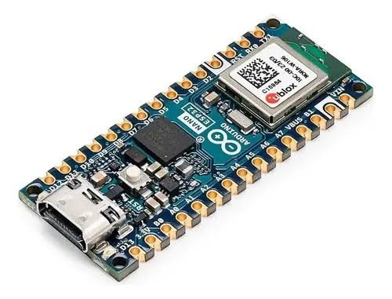 | 1 | Main controller: sensors, control loops, motor and servo | Dual-core 240 MHz ESP32-S3, 512 KB SRAM, small Nano footprint. Fast enough for gyro integration and PID at a high loop rate. 3.3 V logic |
| **ESP32-S3-CAM** (emakefun) | 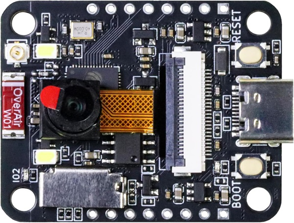 | 1 | Vision board | ESP32-S3 with 8 MB PSRAM (needed for camera frame buffers) and native USB. Keeps image processing off the main controller |
| **OV2640** camera | 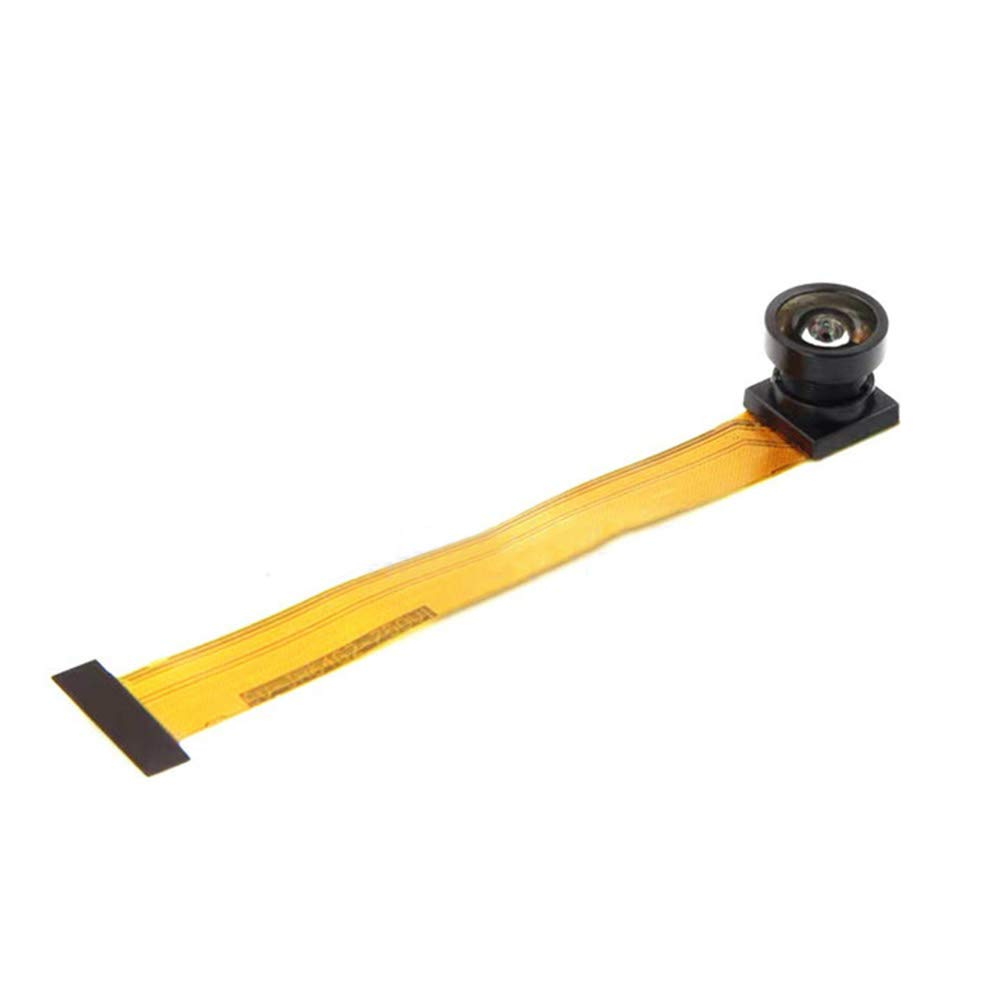 | 1 | Colour images for pillar detection | 2 MP CMOS sensor, 68° field of view, supported natively by the ESP32 camera driver |
| **TOF400C** (VL53L1X) | 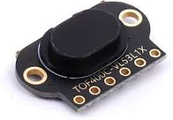 | 4 | Distance to the walls: front, back, left, right | Laser time-of-flight, up to 4 m, 27° field of view, programmable measurement area (ROI). Replaced Sharp infrared sensors (see section 5) |
| **BMI160** IMU | 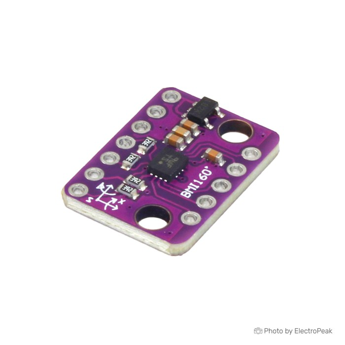 | 1 | Heading (yaw) from the gyroscope | 6-axis IMU on the same I²C bus as the TOF sensors; low noise and low current |
| **TB6612FNG** driver | 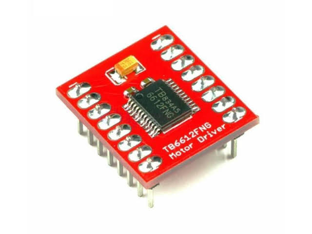 | 1 | Speed and direction of the drive motor | MOSFET H-bridge (much lower losses than an L298N), PWM control and an active short-brake mode for precise stops |
| **CN3903** buck converter | 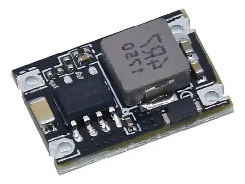 | 1 | 11.4 V → 5 V, up to 3 A | Switching regulator: far less heat than a linear regulator when dropping ~6 V |
| **Steering servo** (MG90, metal gear) | 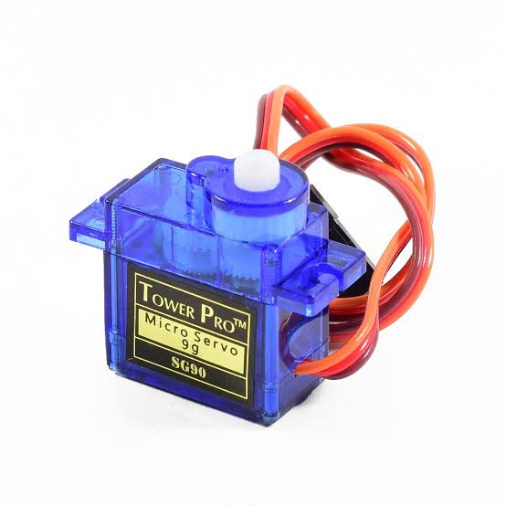 | 1 | Ackermann steering | The PCB was designed for an SG90; it was replaced by the pin-compatible MG90 because the SG90 moved inside its mount (journal Problem 8) |
| **N20 DC motor with Hall encoder**, 1000 rpm | 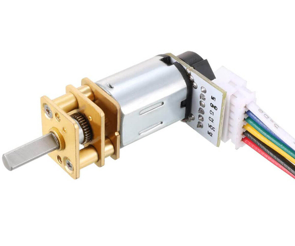 | 1 | Rear-wheel drive through a differential | Very small and light, 12 V, built-in encoder for distance/speed feedback |
| **GNB 3S 380 mAh HV LiPo** (11.4 V, 4.33 Wh, 90C) | 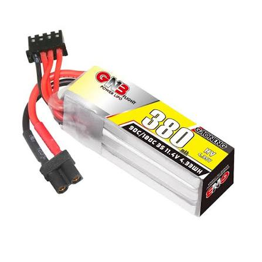 | 1 | Power source | Lightest pack that powers the 12 V motor directly with enough capacity for many rounds (see power budget) |
| **Start button** | 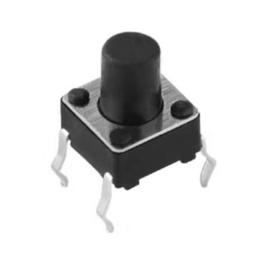 | 1 | Starts the run (rules require a single start button) | — |
| **Power switch** | — | 1 | Main power on/off (required by the rules) | Between the battery and the PCB |
| **Custom tyres** | 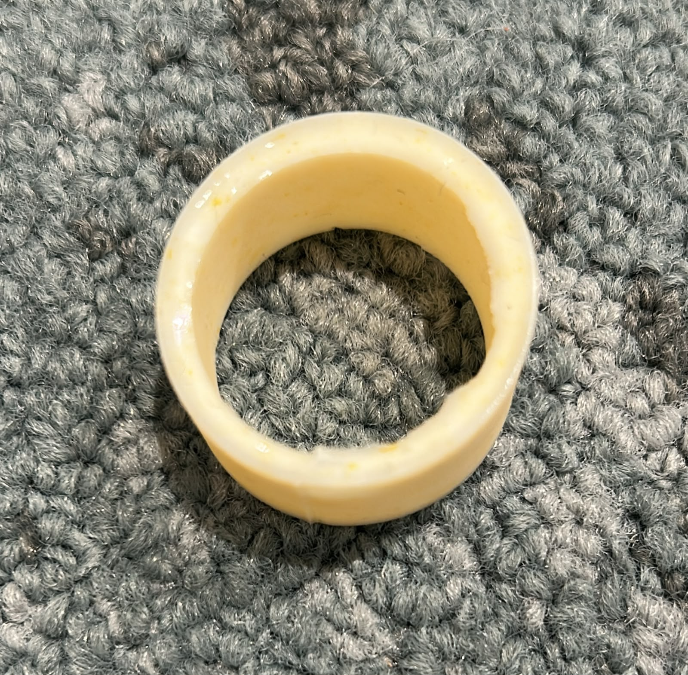 | 4 | Grip | 41 mm diameter, 5 mm silicone tread |

---

## 2. Schematic

<div align="center">
  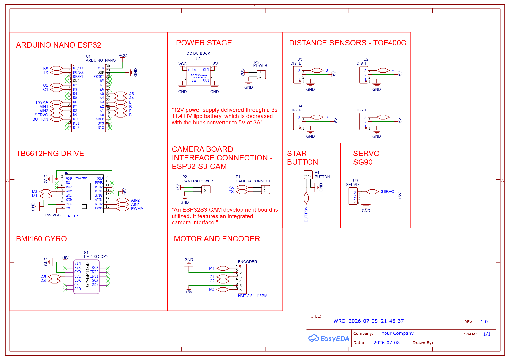
</div>

The schematic is organised in functional blocks:

| Block | Connections |
|---|---|
| **Arduino Nano ESP32** | VIN from the battery rail (VCC) · D0/D1 = UART to the camera board · D2/D3 = encoder C2/C1 · D6/D7/D8 = PWMA/AIN1/AIN2 · D9 = servo · D10 = start button · A4/A5 = I²C SDA/SCL · A0/A1/A2/A3 = XSHUT of the BACK/FRONT/RIGHT/LEFT TOF sensors |
| **Power stage** | Battery (VCC, 11.4 V) → power switch → CN3903 buck → +5 V rail |
| **Distance sensors** | 4 × 3-pin connectors (XSHUT, +5 V, GND); SDA/SCL of all TOF sensors share the I²C bus with the BMI160 |
| **TB6612FNG** | VM = battery, VCC = +5 V, **STBY tied to +5 V** (driver always enabled, no MCU pin needed), channel A only (single motor) |
| **Camera interface** | +5 V / GND power connector and RX/TX connector (camera GPIO44 / GPIO43) |
| **BMI160** | VIN = +5 V (module has its own regulator), SCL = A5, SDA = A4 |
| **Motor + encoder** | 6-pin connector: M1, M2 (motor), C1, C2 (encoder channels), +5 V, GND |
| **Servo** | Signal = D9, +5 V, GND |

---

## 3. Wiring diagram

<div align="center">
  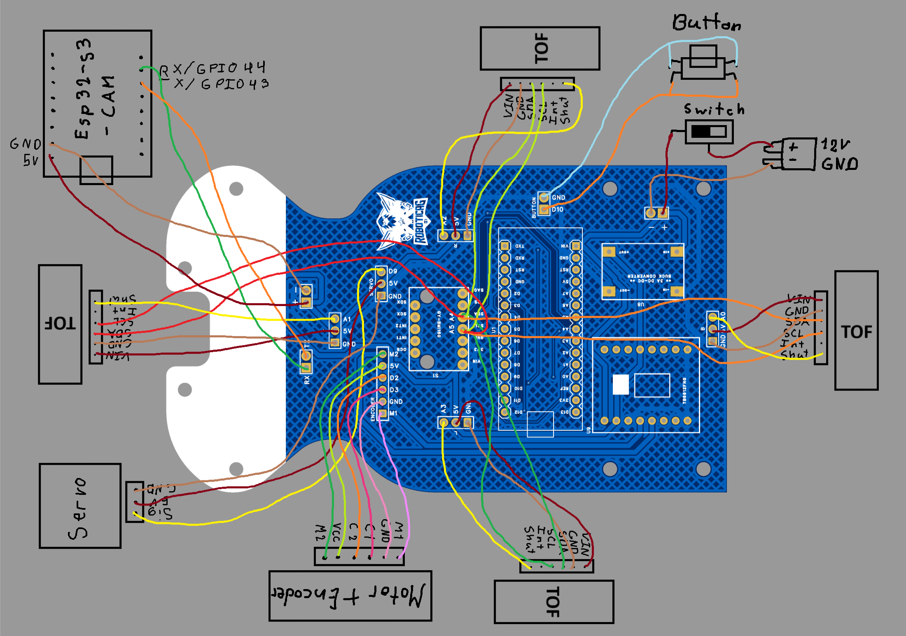
  <br>
  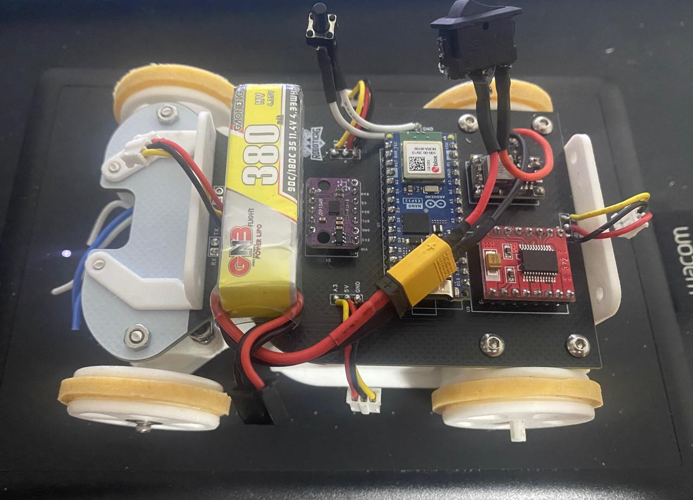
  <br>
  <em>Top: every external connection of the PCB. Bottom: the same wiring on the real car.</em>
</div>

**Pin map summary (Arduino Nano ESP32)**

| Device | Signal | Pin |
|---|---|---|
| Camera board (ESP32-S3-CAM) | UART RX / TX | D0 / D1 ↔ GPIO43 / GPIO44 |
| Encoder | C1 / C2 | D3 / D2 |
| TB6612FNG | PWMA / AIN1 / AIN2 | D6 / D7 / D8 |
| TB6612FNG | STBY | +5 V (hard-wired) |
| Servo | Signal | D9 |
| Start button | Input (to GND) | D10 |
| I²C bus (4 × TOF + BMI160) | SDA / SCL | A4 / A5 |
| TOF BACK / FRONT / RIGHT / LEFT | XSHUT | A0 / A1 / A2 / A3 |

The Nano ESP32 I/O pins work at **3.3 V and are not 5 V tolerant**. Only the board's VIN pin receives the battery voltage.

---

## 4. Power system

### 4.1 Architecture

```
 3S HV LiPo 11.4 V (380 mAh, 4.33 Wh)
        │
   [power switch]
        │
        ├────────────► TB6612FNG VM ─────► N20 drive motor
        ├────────────► Arduino Nano ESP32 VIN (on-board regulator → 3.3 V)
        │
        └─► CN3903 buck 5 V / 3 A ─► +5 V rail ─┬─► ESP32-S3-CAM (→ 3.3 V for OV2640)
                                                ├─► 4 × TOF400C
                                                ├─► BMI160
                                                ├─► TB6612FNG logic (VCC, STBY)
                                                ├─► Steering servo
                                                └─► Encoder
```

**Design reasoning**

- **The motor takes the battery voltage directly.** The N20 is rated for 12 V, so a second regulator would only add losses and weight.
- **The servo has the largest current peaks on the 5 V rail** (up to ~650 mA at stall). A 3 A buck leaves a wide margin, so a servo stall does not pull the rail down and reset the camera board or the sensors.
- **A switching (buck) regulator instead of a linear one:** dropping 11.4 V to 5 V at 0.5 A in a linear regulator would waste ~3.2 W as heat, more than all the electronics use.
- **One common ground** for all boards; the camera board and the Nano share it so the UART link has a clean reference.

### 4.2 Power budget

Values from the datasheets (typical = normal driving; peak = worst case, all at once).

| Load | Rail | Typical | Peak | Typical power | Peak power |
|---|---|---|---|---|---|
| N20 drive motor | 11.4 V | 50 mA | 350 mA | 0.57 W | 3.99 W |
| Arduino Nano ESP32 | 11.4 V (VIN) | ~35 mA | ~105 mA | 0.40 W | 1.20 W |
| ESP32-S3-CAM + OV2640 | 5 V | 100 mA | 310 mA | 0.50 W | 1.55 W |
| 4 × TOF400C | 5 V | 40 mA | 80 mA | 0.20 W | 0.40 W |
| BMI160 | 5 V | 1 mA | 1.5 mA | 0.005 W | 0.008 W |
| TB6612FNG logic | 5 V | 2 mA | 10 mA | 0.01 W | 0.05 W |
| Steering servo | 5 V | 100 mA | 650 mA (stall) | 0.50 W | 3.25 W |
| **5 V rail total** | 5 V | **243 mA** | **1.05 A** | 1.22 W | 5.26 W |
| Buck losses (≈ 85 % efficiency) | — | — | — | 0.21 W | 0.93 W |
| **Total from battery** | 11.4 V | **≈ 0.21 A** | **≈ 1.0 A** | **≈ 2.4 W** | **≈ 11.4 W** |

**What the numbers tell us**

- **Run time:** usable energy ≈ 80 % × 4.33 Wh ≈ 3.5 Wh. At typical load that is ≈ 3.5 / 2.4 ≈ **1.4 h**; even at a continuous worst case it is ≈ **18 min**. A round lasts at most 3 minutes, so one charge covers a full competition day of rounds and testing.
- **Discharge rate:** the 1.0 A peak is ≈ 2.6 C, far below the battery's 90C rating, so voltage sag at the motor is small.
- **Buck margin:** the 5 V rail peaks at ~1.05 A of the CN3903's 3 A, so the regulator never runs near its limit.
- **Charging:** ≈ 45–50 min with a balance charger (IMAX B6AC) at 0.4 A (≈ 1C).

### 4.3 Failure points we considered

| Risk | What could happen | Mitigation |
|---|---|---|
| Battery voltage on a 3.3 V pin | Permanent damage to the Nano ESP32 | On the PCB the battery rail only reaches VIN, the TB6612FNG VM pin and the buck input. Journal Problem 31 led to a safety rule: **upload code with the battery off** |
| Servo stall pulls the 5 V rail down | Camera or sensors reset during a run | 3 A buck with large margin (see budget) |
| Loose sensor wires | A TOF stops answering, I²C bus freezes | Locking JST connectors on the PCB; `Wire.setTimeOut()` in code so a frozen bus does not hang the program (journal Problems 12 and 30) |
| All TOF sensors start with the same I²C address | Address conflict, no readings | XSHUT lines: sensors are switched on one at a time at start-up and each gets its own address (journal Problem 15) |
| Short circuit while handling | Burnt traces or battery damage | Power switch on the main line; XT30 connector on the battery so it can be unplugged quickly |

---

## 5. Sensor selection and placement

| Sensor | Placement | Reasoning (field geometry) |
|---|---|---|
| TOF FRONT | Front centre, facing forward | Emergency stop and corner backup. Corridors are 100 cm wide (or 60 cm when the inner walls are close), so the front wall is visible well before the car must turn |
| TOF LEFT / RIGHT | Sides, perpendicular to the car | Measure the distance to each wall. A sudden jump in one side reading means that wall has ended: a corner. Placed **about 2 cm higher** on the second chassis so the beam does not pass over the 10 cm wall (journal Problem 16) |
| TOF BACK | Rear centre | Distance to the wall behind, used to know the position along a straight section |
| BMI160 | Flat on the PCB, near the car's centre | Only yaw is used; mounting it flat makes the Z axis the turning axis |
| Camera | Front, facing forward and slightly down | Sees the pillars of the next section; only a horizontal band of the image is searched so objects outside the field are ignored (journal §6) |

**Why TOF instead of infrared or ultrasonic:** our first sensors were Sharp GP2Y0A21 infrared sensors. Their output is non-linear (distance ∝ V^-1.15), so the noise grows with distance and they were unreliable beyond 50–60 cm, less than one corridor width (journal Problem 3). Ultrasonic sensors have a wide cone that would see the floor and the neighbouring walls. The VL53L1X measures up to 4 m and its measurement area (ROI) can be narrowed in software; we chose the ROI with a measured experiment (journal §8.2).

**Calibration methods**

- **Gyroscope:** 200 samples at rest before each run; the average is subtracted as offset (like taring a scale).
- **TOF sensors:** per-sensor offset in code, median filter of the last 5 valid readings, ROI chosen by experiment.
- **Steering:** centre and limits measured on the real chassis with the `servo_calibration` sketch, with a 2–3° margin before each mechanical stop.
- **Camera colours:** HSV thresholds tuned live with our Pillar Vision Lab tool under the real lighting.

---

## 6. PCB design and manufacturing

### 6.1 Why a custom PCB

We first planned a perforated prototype board (pertinax), but it was too bulky for a car limited to 30 × 20 cm. A custom PCB gives:

- **Clean, short connections** that do not come loose with vibration.
- **A structural base:** its custom outline holds the steering and drive supports, so the board is part of the chassis.
- **Reproducibility:** another team can order exactly the same board from the online project.

The trade-off was time: the boards are made in China and take about 2 weeks to arrive in Ecuador, so every change to the design costs weeks. We reviewed the schematic carefully before ordering to avoid a second revision.

### 6.2 Tools

We used **EasyEDA Pro** (web version) because its learning curve is shorter than KiCad or Proteus, it has a large library of ready footprints for our modules, and it exports directly to **JLCPCB** for manufacturing.

<div align="center">
  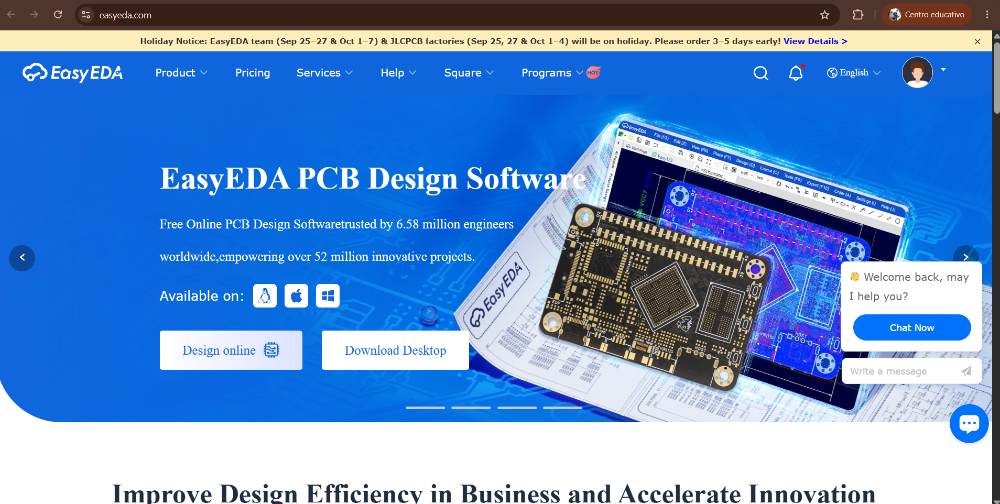
  
  <br><em>1) The board was designed in EasyEDA from the schematic. 2) We used the Pro edition for its extra layout features.</em>
  <br><br>
  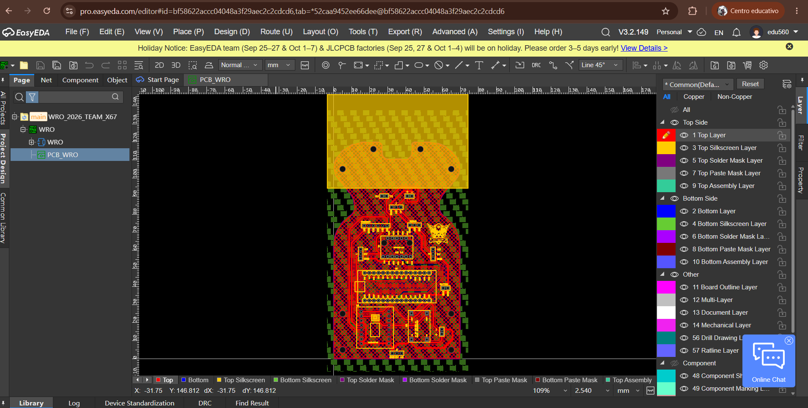
  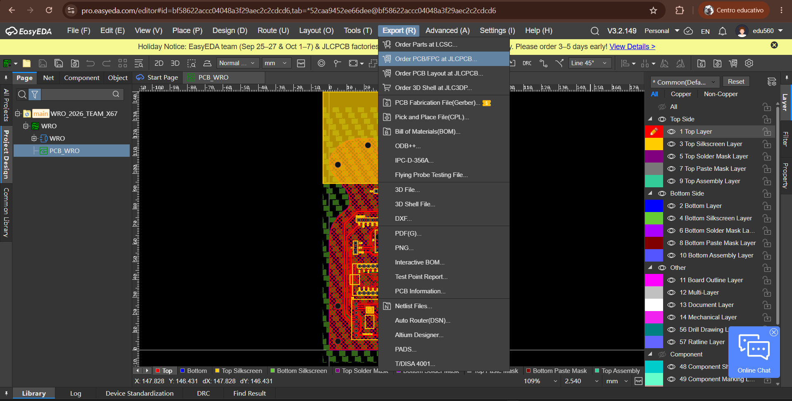
  <br><em>3–4) The finished layout is exported from the project directly to JLCPCB.</em>
  <br><br>
  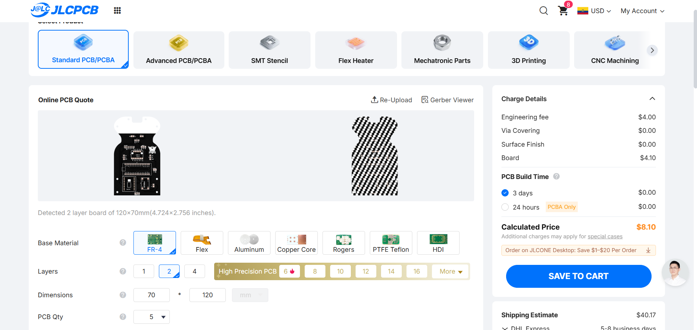
  <br><em>5) Order options: 1.6 mm board thickness; the colour is free to choose.</em>
</div>

### 6.3 Result

<div align="center">
  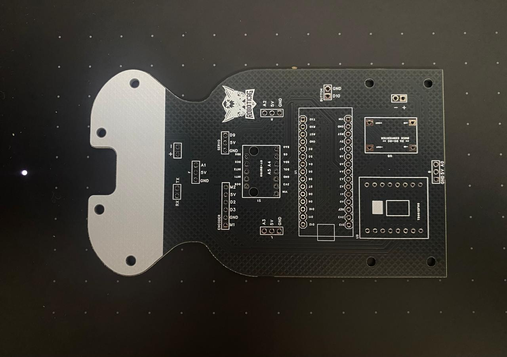
  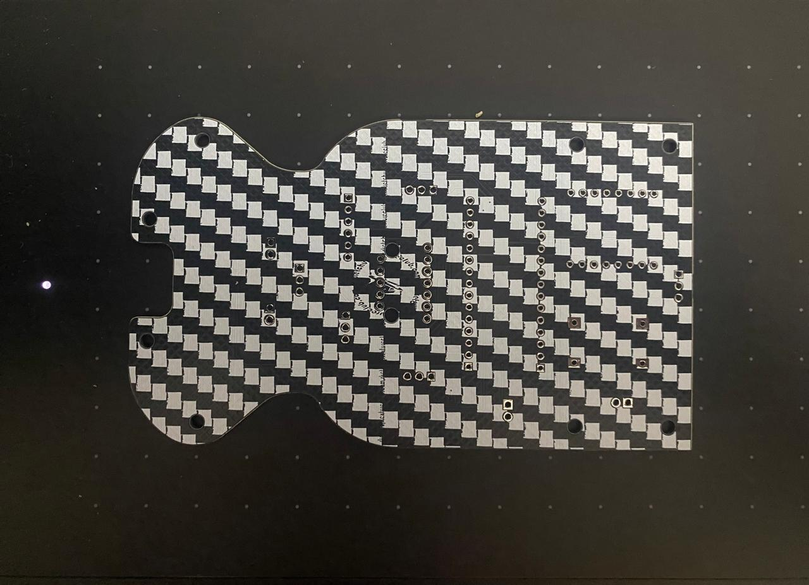
  <br><em>Manufactured PCB, front and back.</em>
</div>

The boards arrived in under two weeks and have worked without a single failure since. To reproduce them: open the [OSHWLab project](https://oshwlab.com/edu560/project_ehytvvog), choose *Order PCB*, keep 1.6 mm thickness, then solder female headers for the Nano ESP32, the BMI160, the TB6612FNG and the buck converter, and JST connectors for the external components.

### 6.4 PCB blocks

| Block | Layout |
|---|---|
| Arduino Nano ESP32 | 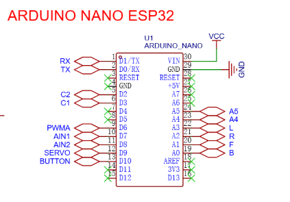 |
| Camera board connectors | 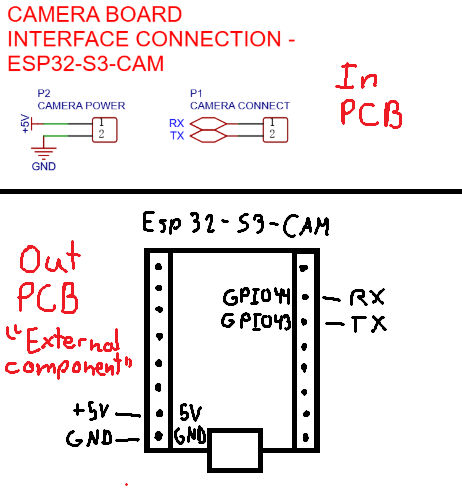 |
| TOF sensor connectors | 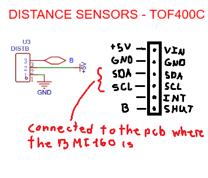 |
| BMI160 | 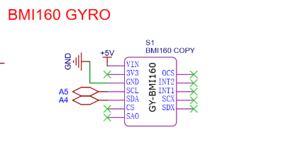 |
| TB6612FNG | 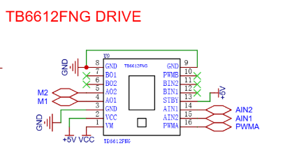 |
| Motor + encoder connector | 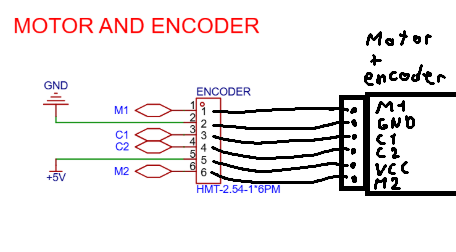 |
| Servo connector | 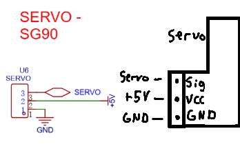 |
| Buck converter | 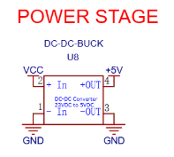 |

---

## 7. Datasheets

| Component | File | Key data used |
|---|---|---|
| Arduino Nano ESP32 | [Arduino_nano_esp32-datasheet.pdf](datasheets/Arduino_nano_esp32-datasheet.pdf) | Pinout, VIN range, 3.3 V I/O limits |
| ESP32-S3-CAM | [GitHub: nulllaborg/esp32s3-cam](https://github.com/nulllaborg/esp32s3-cam) | Camera pin layout, PSRAM, flash size |
| OV2640 | [OV2640DS.pdf](datasheets/OV2640DS.pdf) | Resolutions, RGB565 output |
| VL53L1X (TOF400C) | [DS_vl53l1x.pdf](datasheets/DS_vl53l1x.pdf) | Range, timing budget, ROI, I²C address change |
| BMI160 | [BMI160.pdf](datasheets/BMI160.pdf) | Gyroscope registers, ranges, sensitivity |
| TB6612FNG | [TB6612FNG.PDF](datasheets/TB6612FNG.PDF) | Truth table (forward, reverse, coast, short brake), current limits |
| CN3903 buck | [CN3903.PDF](datasheets/CN3903.PDF) | Input range, 3 A output |
| N20 motor | [N20_motors.pdf](datasheets/N20_motors.pdf) | Speed, current, encoder |
| SG90 servo (original choice) | [SG90.PDF](datasheets/SG90.PDF) | Pulse range, torque; the MG90 uses the same pulse range and connector |
