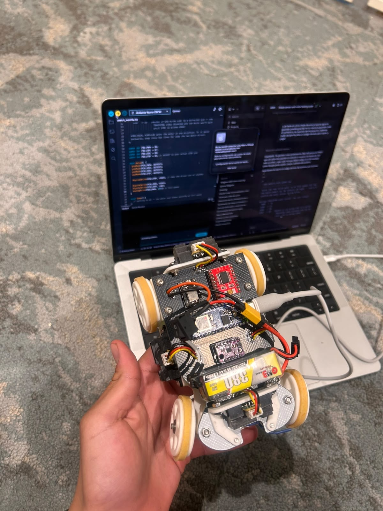

# Vehicle photos

The rules ask for six photos of the vehicle: front, back, left, right, top and bottom.

| View | Photo |
|---|---|
| Top (during programming) |  |
| Top (wiring detail) |  |

> The six standard views (front, back, left, right, top, bottom) of the final vehicle will be added here.
